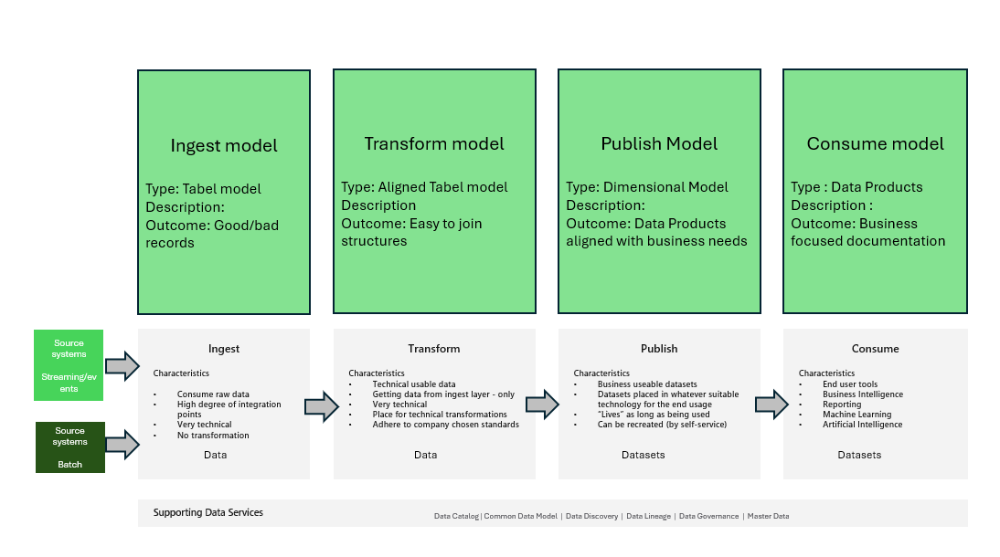

# Eine Data Platform - Data model

## Einleitung

Die Datenmodellierung ist ein wichtiger Aspekt des Datenmanagements und des Datenbankdesigns und dient als Blaupause für die Strukturierung und Organisation von Daten. Es umfasst verschiedene Techniken und Methoden
die bei der Erfassung und Darstellung von Datenanforderungen und Geschäftsprozessen helfen.

## Verständnis der Datenmodellierung
Datenmodellierung ist der Prozess der Definition und Analyse von Datenanforderungen, die zur Unterstützung der Geschäftsprozesse innerhalb einer Organisation erforderlich sind. Dabei werden Diagramme und Modelle erstellt, die die Beziehungen zwischen verschiedenen Datenelementen abbilden. Diese Modelle dienen als Leitfaden für die Erstellung von Datenbanken und anderen datenbezogenen Systemen.

## Arten von Datenmodellen
Es gibt verschiedene Arten von Datenmodellen, die jeweils einem bestimmten Zweck im Datenlebenszyklus dienen:
1) Konzeptionelle Datenmodelle: Bei diesen Modellen handelt es sich um High-Level-Darstellungen von Organisationsdaten, die sich auf die Entitäten und ihre Beziehungen konzentrieren. Sie dienen dazu, den Datenbedarf auf strategischer Ebene zu verstehen und zu dokumentieren.
2) Logische Datenmodelle: Diese Modelle bieten eine detailliertere Ansicht der Daten, einschließlich der Attribute und Schlüssel jeder Entität. Sie werden verwendet, um die Struktur der Daten abzubilden, ohne die physischen Aspekte der Speicherung zu berücksichtigen.
3) Physische Datenmodelle: Diese Modelle übersetzen das logische Datenmodell in eine physische Struktur und geben an, wie die Daten in der Datenbank gespeichert werden. Dazu gehören Details wie Tabellen, Spalten, Indizes und Einschränkungen.

## Techniken zur Datenmodellierung

Bei der Datenmodellierung werden verschiedene Techniken eingesetzt, um eine genaue und effiziente Darstellung von Daten zu gewährleisten:

1) Entity-Relationship (ER) Modellierung: Bei dieser Technik werden Entitäten, ihre Attribute und Beziehungen identifiziert. ER-Diagramme sind ein gängiges Werkzeug, das bei dieser Technik verwendet wird.
2) Normalisierung: Diese Technik wird verwendet, um Daten zu organisieren, um Redundanz zu reduzieren und die Datenintegrität zu verbessern. Dabei geht es darum, große Tische in kleinere, handlichere Teile zu unterteilen.
3) Dimensionale Modellierung: Diese Technik wird hauptsächlich im Data Warehousing verwendet und umfasst die Erstellung von Fakten- und Dimensionstabellen zur Unterstützung analytischer Abfragen.

## Datenmodellierung in der Datenplattform

Neben den oben genannten Techniken führt die Datenplattform einige Aspekte der Datenmodellierung ein, die nicht zu den allgemeinen Aspekten der Datenmodellierung gehören.

Abbildung 1 zeigt diese Datenmodelle in der Data Platform.

### Tabellenmodell

Im **Ingest-Bereich** wird  ein Datenmodell namens *Tabel Model* vorgestellt. Dieses Modell beschreibt, worauf wir uns geeinigt haben, dass ein bestimmter Ingest-Stream liefert. Und daher dieses Modell
kann verwendet werden, um zu überprüfen, ob die von einem entsprechenden Prozess gelieferten Daten den Erwartungen entsprechen. Es kann auch den Nachweis erbringen, dass neue "Spalten" in den empfangenen Daten vorhanden sind, so dass diese
angemessen gehandhabt.

Die Daten selbst werden in keiner Weise verändert, sondern können in einem  *guten* und *schlechten* Datensatzbereich geparkt werden,  basierend auf entweder falschem Inhalt in Bezug auf das, was erwartet wurde, oder 
Ein fehlerhafter Datensatz, der z.B. auf fehlenden Daten basiert.

Dieses Modell wird von den *Data Engineers* gepflegt.

### Abgestimmtes Datenmodell

Im Bereich **Transformation** wird das erstellte Modell als *ausgerichtetes Datenmodell* bezeichnet. Dieses Modell stellt ein traditionelleres EB-Datenmodell dar, aber mit dem großen Unterschied, dass das Datenmodell
implementiert die Beziehungen nicht. Sie werden beschrieben, aber nicht durchgesetzt. Bei den Tabellen, die in diesem Bereich beschrieben werden, handelt es sich um "korrekte Datensätze", bei denen die Entitäten und Attribute an
Allgemeine Regeln wie Datentyp, Datumsformate, Beschreibungen, Schlüssel, Fremdschlüssel, Dezimalgenauigkeit usw. Das Ergebnis müssen Strukturen sein, die sich sehr einfach zu einer Form verbinden lassen 
die Datensätze im **Veröffentlichungsbereich**.

Dieses Modell wird von den *Data Engineers* gepflegt.

### Dimensionales Modell

Bei den Datenmodellen, die im **Veröffentlichungsbereich** vorhanden  sind, handelt es sich um standardmäßige *dimensionale Modelle*, bei denen Daten verknüpft und die richtigen Spalten vorhanden sind, um die jeweilige Geschäftsaufgabe zu unterstützen.

Dieses Modell wird von den *Designern* gepflegt

### Datenprodukt

Die *dimensionalen Modelle* im **Veröffentlichungsbereich** werden im **Verbrauchsbereich** weiter verbessert, indem  sie zu *Datenprodukten* geformt werden. Ein *Datenprodukt* ändert das Layout des *dimensionalen Modells* nicht
fügt aber beschreibende Informationen wie *Anwendungsfall*, *Dokumentation*, *Benutzerhandbücher* usw. hinzu.

Diese Informationen sollten von dem Geschäftsinhaber gepflegt werden, der das *dimensionale Modell* "bestellt" hat.

## Vorteile der Datenmodellierung

Die Datenmodellierung bietet zahlreiche Vorteile, die die Effizienz und Effektivität des Datenmanagements steigern:

1) Verbesserte Datenqualität: Durch die Identifizierung und Beseitigung von Redundanzen trägt die Datenmodellierung zur Aufrechterhaltung einer hohen Datenqualität bei.
2) Verbesserte Kommunikation: Datenmodelle bieten eine klare und standardisierte Möglichkeit, Datenanforderungen zwischen den Beteiligten zu kommunizieren.
3) Bessere Datenbankleistung: Durch die Optimierung der Struktur der Datenbank kann die Datenmodellierung die Leistung erheblich verbessern.
4) Erleichterte Wartung: Mit klar definierten Datenmodellen ist es einfacher, Datenbanken zu pflegen und zu aktualisieren, wenn sich die Geschäftsanforderungen ändern.

## Anwendungen der Datenmodellierung

Die Datenmodellierung wird in verschiedenen Bereichen und Branchen angewendet und hilft bei der Gestaltung und Implementierung robuster Datensysteme:

1) Datenbankdesign: Die Datenmodellierung ist entscheidend für die Gestaltung relationaler Datenbanken, um sicherzustellen, dass sie effizient und skalierbar sind.
2) Data Warehousing: Dimensionale Modellierungstechniken werden angewendet, um Data Warehouses zu erstellen, die Business Intelligence und Analysen unterstützen.
3) Softwareentwicklung: Datenmodelle werden verwendet, um die für Softwareanwendungen erforderlichen Datenstrukturen zu definieren, um eine nahtlose Integration und Funktionalität zu ermöglichen.
4) Geschäftsanalyse: Datenmodelle helfen beim Verständnis von Geschäftsprozessen und -anforderungen, was zu einer besseren Entscheidungsfindung und strategischen Planung führt.

## Herausforderungen bei der Datenmodellierung

Trotz ihrer Vorteile steht die Datenmodellierung vor mehreren Herausforderungen, die angegangen werden müssen:

1) Komplexität: Die Datenmodellierung kann komplex werden, insbesondere in großen Unternehmen mit großen Datenmengen.
2) Sich ändernde Anforderungen: Geschäftsanforderungen ändern sich häufig und erfordern häufige Aktualisierungen der Datenmodelle.
3) Integration: Die Integration von Daten aus mehreren Quellen kann eine Herausforderung darstellen und erfordert robuste Datenmodellierungstechniken.
4) Werkzeugauswahl: Die Auswahl der richtigen Werkzeuge und Technologien für die Datenmodellierung kann angesichts der Fülle der verfügbaren Optionen schwierig sein.

## Fazit

Die Datenmodellierung ist ein unverzichtbarer Bestandteil des Datenmanagements, der einen strukturierten Ansatz für die Organisation und Verwaltung von Daten bietet. Durch das Verständnis der Arten, Techniken, Vorteile und Anwendungen der Datenmodellierung können Unternehmen robuste Datensysteme erstellen, die ihre Geschäftsprozesse und strategischen Ziele unterstützen. Trotz der Herausforderungen überwiegen die Vorteile der Datenmodellierung bei weitem die Nachteile, was sie zu einer Schlüsselkomponente erfolgreicher Datenmanagementstrategien macht.

