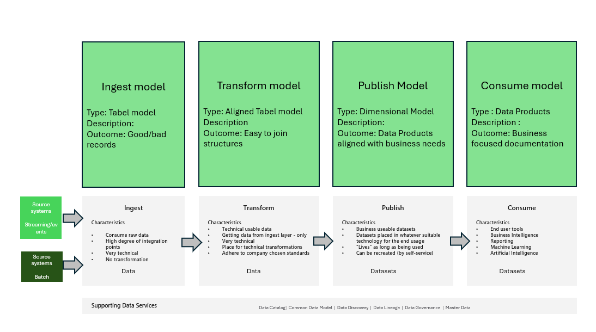

# A data platform - Data Model

## Introduction

Data modelling is a critical aspect of data management and database design, serving as the blueprint for structuring and organizing data. It encompasses various techniques and methodologies
that help in capturing and representing data requirements and business processes.

## Understanding Data Modelling

Data modelling is the process of defining and analyzing data requirements needed to support the business processes within an organization. This involves creating diagrams and models that depict the relationships between different data elements. These models serve as a guide for the creation of databases and other data-related systems.

## Types of Data Models

There are several types of data models, each serving a specific purpose in the data lifecycle:

1) Conceptual Data Models: These models are high-level representations of organizational data, focusing on the entities and their relationships. They are used for understanding and documenting the data requirements at a strategic level.
2) Logical Data Models: These models provide a more detailed view of the data, including the attributes and keys of each entity. They are used to map out the structure of the data without considering the physical aspects of storage.
3) Physical Data Models: These models translate the logical data model into a physical structure, specifying how the data will be stored in the database. They include details such as tables, columns, indexes, and constraints.

## Data Modelling Techniques

Several general techniques are employed in data modelling to ensure accurate and efficient representation of data:

1) Entity-Relationship (ER) Modelling: This technique involves identifying entities, their attributes, and relationships. ER diagrams are a common tool used in this technique.
2) Normalization: This technique is used to organize data to reduce redundancy and improve data integrity. It involves dividing large tables into smaller, more manageable pieces.
3) Dimensional Modelling: Used primarily in data warehousing, this technique involves creating fact and dimension tables to support analytical queries.

## Data modelling in the Data platform

Besides the above mentioned techniques the Data Platform introduces a couple of ekstra aspects of data modelling, which does not belong to the general aspects of data modelling.

Figure 1 shows these data models in the Data Platform.

### Table model

In the **ingest area** a data model called *tabel model* is introduced. This model describes what we has agreed upon that a given ingest stream delivers. And hence this model
can be used to check wether the data provided by a corresponding process is as expected. It can also provide evidence of new "columns" in the data being receivied, so that this can be
handled appropiate.

The data itself is not changed in any way, but may be parked in a *good* and *bad* records area based on either wrong content in respects what was expected or 
a faulty record based on i.e. missing data.

This model is maintained by the *data engineers*.

### Aligned data model

In the **transformation area** the model created is called *aligned data model*. This model represent a more traditional ER data model, but with that big difference that the data model
does not implement the relationships. They are described but not enforced. The tables being described in this area are "correct records" where the entities and attributes are aligned with
overall rules like datatype, date formats, descriptions, keys, foreign keys, decimal precision etc. The outcome must be structures that can very easily be joined to form 
the datasets in the **publish area**.

This model is maintained by the *data engineers*.

### Dimensional model

The data models being present in the **publish area** are standard *dimensional models*, where data are joined and the correct columns are in place to support the given business task.

This model is maintained by the *designers*

### Data product

The *dimensional models* in the **publish area** are further enhanced in the **consume area** forming them to *data products*. A *data product* does not change the layout of *dimensional model*
but adds descriptive information like *use case*, *documentation*, *user guides* etc.

This information should be maintained by the business owner that "ordered" the *dimensional model*.

## Benefits of Data Modelling

Data modelling offers numerous benefits that enhance the efficiency and effectiveness of data management:

1) Improved Data Quality: By identifying and eliminating redundancy, data modelling helps maintain high data quality.
2) Enhanced Communication: Data models provide a clear and standardized way to communicate data requirements between stakeholders.
3) Better Database Performance: By optimizing the structure of the database, data modelling can significantly improve performance.
4) Facilitated Maintenance: With well-defined data models, it is easier to maintain and update databases as business needs change.

## Applications of Data Modelling

Data modelling is applied across various domains and industries, aiding in the design and implementation of robust data systems:

1) Database Design: Data modelling is crucial in designing relational databases, ensuring that they are efficient and scalable.
2) Data Warehousing: Dimensional modelling techniques are applied to create data warehouses that support business intelligence and analytics.
3) Software Development: Data models are used to define the data structures required for software applications, facilitating seamless integration and functionality.
4) Business Analysis: Data models help in understanding business processes and requirements, leading to better decision-making and strategic planning.

## Challenges in Data Modelling

Despite its benefits, data modelling faces several challenges that need to be addressed:

1) Complexity: Data modelling can become complex, especially in large organizations with vast amounts of data.
2) Changing Requirements: Business requirements often change, necessitating frequent updates to data models.
3) Integration: Integrating data from multiple sources can be challenging, requiring robust data modelling techniques.
4) Tool Selection: Choosing the right tools and technologies for data modelling can be difficult, given the plethora of options available.

## Conclusion

Data modelling is an indispensable part of data management that provides a structured approach to organizing and managing data. By understanding the types, techniques, benefits, and applications of data modelling, organizations can create robust data systems that support their business processes and strategic goals. Despite the challenges, the advantages of data modelling far outweigh the drawbacks, making it a key component of successful data management strategies.

