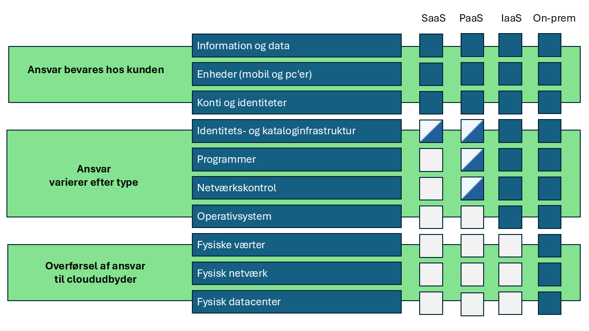
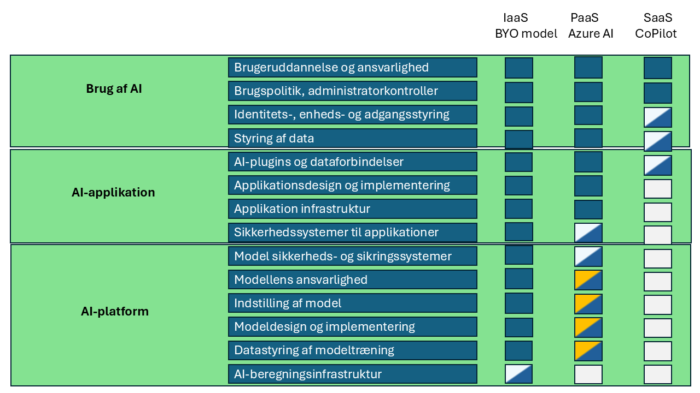
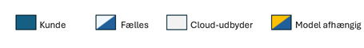
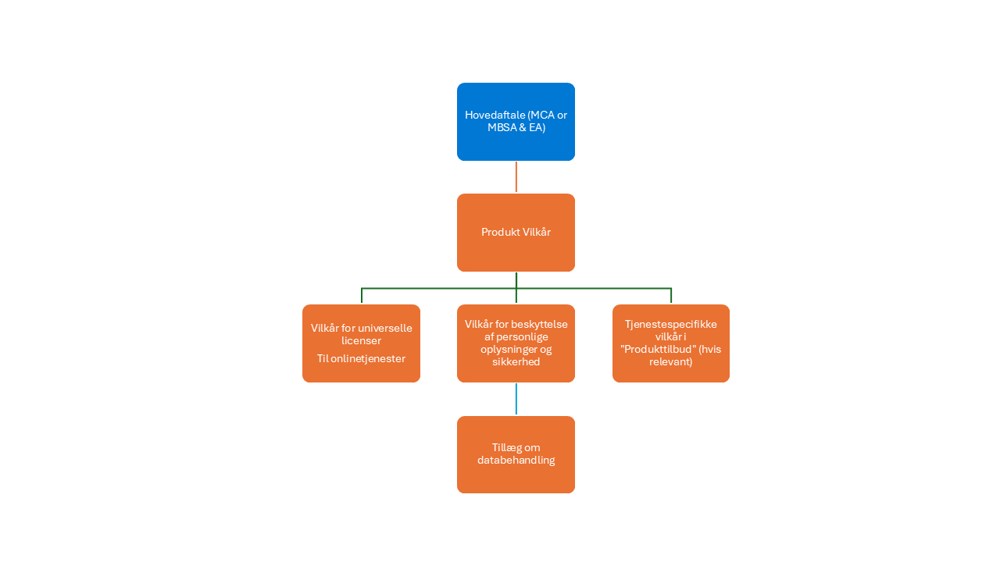

# A data platform - Cloud Enviroments

I den stadigt udviklende verden har cloud computing vist sig som et fyrtårn af innovation, der tilbyder forskellige servicemodeller for at imødekomme forskellige forretningsbehov. Forestil dig et stort digitalt landskab, hvor virksomheder kan vælge mellem forskellige stier, hver førende til et unikt sæt af kapaciteter og kontroller. Disse stier er kendt som Infrastructure as a Service (IaaS), Platform as a Service (PaaS) og Software as a Service (SaaS). Hver sti tilbyder et forskelligt niveau af kontrol, fleksibilitet og styring, ligesom at vælge mellem at bygge dit eget hus, leje en fuldt møbleret lejlighed eller bo på et hotel.

## Infrastrukturas a Service (IaaS)

Forestil dig selv som en arkitekt med et tomt lærred. IaaS giver dig de virtualiserede byggesten over internettet. man har friheden til at oprette og administrere virtuelle maskiner, hver med sit eget operativsystem. Det er som at have en grund, hvor man kan bygge dit drømmehus fra bunden.

### Nøglefunktioner

- Virtuelle Maskiner: Forestil dig at oprette og administrere dine egne digitale hjem.
- Lagring: Tænk på skalerbare lagringsløsninger som store digitale lagre.
- Netværk: Forestil dig virtuelle netværk, load balancers og IP-adresser som veje og broer, der forbinder din digitale by.
- Fleksibilitet: Skaler dine ressourcer op eller ned baseret på efterspørgsel, ligesom at udvide dit hus, når gæster ankommer.
- Betal-efter-forbrug: Betal kun for det, man bruger, ligesom forsyninger i et rigtigt hjem.

### Anvendelsesområder

- Udvikling og Test: Hurtigt opsætte og nedtage udviklingsmiljøer, ligesom at bygge og nedrive midlertidige strukturer.
- Webhosting: Hoste websites og webapplikationer, som at oprette butikker i din digitale by.
- Dataopbevaring og Backup: Opbevare store mængder data med høj tilgængelighed, ligesom at have et sikkert pengeskab.
- Katastrofeberedskab: Implementere katastrofeberedskabsløsninger med minimale forhåndsomkostninger, ligesom at have en nødplan for din by.

### Eksempler

- Microsoft Azure Virtuelle Maskiner
- Amazon Web Services (AWS) EC2
- Google Cloud Compute Engine

## Platformas a Service (PaaS)

Forestil dig nu at flytte ind i en fuldt møbleret lejlighed. PaaS giver en platform, der giver dig mulighed for at udvikle, køre og administrere applikationer uden at bekymre dig om den underliggende infrastruktur. Det er som at have et klar-til-brug rum, hvor man kan fokusere på dine kreative bestræbelser.

### Nøglefunktioner

- Udviklingsværktøjer: Integrerede udviklingsmiljøer (IDEs) og værktøjer til kodning, test og implementering af applikationer, ligesom at have et fuldt udstyret værksted.
- Middleware: Software, der forbinder forskellige applikationer og tjenester, som VVS og ledninger i din lejlighed.
- Database Management: Administrerede databaseservices til opbevaring og hentning af data, ligesom at have et indbygget bibliotek.
- Skalerbarhed: Automatisk skalering af applikationer baseret på efterspørgsel, ligesom at have udvidelige rum.
- Integration: Nem integration med forskellige tjenester og API'er, ligesom at have sømløse forbindelser til forsyninger og tjenester.

### Anvendelsesområder

- Applikationsudvikling: Udvikle og implementere web- og mobilapplikationer, ligesom at skabe digitale mesterværker.
- API-udvikling: Oprette og administrere API'er til forskellige tjenester, som at bygge broer mellem digitale øer.
- Analytics og Business Intelligence: Bygge og implementere analytics-applikationer, ligesom at opsætte observatorier for at få indsigt.
- IoT-applikationer: Udvikle og administrere Internet of Things (IoT) applikationer, ligesom at skabe et smart hjem.

### Eksempler

- Google App Engine
- Microsoft Azure App Services
- Heroku

## Softwareas a Service (SaaS)

Endelig, forestil dig at bo på et luksushotel. SaaS leverer softwareapplikationer over internettet på abonnementsbasis. man får adgang til softwaren via en webbrowser, og udbyderen administrerer alt andet. Det er som at nyde alle faciliteterne uden nogen af ansvarsområderne.

### Nøglefunktioner

- Tilgængelighed: Få adgang til applikationer fra enhver enhed med internetforbindelse, ligesom at have en nøgle til hvert rum på hotellet.
- Vedligeholdelse: Udbyderen håndterer opdateringer, sikkerhed og vedligeholdelse, ligesom at have dedikeret personale.
- Abonnementsbaseret: Betal for softwaren på abonnementsbasis, ofte månedligt eller årligt, ligesom at betale for dit ophold.
- Skalerbarhed: Nem skalering af antallet af brugere og funktioner efter behov, ligesom at booke flere rum til gæster.
- Integration: Integrer med andre SaaS-applikationer og tjenester, ligesom at nyde alle hotellets faciliteter.

### Anvendelsesområder

- Forretningsapplikationer: CRM, ERP og HR management systemer, ligesom at have en concierge service.
- Samarbejdsværktøjer: Email, instant messaging og projektstyringsværktøjer, ligesom at have et konferencerum.
- Content Management: Administrere og distribuere digitalt indhold, ligesom at have et mediecenter.
- E-handel: Online shopping platforme og betalingsgateways, ligesom at have et shoppingarkade.

### Eksempler

- Microsoft Office 365
- Google Workspace (tidligere G Suite)
- Salesforce

## Fælles ansvar i et cloud-miljø

Det er vigtigt at forstå, hvem der har ansvaret for de forskellige lag i infrastrukturen, når man bruger enten on-premise eller cloud, og i cloud forstå dette på tværs af Infrastructure as a Service (IaaS), Platform as a Service (Paas) og Software as a Service (SaaS).

I figur 1 vises forskelle mellem on-premise, IaaS, PaaS og SaaS med hensyn til cloud-udbyderens og kundens ansvar.

Følgende beskriver på et mere detaljeret niveau betydningen af dette.

### On-Premise

**Kundens ansvar**:

- Infrastruktur - Kunden er ansvarlig for indkøb, administration og vedligeholdelse af al hardware, herunder servere, storage og netværksudstyr.
- Software - Kunden installerer, konfigurerer og opdaterer al software, herunder operativsystemer, middleware og applikationer.
- Sikkerhed - Kunden er ansvarlig for alle aspekter af sikkerhed, herunder fysisk sikkerhed, netværkssikkerhed og databeskyttelse.
- Data - Kunden administrerer alle data, herunder sikkerhedskopier og disaster recovery.

**Cloud-udbyderens ansvar**:

- Ingen - I en on-premise opsætning er der ingen involvering fra en cloud-udbyder.

### Infrastruktur as a Service (IaaS)

**Kundens ansvar**:

- Applikationer - Kunden installerer, konfigurerer og administrerer applikationer.
- Data - Kunden er ansvarlig for at administrere data, herunder backup og disaster recovery.
- Runtime - Kunden administrerer runtime-miljøet for applikationer.
- Middleware - Kunden installerer og administrerer middleware.
- Operativsystem - Kunden installerer, konfigurerer og opdaterer operativsystemet.

**Cloud-udbyderens ansvar**:

- Virtualisering - Cloud-udbyderen administrerer virtualiseringslaget.
- Servere - Cloud-udbyderen vedligeholder de fysiske servere.
- Opbevaring - Cloud-udbyderen administrerer lagerinfrastruktur, herunder sikring af kryptering.
- Netværk - Cloud-udbyderen håndterer netværksinfrastruktur.
- Fysisk sikkerhed - Cloud-udbyderen sikrer den fysiske sikkerhed i datacentrene.

### Platform as a Service (PaaS)

**Kundens ansvar**:

- Applikationer - Kunden udvikler, implementerer og administrerer applikationer.
- Data - Kunden administrerer data, herunder sikkerhedskopier og disaster recovery.

**Cloud-udbyderens ansvar**:

- Runtime - Cloud-udbyderen administrerer runtime-miljøet.
- Middleware - Cloud-udbyderen leverer og administrerer middleware.
- Operativsystem - Cloud-udbyderen installerer, konfigurerer og opdaterer operativsystemet.
- Virtualisering - Cloud-udbyderen administrerer virtualiseringslaget.
- Servere - Cloud-udbyderen vedligeholder de fysiske servere.
- Opbevaring - Cloud-udbyderen administrerer lagerinfrastruktur, herunder sikring af kryptering.
- Netværk - Cloud-udbyderen håndterer netværksinfrastruktur.
- Fysisk sikkerhed - Cloud-udbyderen sikrer den fysiske sikkerhed i datacentrene.

### Software as a Service (SaaS)

**Kundes ansvar**

- Data - Kunden administrerer data, herunder sikkerhedskopier og katastrofegendannelse (i det omfang SaaS-udbyderen tillader det).

**Cloud-udbyderens ansvar**

- Applikationer - Cloud-udbyderen udvikler, implementerer og administrerer applikationer.
- Data - Cloud-udbyderen sikrer datasikkerhed og compliance.
- Runtime - Cloud-udbyderen administrerer runtime-miljøet.
- Middleware - Cloud-udbyderen leverer og administrerer middleware.
- Operativsystem - Cloud-udbyderen installerer, konfigurerer og opdaterer operativsystemet.
- Virtualisering - Cloud-udbyderen administrerer virtualiseringslaget.
- Servere - Cloud-udbyderen vedligeholder de fysiske servere.
- Opbevaring - Cloud-udbyderen administrerer lagerinfrastruktur, herunder sikring af kryptering.
- Netværk - Cloud-udbyderen håndterer netværksinfrastruktur.
- Fysisk sikkerhed - Cloud-udbyderen sikrer den fysiske sikkerhed i datacentrene.

Denne ansvarsfordeling hjælper kunder med at vælge den rigtige cloud-tjenestemodel baseret på deres behov og muligheder.
Dette valg kan/skal/bør variere fra projekt til projekt, så en kunde altid opnår den mest optimale løsning baseret på funktionalitet og omkostninger.

## Delt ansvar i et AI-cloudmiljø

I forbindelse med AI er cloud-udbyderens og kundens ansvar betydeligt forskelligt på tværs af Infrastructure as a Service (IaaS), Platform as a Service (PaaS) og Software as a Service (SaaS) i forhold til en *standard* cloud model, som beskrevet ovenfor.

Her følger en oversigt over disse forskelle.

### Infrastruktur as a Service (IaaS) - Medbring din egen model

**Kundens ansvar**

- AI-modeludvikling - Kunden er ansvarlig for at udvikle, træne og implementere deres AI-modeller. Dette inkluderer valg og konfiguration af den nødvendige software og værktøjer.
- Datahåndtering - Kunden håndterer forberedelse, opbevaring og administration af data, herunder sikring af datakvalitet og overholdelse af relevante regler.
- Runtime Environment - Kunden administrerer runtime-miljøet, herunder operativsystemet, middleware og runtime-biblioteker.
- Sikkerhed - Kunden er ansvarlig for at sikre sine applikationer og data, herunder implementering af adgangskontrol og overvågning af sikkerhedstrusler.

**Cloud-udbyderens ansvar**

- Infrastruktur - Cloud-udbyderen administrerer den underliggende infrastruktur, herunder fysiske servere, storage og netværk.
- Virtualisering - Udbyderen håndterer virtualiseringslaget og sikrer, at virtuelle maskiner er tilgængelige og fungerer korrekt.
- Grundlæggende sikkerhed - Udbyderen sikrer den fysiske sikkerhed i datacentre og sikkerheden i infrastrukturen.

### Platform as a Service (PaaS) – Azure AI

**Kundens ansvar**

- AI-modeludvikling - Kundefokus på at udvikle og implementere AI-modeller ved hjælp af de værktøjer og rammer, der leveres af PaaS.
- Datahåndtering - Kunden administrerer deres data, herunder dataforberedelse og sikring af overholdelse af relevante regler.
- Applikationslogik - Kunden er ansvarlig for logikken og funktionaliteten af deres AI-applikationer.

**Cloud-udbyderens ansvar**

- Infrastruktur og runtime - Cloud-udbyderen administrerer den underliggende infrastruktur, operativsystem, middleware og runtime-miljø.
- AI-værktøjer og -rammer - Udbyderen tilbyder forudbyggede AI-værktøjer, rammer og tjenester, som kunden kan bruge til at udvikle og implementere deres modeller.
- Sikkerhed - Udbyderen sikrer platformens sikkerhed, herunder patching og opdatering af operativsystemet og middleware.

### Software as a Service (SaaS) - CoPilot

**Kundens ansvar**

- Datainput - Kunden leverer de data, som AI-tjenesten vil behandle.
- Konfiguration – Kunden konfigurerer AI-tjenesten til at opfylde deres specifikke behov, f.eks. angivelse af parametre og definition af arbejdsgange.
- Brug – Kunden bruger AI-tjenesten til at nå deres forretningsmål, f.eks. generere indsigt eller automatisere opgaver.

**Cloud-udbyderens ansvar**

- Alt andet - Cloud-udbyderen administrerer hele stakken, inklusive infrastrukturen, runtime-miljøet, AI-modeller og applikationslogik.
- AI-tjenestelevering - Udbyderen sikrer, at AI-tjenesten er tilgængelig, pålidelig og sikker. Dette omfatter vedligeholdelse og opdatering af AI-modellerne og den underliggende infrastruktur.
- Datasikkerhed - Udbyderen sikrer sikkerheden og overholdelsen af de data, der behandles af AI-tjenesten.

## **Kontrakterne**

> [!NOTE]
> Den angivne beskrivelse er **KUN** til orientering og erstatter på ingen måde brugen af ​​de originale dokumenter.
> Disse dokumenter kan findes [her](<https://www.microsoft.com/en-us/licensing>) og [her][<https://servicetrust.microsoft.com/>]

Grundlaget for at forstå, hvem der har hvilket ansvar, kræver dokumenter, der beskriver, hvordan dette håndteres.

Resten af dette afsnit beskriver strukturen i Microsoft og dermed en dataplatform baseret på Azure. Se venligst lignende dokumentation afhængigt af infrastrukturen.

De forskellige aspekter af det beskrevne delte ansvar i Microsoft håndteres i flere dokumenter.

Dette er vist i figur 4.

**Hovedaftalen (MCA eller MBSA & EA)** er den "hovedkontrakt", der beskriver "købsbetingelserne".

Denne henviser til **Produkt vilkårene** der indeholder mere detaljerede oplysninger om de rettigheder og begrænsninger, der er knyttet til brugen af Microsoft-produkter og -tjenester.

**Produkt vilkår** adressere flere vigtige aspekter, herunder:

- **Formål og omfang**
   - Det primære formål med *produktvilkårene* er at forklare de rettigheder, der gives til kunden til brug af Microsoft-produkter ("brugsrettighederne") og eventuelle begrænsninger eller begrænsninger for denne brug.
   - *Produktvilkårene* kan også indeholde andre forpligtelser, som kunden måtte have i forhold til et produkt, som ikke er omfattet af hoved-aftalen.

- **Indhold**
   - *Produktvilkårene* dækker forskellige aspekter såsom licensvilkår, privatlivs- og sikkerhedsvilkår, tillæg til databehandling og tjenestespecifikke vilkår.
   - De omfatter også universelle licensvilkår for onlinetjenester og specifikke vilkår for forskellige produkttilbud.

- **Generative AI-tjenester**:
   - *Produktvilkårene* indeholder specifikke bestemmelser for brugen af Microsoft Generative AI-tjenester, f.eks. begrænsninger for brug af disse tjenester til at generere syntetiske træningsdata til udvikling af AI-modeller med funktionalitet, der ligner Microsofts AI-tjenester.
   - Kunden kan bruge Azure OpenAI-tjenesten til at oprette syntetiserede data udelukkende til finjustering af visse modeltyper.

- **Opdateringer og tilgængelighed**:
   - *Produktvilkårene* opdateres regelmæssigt for at afspejle ændringer i Microsofts produkttilbud og -tjenester.
   - De er tilgængelige via webstedet for [produktvilkår](<https://www.microsoft.com/en-us/licensing>), hvor kunden kan finde detaljerede oplysninger om de vilkår, der gælder for deres specifikke produkter.

Samlet set er Microsofts *produktvilkår* designet til at give klare, præcise og omfattende oplysninger om de brugsrettigheder og -forpligtelser, der er forbundet med Microsoft-produkter og -tjenester, hvilket sikrer, at kunderne har en klar forståelse af deres licensvilkår og -betingelser.

**Produktvilkårene** er yderligere "foldet ud" i tre dokumenter:

- Vilkår for beskyttelse af personlige oplysninger og sikkerhed
- Universelle licensvilkår for onlinetjenester
- Tjenestespecifikke vilkår i "Produkttilbud"

### Vilkår for beskyttelse af personlige oplysninger og sikkerhed

Vilkårene for beskyttelse af personlige oplysninger og sikkerhed indeholder flere nøgleelementer, der er designet til at sikre beskyttelsen af **personoplysninger** og overholdelse af relevante regler. Her er en overordnet beskrivelse af, hvad de indeholder:

- **Databeskyttelse og privatliv**
   - Standarder for beskyttelse af personlige oplysninger – Vilkårene beskriver de standarder for beskyttelse af personlige oplysninger, som Microsoft overholder, og sikrer, at personlige data indsamles, bruges og deles på en måde, der respekterer enkeltpersoners rettigheder til beskyttelse af personlige oplysninger.
   - Datataksonomi og brugsramme - Denne ramme hjælper med at kategorisere og administrere data baseret på deres følsomhed og tilsigtede anvendelse.
   - Privatlivshændelser - Procedurer for håndtering af privatlivshændelser, herunder rapportering og afhjælpningstrin, er detaljerede for at sikre hurtige og effektive reaktioner.
- **Sikkerhedsforanstaltninger**
   - Informationssikkerhed – Vilkårene omfatter krav til håndtering af fortrolige oplysninger, hvilket sikrer, at adgang til Microsoft- og kundedata kun gives på grundlag af et legitimt forretningsbehov.
   - Sikkerhedskontroller - Retningslinjer for opretholdelse af sikkerhedskontroller, såsom ikke at dele brugerkontooplysninger og sikre enheder, når de ikke er i brug, er angivet for at forhindre uautoriseret adgang.
   - Overholdelse af standarder - Microsoft overholder forskellige sikkerhedsstandarder og certificeringer, såsom ISO 27001, ISO 27018 og ISO 27701, for at sikre robust databeskyttelse.
- **Brug af kundedata**
   - Databehandling - Vilkårene styrer, hvordan kundedata behandles, opbevares og videregives, med forpligtelser til privatliv og sikkerhed.
   - Tredjepartssoftware - Enhver brug af tredjepartssoftware skal følge en styringsproces for at mindske risici og sikre korrekt gennemgang.
- **Ansvarlig AI**
   - Etisk AI-brug - Tilgangen til ansvarlig AI fokuserer på retfærdighed, inklusion, gennemsigtighed, privatliv, sikkerhed, pålidelighed og sikkerhed.
   - Overholdelse af AI-regler - Vilkårene sikrer, at brugen af AI-teknologier overholder relevante regler.
- **Medarbejder data**
   - Principper for beskyttelse af personlige oplysninger - De samme principper for beskyttelse af personlige oplysninger, der gælder for kundedata, gælder også for medarbejderdata, hvilket sikrer ensartet beskyttelse på tværs af alle personlige data.
- **Leverandørsikkerhed og beskyttelse af personlige oplysninger**
   - Leverandørkrav: Leverandører, der håndterer personlige data på Microsofts vegne, skal overholde krav til beskyttelse af personlige oplysninger og sikkerhed, hvilket sikrer overholdelse og beskyttelse.

Disse elementer sikrer, at vilkårene for beskyttelse af personlige oplysninger og sikkerhed er omfattende, klare og i overensstemmelse med relevante regler, hvilket gør det lettere for kunderne at forstå og stole på datahåndteringspraksis.

**Universelle licensvilkår for onlinetjenester**

Vilkårene for universel licens til onlinetjenester indeholder flere nøgleelementer, der er designet til at sikre klarhed, konsistens og overholdelse af relevante regler. Her er en overordnet beskrivelse af, hvad de indeholder:

- Definitioner - Begreberne giver klare definitioner af nøglebegreber og terminologi, der anvendes i hele dokumentet. Dette sikrer, at alle parter har en fælles forståelse af vilkårene og betingelserne.
- Kundens brugsrettigheder - Kunden tildeles specifikke brugsrettigheder til de onlinetjenester, de har licenseret. Disse rettigheder er betinget af overholdelse af volumenlicensaftalen og de specifikke vilkår, der er beskrevet i produktvilkårene. Kunden skal have en licens til hvert produkt og separat licenseret funktionalitet, der bruges på en enhed eller af en bruger.
- Overholdelse af love - Vilkårene sikrer, at brugen af onlinetjenester overholder gældende love og regler, herunder import-/eksporttjenester, politikker for acceptabel brug og tekniske begrænsninger.
- Databeskyttelse og privatliv - Vilkårene omfatter forpligtelser til databeskyttelse og privatliv, hvilket sikrer, at kundedata håndteres i overensstemmelse med relevante regler såsom GDPR. Dette omfatter oplysninger om, hvordan data behandles, opbevares og videregives.
- Sikkerhedsforanstaltninger - Vilkårene beskriver de sikkerhedsforanstaltninger, der skal være på plads for at beskytte kundedata. Dette omfatter krav til håndtering af fortrolige oplysninger og opretholdelse af sikkerhedskontroller for at forhindre uautoriseret adgang.
- Serviceniveauaftaler – Mange onlinetjenester tilbyder SLA'er, der beskriver ydeevne- og tilgængelighedsgarantier, der leveres til kunden. Disse aftaler specificerer forpligtelserne til oppetid og konnektivitet.
- Brug af kundedata - Vilkårene regulerer brugen af kundedata, herunder hvordan de behandles, opbevares og videregives. Dette omfatter forpligtelser til beskyttelse af personlige oplysninger og sikkerhed samt specifikke vilkår for brug af kundedata i forskellige områder.
- Ansvarlig AI - Tilgangen til ansvarlig AI fokuserer på retfærdighed, inklusion, gennemsigtighed, privatliv, sikkerhed, pålidelighed og sikkerhed. Vilkårene sikrer, at brugen af AI-teknologier er i overensstemmelse med relevante regler.
- Opdateringer og ændringer - Vilkårene kan opdateres for at afspejle ændringer i lovkrav, nye funktioner eller andre relevante opdateringer. Kunden informeres om disse ændringer, og hvordan de påvirker deres brug af onlinetjenesterne.

Disse elementer sikrer, at de universelle licensvilkår for onlinetjenester er omfattende, klare og i overensstemmelse med relevante regler, hvilket gør det lettere for kunderne at forstå og bruge tjenesterne effektivt.

### Tjenestespecifikke vilkår i *produkttilbud*

Hvis der er behov for særlige vilkår for en given tjeneste (normalt på grund af arten af det, denne tjeneste gør), dokumenterer de tjenestespecifikke vilkår *produkttilbud* dette.
Dette dokument indeholder flere nøgleelementer, der er designet til at skabe klarhed og detaljerede oplysninger om den pågældende specifikke tjeneste.

Her er en overordnet beskrivelse af, hvad de indeholder:

- Tjenestedefinitioner - Disse vilkår giver klare definitioner for hver tjeneste, der tilbydes, hvilket sikrer, at kunden forstår omfanget og arten af de tjenester, de bruger.
- Brugsrettigheder og begrænsninger - Detaljerede oplysninger om de brugsrettigheder, der er tildelt kunden for hver tjeneste, herunder eventuelle begrænsninger eller begrænsninger for, hvordan tjenesterne kan bruges.
- Service Level Agreements (SLA'er) - Specifikke ydelses- og tilgængelighedsgarantier for hver service, der beskriver de forpligtelser, vi påtager os vedrørende oppetid, svartider og andre nøglepræstationsindikatorer.
- Databeskyttelse og beskyttelse af personlige oplysninger - Oplysninger om, hvordan kundedata håndteres, herunder databehandling, opbevaring og videregivelsespraksis. Dette afsnit sikrer overholdelse af relevante databeskyttelsesbestemmelser og skitserer forpligtelserne til at opretholde kundernes privatliv.
- Sikkerhedsforanstaltninger - Detaljer om de sikkerhedsforanstaltninger, der er indført for at beskytte kundedata og sikre tjenesternes integritet og fortrolighed. Dette omfatter oplysninger om adgangskontrol, kryptering og andre sikkerhedsprotokoller.
- Overholdelse af love - Sikkerhed for, at brugen af tjenesterne overholder gældende love og regler, herunder import-/eksportkontrol, politikker for acceptabel brug og tekniske begrænsninger.
- Opdateringer og ændringer - Oplysninger om, hvordan opdateringer og ændringer af tjenesterne vil blive kommunikeret til kunden, herunder eventuelle påvirkninger af tjenestens brug eller ydeevne.
- Support og vedligeholdelse - Oplysninger om de support- og vedligeholdelsestjenester, der er tilgængelige for kunden, herunder hvordan man får adgang til support, svartider og eventuelle tilknyttede omkostninger.
- Opsigelse og suspension - Betingelser, hvorunder tjenester kan opsiges eller suspenderes, herunder kundeansvar og eventuelle opsigelsesfrister.

### Tillæg om databehandling (DPA)

Dokumentet Vilkår for beskyttelse af personlige oplysninger og sikkerhed er "understøttet" af det kritiske dokument Data Processing Addendum (DPA), som skitserer vilkår og betingelser i forbindelse med behandling og beskyttelse af personoplysninger.

Her er en overordnet beskrivelse af, hvad databehandlingstillægget indeholder:

- Definitioner - DPA giver klare definitioner af nøglebegreber som "dataansvarlig", "databehandler", "personoplysninger" og "registreret". Disse definitioner sikrer, at alle parter har en fælles forståelse af de termer, der anvendes i hele dokumentet.
- Vilkår for databehandling - Dette afsnit beskriver de specifikke vilkår og betingelser, hvorunder personoplysninger vil blive behandlet. Den indeholder oplysninger om arten, formålet og varigheden af databehandlingsaktiviteterne samt de typer af personoplysninger og kategorier af registrerede, der er involveret.
- Overholdelse af love - DPA sikrer, at alle databehandlingsaktiviteter overholder gældende databeskyttelseslove og -regler, såsom den generelle databeskyttelsesforordning (GDPR) og California Consumer Privacy Act (CCPA). Dette omfatter forpligtelser til at overholde databeskyttelsesprincipperne og til at implementere passende tekniske og organisatoriske foranstaltninger til beskyttelse af personoplysninger.
- Datasikkerhed - Dette afsnit beskriver de sikkerhedsforanstaltninger, der skal være på plads for at beskytte personoplysninger. Det omfatter krav til opretholdelse af fortrolighed, integritet og tilgængelighed af personoplysninger samt procedurer for håndtering af sikkerhedshændelser og brud.
- Den registreredes rettigheder - Datatilsynet beskriver de registreredes rettigheder, såsom retten til at få adgang til, berigtige, slette og begrænse behandlingen af deres personoplysninger. Den omfatter også procedurer for besvarelse af anmodninger fra registrerede og sikring af, at registrerede kan udøve deres rettigheder.
- Underdatabehandlere - Dette afsnit indeholder oplysninger om brugen af underdatabehandlere, herunder de betingelser, hvorunder underdatabehandlere kan ansættes, og databehandlerens ansvar i forhold til underdatabehandlere. Det indeholder også krav om at sikre, at underdatabehandlere overholder de samme databeskyttelsesforpligtelser som databehandleren.
- Dataoverførsler - DPA adresserer overførsel af personoplysninger til tredjelande eller internationale organisationer og sikrer, at sådanne overførsler udføres i overensstemmelse med gældende databeskyttelseslove. Dette omfatter brugen af passende sikkerhedsforanstaltninger, såsom standardkontraktbestemmelser eller bindende virksomhedsregler.
- Opbevaring og sletning af data - Dette afsnit beskriver politikker og procedurer for opbevaring og sletning af personoplysninger. Det indeholder krav om at sikre, at personoplysninger kun opbevares, så længe det er nødvendigt for at opfylde de formål, hvortil de blev indsamlet, og om sikker sletning af personoplysninger, når de ikke længere er nødvendige.
- Revisionsrettigheder - DPA giver den dataansvarlige ret til at foretage revisioner og inspektioner for at verificere databehandlerens overholdelse af vilkårene i DPA og gældende databeskyttelseslove. Dette omfatter bestemmelser om at give adgang til relevante optegnelser og oplysninger.
- Ansvar og skadesløsholdelse - Dette afsnit skitserer parternes ansvar og skadesløsholdelsesforpligtelser i forbindelse med brud på databeskyttelse og manglende overholdelse af DPA. Den indeholder bestemmelser om erstatning til registrerede for skader som følge af overtrædelser af databeskyttelsesreglerne.

Disse elementer sikrer, at databehandlingstillægget er omfattende, klart og i overensstemmelse med relevante databeskyttelsesregler, hvilket giver en robust ramme for behandling og beskyttelse af personoplysninger.

## Datasikkerhed og compliance

Baseret på arten af de cloud-tjenester (IaaS, PaaS og SaaS), der bruges i ens dataplatform og de kontraktlige elementer, der bruges, bør der etableres en proces, der definerer ens sikkerhedsstilling.

I denne proces bør det være klart, hvem der har ansvaret for de forskellige elementer i platformen.

! [figur 5](.. /images/dansk/Slide16.png)

Det første skridt bør være "på hvilke vilkår" vi opererer, det vil sige **Kontraktlig overholdelse**,  der definerer forpligtelserne mellem parterne og også fastsætter, hvordan overholdelse af forpligtelser skal påvises.

Når de vilkår, vi opererer på, er fastlagt, vil næste skridt være at **Demonstrere overholdelse**. Det er lidt "hvordan og hvad", hvor vi demonstrerer *fælles ansvar* i praksis. Det betyder evnen til at udføre revision og inspektion.

Det sidste skridt er så at **Adopt Compliance**, det vil sige at have compliance i aktion. Dette påvirker overholdelses-, sikkerheds- og risikostillingen i forbindelse med organisatorisk brug af data.

## Microsofts tilgang til datasikkerhed og overholdelse af angivne standarder i onlinetjenester

**Overholdelse af kontrakter**

De vigtige dokumenter i forhold til dataplatformen er Produktvilkår og DPA

Datatilsynet har de generelle forpligtelser.

De produktspecifikke vilkår og produktdokumentationen indeholder derefter specifikke vilkår og vejledning.

Så en generel DPA for produkter (onlinetjenester og software) og professionel service
    - Med forskellige termer for:
         - Forhåndsvisning af onlinetjenester vs. onlinetjenester
         - Onlinetjenester vs. centrale onlinetjenester
         - Grundlæggende onlinetjeneste vs. EU's onlinetjeneste for datagrænser

Det er vigtigt at huske, at deres kan være produktspecifikke termer. Og at produktdokumentationen beskriver specifikke databrugsscenarier og
Funktioner til kundekonfigurationer.

**Demonstreret overholdelse**

"Hvordan og hvad" omfatter følgende scenarier, der skal håndteres:

- Forsikring af service
   - Forstå designet af datacenterdrift og -kontroller for at beskytte kundedata.
   - Forstå, hvilke trænings- og uddannelsesveje der skal følges.

- Tredjeparts certificering og revisioner
   - Forstå Microsoft-kontrollerne, og hvilke forskellige standarder de er baseret på.
   - Sørg for, at den rigtige tredjepartscertificering og -revision, tredjepartsattestering og -certificering er en del af din dokumentation (ISO, SOC osv.).

- Penetrationstest
   - Sørg for, at du udfører penetrationstest - enten af tredjepart eller af dig.

- Program for overholdelse af regler og standarder
   - Microsoft kan levere **White glove** -tjenester mod et årligt gebyr.

**Vedtaget overholdelse**

- Tekniske og sikkerhedsmæssige foranstaltninger og værktøjer til organisatorisk brug
   - Værktøjer til datasikkerhed
   - Kryptering, Customer Lockbox osv.

