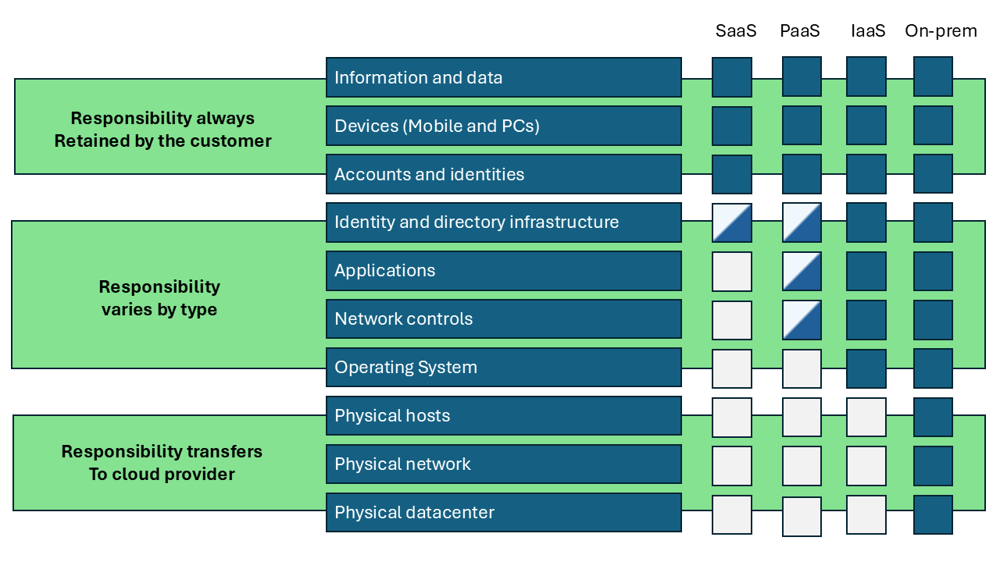
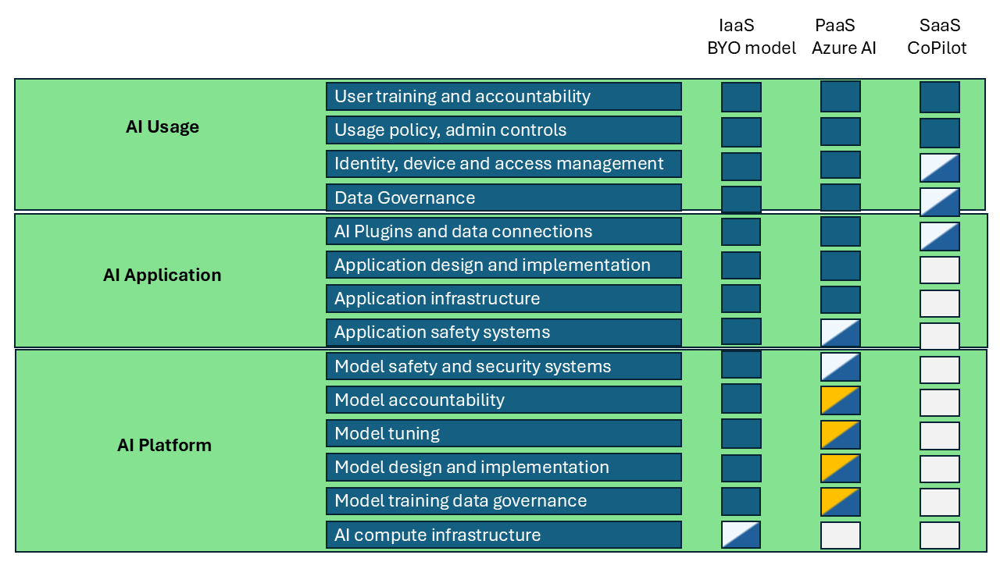
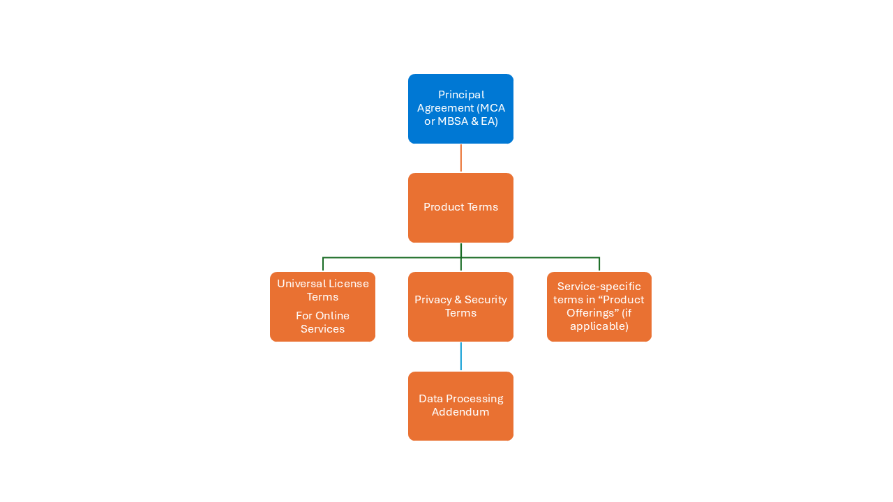

# A data platform - Cloud Enviroments

In der sich ständig weiterentwickelnden Welt der Technologie hat sich Cloud Computing als Leuchtfeuer der Innovation erwiesen und bietet verschiedene Servicemodelle, um unterschiedliche Geschäftsanforderungen zu erfüllen. Stellen Sie sich eine riesige digitale Landschaft vor, in der Unternehmen zwischen verschiedenen Wegen wählen können, die jeweils zu einem einzigartigen Satz von Fähigkeiten und Kontrollen führen. Diese Wege sind bekannt als Infrastructure as a Service (IaaS), Platform as a Service (PaaS) und Software as a Service (SaaS). Jeder Weg bietet ein unterschiedliches Maß an Kontrolle, Flexibilität und Verwaltung, ähnlich wie die Wahl zwischen dem Bau eines eigenen Hauses, der Anmietung einer voll möblierten Wohnung oder dem Aufenthalt in einem Hotel.

## Infrastruktur als Service (IaaS)

Stellen Sie sich vor, Sie sind ein Architekt mit einer leeren Leinwand. IaaS bietet Ihnen die virtualisierten Bausteine über das Internet. Sie haben die Freiheit, virtuelle Maschinen zu erstellen und zu verwalten, jede mit ihrem eigenen Betriebssystem. Es ist, als hätten Sie ein Grundstück, auf dem Sie Ihr Traumhaus von Grund auf bauen können.

### Hauptmerkmale

- Virtuelle Maschinen: Stellen Sie sich vor, Sie erstellen und verwalten Ihre eigenen digitalen Häuser.
- Speicher: Denken Sie an skalierbare Speicherlösungen als riesige digitale Lagerhäuser.
- Netzwerk: Stellen Sie sich virtuelle Netzwerke, Lastenausgleicher und IP-Adressen als Straßen und Brücken vor, die Ihre digitale Stadt verbinden.
- Flexibilität: Skalieren Sie Ihre Ressourcen je nach Bedarf nach oben oder unten, ähnlich wie Sie Ihr Haus erweitern, wenn Gäste kommen.
- Bezahlen nach Nutzung: Zahlen Sie nur für das, was Sie nutzen, ähnlich wie bei Versorgungsleistungen in einem echten Zuhause.

### Anwendungsfälle

- Entwicklung und Test: Richten Sie Entwicklungsumgebungen schnell ein und bauen Sie sie wieder ab, ähnlich wie beim Bau und Abriss temporärer Strukturen.
- Webhosting: Hosten Sie Websites und Webanwendungen, ähnlich wie beim Einrichten von Geschäften in Ihrer digitalen Stadt.
- Datenspeicherung und Backup: Speichern Sie große Datenmengen mit hoher Verfügbarkeit, ähnlich wie bei einem sicheren Tresor.
- Katastrophenwiederherstellung: Implementieren Sie Katastrophenwiederherstellungslösungen mit minimalen Vorabkosten, ähnlich wie bei einem Notfallplan für Ihre Stadt.

### Beispiele

- Microsoft Azure Virtuelle Maschinen
- Amazon Web Services (AWS) EC2
- Google Cloud Compute Engine

## Plattform als Service (PaaS)

Stellen Sie sich nun vor, Sie ziehen in eine voll möblierte Wohnung. PaaS bietet eine Plattform, die es Ihnen ermöglicht, Anwendungen zu entwickeln, auszuführen und zu verwalten, ohne sich um die zugrunde liegende Infrastruktur kümmern zu müssen. Es ist, als hätten Sie einen bezugsfertigen Raum, in dem Sie sich auf Ihre kreativen Bestrebungen konzentrieren können.

### Hauptmerkmale

- Entwicklungswerkzeuge: Integrierte Entwicklungsumgebungen (IDEs) und Werkzeuge zum Codieren, Testen und Bereitstellen von Anwendungen, ähnlich wie ein voll ausgestattetes Werkstatt.
- Middleware: Software, die verschiedene Anwendungen und Dienste verbindet, ähnlich wie die Sanitär- und Elektroinstallationen in Ihrer Wohnung.
- Datenbankverwaltung: Verwaltete Datenbankdienste zum Speichern und Abrufen von Daten, ähnlich wie eine eingebaute Bibliothek.
- Skalierbarkeit: Automatische Skalierung von Anwendungen je nach Bedarf, ähnlich wie erweiterbare Räume.
- Integration: Einfache Integration mit verschiedenen Diensten und APIs, ähnlich wie nahtlose Verbindungen zu Versorgungsleistungen und Diensten.

### Anwendungsfälle

- Anwendungsentwicklung: Entwickeln und Bereitstellen von Web- und Mobilanwendungen, ähnlich wie das Erstellen digitaler Meisterwerke.
- API-Entwicklung: Erstellen und Verwalten von APIs für verschiedene Dienste, ähnlich wie das Bauen von Brücken zwischen digitalen Inseln.
- Analytics und Business Intelligence: Erstellen und Bereitstellen von Analytics-Anwendungen, ähnlich wie das Einrichten von Observatorien, um Einblicke zu gewinnen.
- IoT-Anwendungen: Entwickeln und Verwalten von Internet of Things (IoT)-Anwendungen, ähnlich wie das Erstellen eines Smart Homes.

### Beispiele

- Google App Engine
- Microsoft Azure App Services
- Heroku

## Software als Service (SaaS)

Stellen Sie sich schließlich vor, Sie wohnen in einem luxuriösen Hotel. SaaS liefert Softwareanwendungen über das Internet auf Abonnementbasis. Sie greifen über einen Webbrowser auf die Software zu, und der Anbieter verwaltet alles andere. Es ist, als würden Sie alle Annehmlichkeiten genießen, ohne irgendwelche Verantwortlichkeiten zu haben.

### Hauptmerkmale

- Zugänglichkeit: Greifen Sie von jedem Gerät mit Internetverbindung auf Anwendungen zu, ähnlich wie bei einem Schlüssel zu jedem Zimmer im Hotel.
- Wartung: Der Anbieter kümmert sich um Updates, Sicherheit und Wartung, ähnlich wie ein engagiertes Personal.
- Abonnementbasiert: Zahlen Sie für die Software auf Abonnementbasis, oft monatlich oder jährlich, ähnlich wie bei der Bezahlung Ihres Aufenthalts.
- Skalierbarkeit: Skalieren Sie die Anzahl der Benutzer und Funktionen nach Bedarf, ähnlich wie bei der Buchung weiterer Zimmer für Gäste.
- Integration: Integrieren Sie mit anderen SaaS-Anwendungen und -Diensten, ähnlich wie bei der Nutzung aller Annehmlichkeiten des Hotels.

### Anwendungsfälle

- Geschäftsanwendungen: CRM-, ERP- und HR-Managementsysteme, ähnlich wie ein Concierge-Service.
- Zusammenarbeitstools: E-Mail, Instant Messaging und Projektmanagement-Tools, ähnlich wie ein Konferenzraum.
- Content Management: Verwalten und Verteilen digitaler Inhalte, ähnlich wie ein Medienzentrum.
- E-Commerce: Online-Shopping-Plattformen und Zahlungsgateways, ähnlich wie eine Einkaufspassage.

### Beispiele

- Microsoft Office 365
- Google Workspace (ehemals G Suite)
- Salesforce

## Gemeinsame Verantwortung in einer Cloud-Umgebung

Es ist wichtig zu verstehen, wer die Verantwortung für die verschiedenen Schichten in der Infrastruktur trägt, wenn Sie entweder On-Premise oder eine Cloud nutzen, und in der Cloud dies über Infrastructure-as-a-Service (IaaS), Platform-as-a-Service (Paas) und Software-as-a-Service hinweg zu verstehen.

In Abbildung 1 sind die Unterschiede zwischen On-Premise, IaaS, PaaS und SaaS in Bezug auf die Verantwortlichkeiten des Cloud-Anbieters und des Kunden dargestellt.

Auf einer detaillierteren Ebene bedeutet dies dann folgendes:

### On-Premise

**Verantwortung des Kunden**:

* Infrastruktur – Der Kunde ist für den Kauf, die Verwaltung und die Wartung der gesamten Hardware, einschließlich Server, Speicher und Netzwerkgeräte, verantwortlich.
* Software – Der Kunde installiert, konfiguriert und aktualisiert die gesamte Software, einschließlich Betriebssysteme, Middleware und Anwendungen.
* Sicherheit - Der Kunde ist für alle Aspekte der Sicherheit verantwortlich, einschließlich physischer Sicherheit, Netzwerksicherheit und Datenschutz.
* Daten - Der Kunde verwaltet alle Daten, einschließlich Backups und Disaster Recovery.

**Verantwortung des Cloud-Anbieters**:

* Keine: In einem On-Premise-Setup ist kein Cloud-Anbieter beteiligt.

### Infrastruktur-as-a-Service (IaaS)

**Verantwortung des Kunden**:

* Anwendungen - Der Kunde installiert, konfiguriert und verwaltet Anwendungen.
* Daten - Der Kunde ist für die Verwaltung von Daten verantwortlich, einschließlich Backups und Disaster Recovery.
* Runtime - Der Kunde verwaltet die Laufzeitumgebung für Anwendungen.
* Middleware - Der Kunde installiert und verwaltet die Middleware.
* Betriebssystem - Der Kunde installiert, konfiguriert und aktualisiert das Betriebssystem.

**Verantwortung des Cloud-Anbieters**:

* Virtualisierung - Der Cloud-Anbieter verwaltet die Virtualisierungsschicht.
* Server - Der Cloud-Anbieter verwaltet die physischen Server.
* Speicher - Der Cloud-Anbieter verwaltet die Speicherinfrastruktur.
* Netzwerk: Der Cloud-Anbieter kümmert sich um die Netzwerkinfrastruktur.
* Physische Sicherheit - Der Cloud-Anbieter sorgt für die physische Sicherheit der Rechenzentren.

### Plattform-as-a-Service (PaaS)

**Verantwortung des Kunden**:

* Anwendungen - Der Kunde entwickelt, implementiert und verwaltet Anwendungen.
* Daten - Der Kunde verwaltet Daten, einschließlich Backups und Disaster Recovery.

**Verantwortung des Cloud-Anbieters**:

* Runtime - Der Cloud-Anbieter verwaltet die Laufzeitumgebung.
* Middleware - Der Cloud-Anbieter stellt Middleware bereit und verwaltet sie.
* Betriebssystem - Der Cloud-Anbieter installiert, konfiguriert und aktualisiert das Betriebssystem.
* Virtualisierung - Der Cloud-Anbieter verwaltet die Virtualisierungsschicht.
* Server - Der Cloud-Anbieter verwaltet die physischen Server.
* Speicher - Der Cloud-Anbieter verwaltet die Speicherinfrastruktur.
* Netzwerk: Der Cloud-Anbieter kümmert sich um die Netzwerkinfrastruktur.
* Physische Sicherheit - Der Cloud-Anbieter sorgt für die physische Sicherheit der Rechenzentren.

### Software-as-a-Service (SaaS)

**Verantwortung des Kunden**
* Daten - Der Kunde verwaltet Daten, einschließlich Backups und Disaster Recovery (soweit vom SaaS-Anbieter zugelassen).

**Verantwortung des Cloud-Anbieters**

* Anwendungen – Der Cloud-Anbieter entwickelt, implementiert und verwaltet Anwendungen.
* Daten - Der Cloud-Anbieter sorgt für Datensicherheit und Compliance.
* Runtime - Der Cloud-Anbieter verwaltet die Laufzeitumgebung.
* Middleware - Der Cloud-Anbieter stellt Middleware bereit und verwaltet sie.
* Betriebssystem - Der Cloud-Anbieter installiert, konfiguriert und aktualisiert das Betriebssystem.
* Virtualisierung - Der Cloud-Anbieter verwaltet die Virtualisierungsschicht.
* Server - Der Cloud-Anbieter verwaltet die physischen Server.
* Speicher - Der Cloud-Anbieter verwaltet die Speicherinfrastruktur.
* Netzwerk: Der Cloud-Anbieter kümmert sich um die Netzwerkinfrastruktur.
* Physische Sicherheit - Der Cloud-Anbieter sorgt für die physische Sicherheit der Rechenzentren.

Diese Aufteilung der Zuständigkeiten hilft Unternehmen, das richtige Cloud-Service-Modell basierend auf ihren Anforderungen und Fähigkeiten auszuwählen.
Diese Wahl kann/sollte von Projekt zu Projekt unterschiedlich sein, damit ein Kunde immer eine optimale Lösung auf Basis von Funktionalität und Kosten erreicht.

## Gemeinsame Verantwortung in einer KI-Cloud-Umgebung
'

Im Zusammenhang mit KI unterscheiden sich die Verantwortlichkeiten des Cloud-Anbieters und des Kunden je nach Infrastructure-as-a-Service (IaaS), Platform-as-a-Service (PaaS) und Software-as-a-Service (SaaS) erheblich.

Hier ist ein Überblick über diese Unterschiede:

### Infrastructure-as-a-Service (IaaS) - Bringen Sie Ihr eigenes Modell mit

**Verantwortlichkeiten des Kunden**

* KI-Modellentwicklung - Der Kunde ist für die Entwicklung, das Training und die Bereitstellung seiner KI-Modelle verantwortlich. Dazu gehört die Auswahl und Konfiguration der notwendigen Software und Tools.
* Datenmanagement - Der Kunde kümmert sich um die Aufbereitung, Speicherung und Verwaltung von Daten, einschließlich der Sicherstellung der Datenqualität und der Einhaltung relevanter Vorschriften.
* Laufzeitumgebung - Der Kunde verwaltet die Laufzeitumgebung, einschließlich des Betriebssystems, der Middleware und der Laufzeitbibliotheken.
* Sicherheit - Der Kunde ist für die Sicherung seiner Anwendungen und Daten verantwortlich, einschließlich der Implementierung von Zugriffskontrollen und der Überwachung auf Sicherheitsbedrohungen.

**Verantwortlichkeiten des Cloud-Anbieters**

* Infrastruktur – Der Cloud-Anbieter verwaltet die zugrunde liegende Infrastruktur, einschließlich physischer Server, Speicher und Netzwerke.
* Virtualisierung – Der Anbieter übernimmt die Virtualisierungsschicht und stellt sicher, dass virtuelle Maschinen verfügbar sind und ordnungsgemäß funktionieren.
* Basic Security - Der Anbieter sorgt für die physische Sicherheit von Rechenzentren und die Sicherheit der Infrastruktur.

### Platform-as-a-Service (PaaS) – Azure AI

**Verantwortlichkeiten des Kunden**

* KI-Modellentwicklung - Kundenfokus auf die Entwicklung und Bereitstellung von KI-Modellen unter Verwendung der von der PaaS bereitgestellten Tools und Frameworks.
* Datenmanagement - Der Kunde verwaltet seine Daten, einschließlich der Datenaufbereitung und der Sicherstellung der Einhaltung der einschlägigen Vorschriften.
* Anwendungslogik - Der Kunde ist für die Logik und Funktionalität seiner KI-Anwendungen verantwortlich.

**Verantwortlichkeiten des Cloud-Anbieters**

* Infrastruktur und Laufzeit: Der Cloud-Anbieter verwaltet die zugrunde liegende Infrastruktur, das Betriebssystem, die Middleware und die Laufzeitumgebung.
* KI-Tools und -Frameworks - Der Anbieter bietet vorgefertigte KI-Tools, Frameworks und Dienste an, die der Kunde zur Entwicklung und Bereitstellung seiner Modelle verwenden kann.
* Sicherheit - Der Anbieter sorgt für die Sicherheit der Plattform, einschließlich des Patchens und Aktualisierens des Betriebssystems und der Middleware.

### Software-as-a-Service (SaaS) - CoPilot

**Verantwortlichkeiten des Kunden**

* Dateneingabe - Der Kunde gibt die Daten an, die der KI-Dienst verarbeiten wird.
* Konfiguration - Der Kunde konfiguriert den KI-Dienst so, dass er seinen spezifischen Anforderungen entspricht, z. B. das Festlegen von Parametern und das Definieren von Workflows.
* Nutzung - Kunden nutzen den KI-Service, um ihre Geschäftsziele zu erreichen, z. B. um Erkenntnisse zu generieren oder Aufgaben zu automatisieren.

**Verantwortlichkeiten des Cloud-Anbieters**

Alles andere - Der Cloud-Anbieter verwaltet den gesamten Stack, einschließlich der Infrastruktur, der Laufzeitumgebung, der KI-Modelle und der Anwendungslogik.
* KI-Servicebereitstellung - Der Anbieter stellt sicher, dass der KI-Dienst verfügbar, zuverlässig und sicher ist. Dazu gehört die Pflege und Aktualisierung der KI-Modelle und der zugrundeliegenden Infrastruktur.
* Datensicherheit - Der Anbieter gewährleistet die Sicherheit und Konformität der vom KI-Dienst verarbeiteten Daten.

## **Die Verträge**

> [!NOTE]
> Die bereitgestellte Beschreibung dient **NUR** zu Informationszwecken und ersetzt in keiner Weise die Verwendung der Originaldokumente.
> Diese dokumente sind [hier](<https://www.microsoft.com/en-us/licensing>) und [hier][<https://servicetrust.microsoft.com/>] zugänglich.

Um zu verstehen, wer welche Verantwortung trägt, sind Dokumente erforderlich, die beschreiben, wie dies gehandhabt wird.

Im weiteren Verlauf dieses Abschnitts wird die Struktur innerhalb von Microsoft und damit eine Datenplattform auf Basis von Azure beschrieben. Bitte konsultieren Sie je nach yThe Infrastruktur ähnliche Dokumente.

Die verschiedenen Aspekte der geteilten Verantwortung in Microsoft werden in mehreren Dokumenten behandelt.

Dies ist in Abbildung 4 dargestellt.

Der **Hauptvertrag (MCA oder MBSA & EA)** ist der "Hauptvertrag", der die "Einkaufsbedingungen" beschreibt

Die **Produktbedingungen** enthalten ausführlichere Informationen zu den Rechten und Einschränkungen, die mit der Verwendung von Microsoft-Produkten und -Diensten verbunden sind.

**Produktbedingungen** befasst sich mit mehreren wichtigen Aspekten, darunter:

- **Zweck und Geltungsbereich**
   - Der Hauptzweck der Produktbedingungen besteht darin, die dem Kunden für die Nutzung von Microsoft-Produkten gewährten Rechte (die "Nutzungsrechte") sowie etwaige Einschränkungen oder Beschränkungen ihrer Nutzung zu erläutern.
   - Die Produktbedingungen können auch andere Verpflichtungen enthalten, die der Kunde in Bezug auf ein Produkt haben kann und die nicht in Vorverträgen enthalten sind.

- **Inhalt**:
   - Die Produktbedingungen decken verschiedene Aspekte ab, wie z. B. Lizenzbedingungen, Datenschutz- und Sicherheitsbedingungen, Nachträge zur Datenverarbeitung und dienstspezifische Bedingungen.
   - Sie enthalten auch universelle Lizenzbedingungen für Online-Dienste und spezifische Bedingungen für verschiedene Produktangebote.

- **Generative KI-Dienste**:
   - Die Produktbedingungen enthalten spezifische Bestimmungen für die Nutzung von Microsoft Generative AI Services, wie z. B. Einschränkungen bei der Nutzung dieser Dienste zum Generieren synthetischer Trainingsdaten für die Entwicklung von KI-Modellen mit ähnlicher Funktionalität wie Microsoft AI Services.
   - Der Kunde kann den Azure OpenAI-Dienst verwenden, um synthetisierte Daten ausschließlich für die Feinabstimmung bestimmter Modelltypen zu erstellen.

- **Updates und Zugänglichkeit**:
   - Die Produktbedingungen werden regelmäßig aktualisiert, um Änderungen an den Produktangeboten und Diensten von Microsoft widerzuspiegeln.
   - Sie sind über die Website mit den [Produktbedingungen](<https://www.microsoft.com/en-us/licensing>), zugänglich, auf der der Kunde detaillierte Informationen über die für seine spezifischen Produkte geltenden Bedingungen finden kann.

Insgesamt sind die Microsoft-Produktbedingungen so konzipiert, dass sie klare, prägnante und umfassende Informationen über die Nutzungsrechte und -pflichten im Zusammenhang mit Microsoft-Produkten und -Diensten bereitstellen und sicherstellen, dass Kunden ein klares Verständnis der Lizenzbedingungen haben.

Die **Produktbedingungen** werden in drei Dokumenten weiter "entfaltet":

- Datenschutz- und Sicherheitsbedingungen
- Universelle Lizenzbedingungen für Online-Dienste
- Servicespezifische Bedingungen in "Produktangebote"

### Datenschutz- und Sicherheitsbestimmungen

Die Datenschutz- und Sicherheitsbedingungen enthalten mehrere Schlüsselelemente, die den Schutz personenbezogener Daten und die Einhaltung der einschlägigen Vorschriften gewährleisten sollen. Hier ist eine allgemeine Beschreibung dessen, was sie beinhalten:

- Datenschutz und Privatsphäre 
   - Datenschutzstandards – Die Bedingungen beschreiben die Datenschutzstandards, die Microsoft einhält und die sicherstellen, dass personenbezogene Daten auf eine Weise gesammelt, verwendet und weitergegeben werden, die die Datenschutzrechte des Einzelnen respektiert.
   - Framework für Datentaxonomie und -nutzung - Dieses Framework hilft bei der Kategorisierung und Verwaltung von Daten basierend auf ihrer Sensibilität und ihrem Verwendungszweck.
   - Datenschutzvorfälle - Die Verfahren für den Umgang mit Datenschutzvorfällen, einschließlich der Meldung und der Maßnahmen zur Risikominderung, werden detailliert beschrieben, um eine schnelle und effektive Reaktion zu gewährleisten.
- Sicherheitsmaßnahmen
   - Informationssicherheit – Die Bedingungen enthalten Anforderungen an den Umgang mit vertraulichen Informationen, um sicherzustellen, dass der Zugriff auf Microsoft- und Kundendaten nur auf der Grundlage eines legitimen Geschäftsbedarfs gewährt wird.
   - Sicherheitskontrollen – Richtlinien für die Aufrechterhaltung von Sicherheitskontrollen, wie z. B. die Nichtweitergabe von Anmeldeinformationen für Benutzerkonten und das Sichern von Geräten, wenn sie nicht verwendet werden, werden bereitgestellt, um unbefugten Zugriff zu verhindern.
   - Einhaltung von Standards – Microsoft hält verschiedene Sicherheitsstandards und Zertifizierungen ein, z. B. ISO 27001, ISO 27018 und ISO 27701, um einen robusten Datenschutz zu gewährleisten.
- Verwendung von Kundendaten
   - Datenverarbeitung - Die Bedingungen regeln, wie Kundendaten verarbeitet, gespeichert und offengelegt werden, wobei Vertraulichkeit und Sicherheit gewährleistet sind.
   - Software von Drittanbietern - Jede Verwendung von Software von Drittanbietern muss einem Governance-Prozess folgen, um Risiken zu minimieren und eine ordnungsgemäße Überprüfung zu gewährleisten.
- Verantwortungsvolle KI
   - Ethische KI-Nutzung - Der Ansatz für verantwortungsvolle KI konzentriert sich auf Fairness, Inklusivität, Transparenz, Datenschutz, Sicherheit, Zuverlässigkeit und Sicherheit.
   - Einhaltung von KI-Vorschriften - Die Bedingungen stellen sicher, dass der Einsatz von KI-Technologien den einschlägigen Vorschriften entspricht.
- Mitarbeiterdaten
   - Datenschutzgrundsätze - Die gleichen Datenschutzgrundsätze, die für Kundendaten gelten, gelten auch für Mitarbeiterdaten, um einen einheitlichen Schutz aller personenbezogenen Daten zu gewährleisten.
- Lieferantensicherheit und Datenschutzgarantie
   - Anforderungen an Lieferanten: Lieferanten, die personenbezogene Daten im Auftrag von Microsoft verarbeiten, müssen Datenschutz- und Sicherheitsanforderungen einhalten, um Compliance und Schutz zu gewährleisten.

Diese Elemente stellen sicher, dass die Datenschutz- und Sicherheitsbedingungen umfassend, klar und konform mit den relevanten Vorschriften sind, was es den Kunden erleichtert, die Datenverarbeitungspraktiken zu verstehen und ihnen zu vertrauen.

**Universelle Lizenzbedingungen für Online-Dienste**

Die universellen Lizenzbedingungen für Online-Dienste enthalten mehrere Schlüsselelemente, die Klarheit, Konsistenz und Einhaltung der relevanten Vorschriften gewährleisten sollen. Hier ist eine allgemeine Beschreibung dessen, was sie beinhalten:

- Definitionen - Die Begriffe bieten klare Definitionen für Schlüsselkonzepte und Terminologie, die im gesamten Dokument verwendet werden. Dadurch wird sichergestellt, dass alle Parteien ein gemeinsames Verständnis der Allgemeinen Geschäftsbedingungen haben.
- Nutzungsrechte des Kunden - Dem Kunden werden spezifische Nutzungsrechte für die von ihm lizenzierten Online-Dienste eingeräumt. Diese Rechte sind abhängig von der Einhaltung der Volumenlizenzvereinbarung und der spezifischen Bedingungen, die in den Produktbedingungen dargelegt sind. Der Kunde benötigt eine Lizenz für jedes Produkt und separat lizenzierte Funktionen, die auf einem Gerät oder von einem Benutzer verwendet werden.
- Einhaltung von Gesetzen - Die Bedingungen stellen sicher, dass die Nutzung von Online-Diensten den geltenden Gesetzen und Vorschriften entspricht, einschließlich Import-/Exportdiensten, Richtlinien zur akzeptablen Nutzung und technischen Beschränkungen.
- Datenschutz und Privatsphäre - Die Bedingungen beinhalten Verpflichtungen zum Datenschutz und zur Privatsphäre, um sicherzustellen, dass Kundendaten in Übereinstimmung mit den einschlägigen Vorschriften wie der DSGVO behandelt werden. Dazu gehören auch Details darüber, wie Daten verarbeitet, gespeichert und weitergegeben werden.
- Sicherheitsmaßnahmen - Die Bedingungen beschreiben die Sicherheitsmaßnahmen, die zum Schutz von Kundendaten ergriffen werden müssen. Dazu gehören Anforderungen an den Umgang mit vertraulichen Informationen und die Aufrechterhaltung von Sicherheitskontrollen, um unbefugten Zugriff zu verhindern.
- Service Level Agreements - Viele Online-Dienste bieten SLAs an, in denen Leistungs- und Verfügbarkeitsgarantien für den Kunden aufgeführt sind. In diesen Vereinbarungen sind die Verpflichtungen für Betriebszeit und Konnektivität festgelegt.
- Verwendung von Kundendaten - Die Bedingungen regeln die Verwendung von Kundendaten, einschließlich der Art und Weise, wie sie verarbeitet, gespeichert und offengelegt werden. Dazu gehören Verpflichtungen zu Datenschutz und Sicherheit sowie spezifische Bedingungen für die Verwendung von Kundendaten in verschiedenen Regionen.
- Verantwortungsvolle KI - Der Ansatz für verantwortungsvolle KI konzentriert sich auf Fairness, Inklusivität, Transparenz, Datenschutz, Sicherheit, Zuverlässigkeit und Schutz. Die Bedingungen stellen sicher, dass der Einsatz von KI-Technologien den einschlägigen Vorschriften entspricht.
- Aktualisierungen und Änderungen - Die Bedingungen können aktualisiert werden, um Änderungen der gesetzlichen Anforderungen, neue Funktionen oder andere relevante Aktualisierungen widerzuspiegeln. Der Kunde wird über diese Änderungen und deren Auswirkungen auf die Nutzung der Online-Dienste informiert.

Diese Elemente stellen sicher, dass die universellen Lizenzbedingungen für Online-Dienste umfassend, klar und konform mit den einschlägigen Vorschriften sind, was es den Kunden erleichtert, die Dienste zu verstehen und effektiv zu nutzen.

### Servicespezifische Begriffe in Produktangeboten

Für den Fall, dass für einen bestimmten Dienst besondere Bedingungen erforderlich sind (normal aufgrund der Art dessen, was dieser Dienst tut), dokumentieren die dienstspezifischen Bedingungen Produktangebote dies.
Dieses Dokument enthält mehrere Schlüsselelemente, die Klarheit und detaillierte Informationen über den jeweiligen Dienst schaffen sollen.

Hier ist eine allgemeine Beschreibung dessen, was sie beinhalten:

- Service-Definitionen - Diese Bedingungen bieten klare Definitionen für jeden angebotenen Service, um sicherzustellen, dass der Kunde den Umfang und die Art der von ihm genutzten Services versteht.
- Nutzungsrechte und -einschränkungen - Detaillierte Informationen über die Nutzungsrechte, die dem Kunden für jeden Dienst gewährt werden, einschließlich etwaiger Einschränkungen oder Einschränkungen hinsichtlich der Nutzung der Dienste.
- Service Level Agreements (SLAs) - Spezifische Leistungs- und Verfügbarkeitsgarantien für jeden Dienst, die die Verpflichtungen beschreiben, die wir in Bezug auf Verfügbarkeit, Reaktionszeiten und andere wichtige Leistungsindikatoren eingehen.
- Datenschutz und Privatsphäre - Informationen darüber, wie Kundendaten gehandhabt werden, einschließlich Datenverarbeitung, -speicherung und -offenlegung. Dieser Abschnitt stellt die Einhaltung der einschlägigen Datenschutzbestimmungen sicher und beschreibt die Verpflichtungen zur Wahrung der Privatsphäre der Kunden.
- Sicherheitsmaßnahmen - Details zu den Sicherheitsmaßnahmen, die zum Schutz von Kundendaten und zur Gewährleistung der Integrität und Vertraulichkeit der Dienste ergriffen wurden. Dazu gehören Informationen zu Zugriffskontrollen, Verschlüsselung und anderen Sicherheitsprotokollen.
- Einhaltung von Gesetzen - Gewissheit, dass die Nutzung der Dienste den geltenden Gesetzen und Vorschriften entspricht, einschließlich Import-/Exportkontrollen, Richtlinien zur akzeptablen Nutzung und technischen Beschränkungen.
- Aktualisierungen und Änderungen - Informationen darüber, wie Aktualisierungen und Änderungen an den Diensten dem Kunden mitgeteilt werden, einschließlich möglicher Auswirkungen auf die Nutzung oder Leistung des Dienstes.
- Support und Wartung - Details zu den Support- und Wartungsdiensten, die dem Kunden zur Verfügung stehen, einschließlich des Zugriffs auf den Support, der Reaktionszeiten und der damit verbundenen Kosten.
- Kündigung und Aussetzung - Bedingungen, unter denen Dienste beendet oder ausgesetzt werden können, einschließlich der Verantwortlichkeiten des Kunden und aller erforderlichen Kündigungsfristen.

### Nachtrag zur Datenverarbeitung (DPA)

Das Dokument Datenschutz- und Sicherheitsbedingungen wird durch das kritische Dokument Data Processing Addendum (DPA) "unterstützt", das die Bedingungen in Bezug auf die Verarbeitung und den Schutz personenbezogener Daten umreißt.

Im Folgenden finden Sie eine allgemeine Beschreibung dessen, was der Nachtrag zur Datenverarbeitung enthält:

- Definitionen - Die DPA bietet klare Definitionen für Schlüsselbegriffe wie "Datenverantwortlicher", "Datenverarbeiter", "personenbezogene Daten" und "betroffene Person". Diese Definitionen stellen sicher, dass alle Parteien ein gemeinsames Verständnis der im gesamten Dokument verwendeten Begriffe haben.
- Bedingungen für die Datenverarbeitung - In diesem Abschnitt werden die spezifischen Bedingungen beschrieben, unter denen personenbezogene Daten verarbeitet werden. Sie enthält Angaben zu Art, Zweck und Dauer der Datenverarbeitungstätigkeiten sowie zu den Arten personenbezogener Daten und den Kategorien betroffener Personen.
- Einhaltung von Gesetzen - Die DPA stellt sicher, dass alle Datenverarbeitungsaktivitäten den geltenden Datenschutzgesetzen und -vorschriften entsprechen, wie z. B. der Datenschutz-Grundverordnung (DSGVO) und dem California Consumer Privacy Act (CCPA). Dazu gehören Verpflichtungen zur Einhaltung der Datenschutzgrundsätze und zur Umsetzung geeigneter technischer und organisatorischer Maßnahmen zum Schutz personenbezogener Daten.
- Datensicherheit - In diesem Abschnitt werden die Sicherheitsmaßnahmen beschrieben, die zum Schutz personenbezogener Daten ergriffen werden müssen. Sie umfasst Anforderungen an die Wahrung der Vertraulichkeit, Integrität und Verfügbarkeit personenbezogener Daten sowie Verfahren für den Umgang mit Sicherheitsvorfällen und -verletzungen.
- Rechte der betroffenen Person - Die DPA beschreibt die Rechte der betroffenen Personen, wie z. B. das Recht auf Zugang, Berichtigung, Löschung und Einschränkung der Verarbeitung ihrer personenbezogenen Daten. Sie umfasst auch Verfahren für die Beantwortung von Anträgen betroffener Personen und die Sicherstellung, dass betroffene Personen ihre Rechte ausüben können.
- Unterauftragsverarbeiter - Dieser Abschnitt enthält Informationen über den Einsatz von Unterauftragsverarbeitern, einschließlich der Bedingungen, unter denen Unterauftragsverarbeiter beauftragt werden können, und der Verantwortlichkeiten des Datenverarbeiters in Bezug auf Unterauftragsverarbeiter. Sie enthält auch Anforderungen, die sicherstellen, dass Unterauftragsverarbeiter die gleichen Datenschutzverpflichtungen einhalten wie der Auftragsverarbeiter.
- Datenübermittlungen - Die DPA befasst sich mit der Übermittlung personenbezogener Daten an Drittländer oder internationale Organisationen und stellt sicher, dass solche Übermittlungen in Übereinstimmung mit den geltenden Datenschutzgesetzen durchgeführt werden. Dazu gehört auch der Einsatz geeigneter Schutzmaßnahmen, wie z. B. Standardvertragsklauseln oder verbindliche interne Datenschutzvorschriften.
- Datenspeicherung und -löschung - In diesem Abschnitt werden die Richtlinien und Verfahren zum Aufbewahren und Löschen personenbezogener Daten beschrieben. Sie enthält Anforderungen, die sicherstellen, dass personenbezogene Daten nur so lange aufbewahrt werden, wie es zur Erfüllung der Zwecke, für die sie erhoben wurden, erforderlich ist, und dass personenbezogene Daten sicher gelöscht werden, wenn sie nicht mehr benötigt werden.
- Prüfungsrechte - Die DPA gewährt dem Datenverantwortlichen das Recht, Audits und Inspektionen durchzuführen, um die Einhaltung der Bestimmungen der DPA und der geltenden Datenschutzgesetze durch den Datenverarbeiter zu überprüfen. Dazu gehören Bestimmungen über den Zugang zu relevanten Aufzeichnungen und Informationen.
- Haftung und Entschädigung - In diesem Abschnitt werden die Haftungs- und Entschädigungspflichten der Parteien in Bezug auf Datenschutzverletzungen und die Nichteinhaltung des DPA beschrieben. Er enthält Regelungen zum Ersatz von Schäden, die Betroffene aus Datenschutzverstößen entstehen.

Diese Elemente stellen sicher, dass der Nachtrag zur Datenverarbeitung umfassend, klar und konform mit den einschlägigen Datenschutzbestimmungen ist und einen robusten Rahmen für die Verarbeitung und den Schutz personenbezogener Daten bietet.

## Datensicherheit und Compliance

Basierend auf der Art der Cloud-Dienste (IaaS, PaaS und SaaS), die auf der Datenplattform verwendet werden, und den Vertragselementen, die verwendet werden, sollte ein Prozess zur Definition der Sicherheitslage festgelegt werden.

In diesem Prozess sollte klar sein, wer die Verantwortung für die verschiedenen Elemente in der Plattform trägt.

! [Abbildung 5](.. /images/english/Slide16.png)

Der erste Schritt sollte sein, "zu welchen Bedingungen" wir arbeiten, d.h. die **Vertragseinhaltung** , die die Verpflichtungen zwischen den Parteien definiert und auch festlegt, wie die Einhaltung der Verpflichtungen nachgewiesen werden muss.

Wenn festgelegt ist, zu welchen Bedingungen wir arbeiten, besteht der nächste Schritt darin, die Einhaltung der Vorschriften nachzuweisen. Das ist eine Art "das Wie und Was", bei dem wir in der  Praxis *gemeinsame Verantwortung* demonstrieren  . Dies bedeutet die Fähigkeit, Audits und Inspektionen durchzuführen.

Der letzte Schritt besteht dann darin, die Einhaltung zu übernehmen, d. h. die Einhaltung in Aktion zu halten. Dies wirkt sich auf die Compliance-, Sicherheits- und Risikolage im Zusammenhang mit der organisatorischen Nutzung von Daten aus.

## Microsoft-Ansatz für Datensicherheit und Datencompliance in Onlinediensten

**Einhaltung vertraglicher Vorschriften**

Die wichtigen Dokumente in Bezug auf die Datenplattform sind Product Terms und DPA

Die Datenschutzbehörde hat die allgemeinen Verpflichtungen.

Die produktspezifischen Begriffe und die Produktdokumentation enthalten dann alle spezifischen Begriffe und Anleitungen.

Also, eine allgemeine DPA für Produkte (Online-Dienste und Software) und Professional Service
    - Mit unterschiedlichen Begriffen für:
         - Vorschau von Onlinediensten im Vergleich zu Onlinediensten
         - Onlinedienste im Vergleich zu den wichtigsten Onlinediensten
         - Zentraler Onlinedienst vs. Onlinedienst mit EU-Datengrenze

Es ist wichtig, sich daran zu erinnern, dass es sich um produktspezifische Begriffe handeln kann. Und dass die Produktdokumentation spezifische Datenverwendungsszenarien beschreibt und
Funktionen für Kundenkonfigurationen.

**Nachgewiesene Compliance**

Das "Wie und Was" umfasst die folgenden Szenarien, die behandelt werden sollen:

- Service-Gewährleistung
   - Verstehen Sie das Design von Rechenzentrumsabläufen und -kontrollen, um Kundendaten zu schützen.
   - Verstehen Sie, welche Schulungs- und Weiterbildungspfade befolgt werden sollten.

- Zertifizierungen und Audits durch Dritte
   - Verstehen Sie die Microsoft-Kontrollen und auf welchen verschiedenen Standards sie basieren.
   - Stellen Sie sicher, dass die richtigen Zertifizierungen und Audits sowie Zertifizierungen und Zertifizierungen durch Dritte Teil Ihrer Dokumentation (ISO, SOC usw.) sind.

- Penetrationstests
   - Stellen Sie sicher, dass Sie Penetrationstests durchführen - entweder von Dritten oder von Ihnen.

- Compliance-Programm
   - Microsoft kann  **White Glove**-Dienste gegen eine jährliche Gebühr bereitstellen.

**Angenommene Compliance**

- Technische & Sicherheitsmaßnahmen und Tools für den organisatorischen Einsatz
   - Tools zur Datensicherheit
   - Verschlüsselung, Kunden-Lockbox etc.

