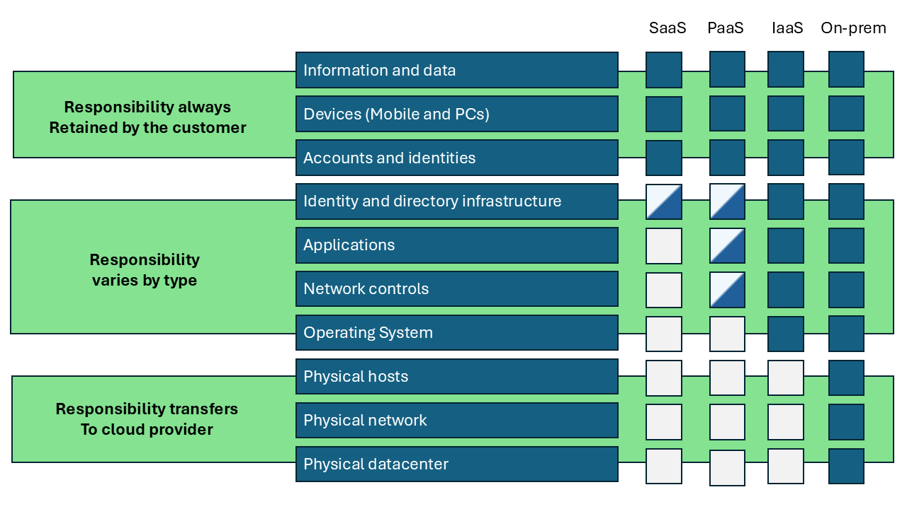
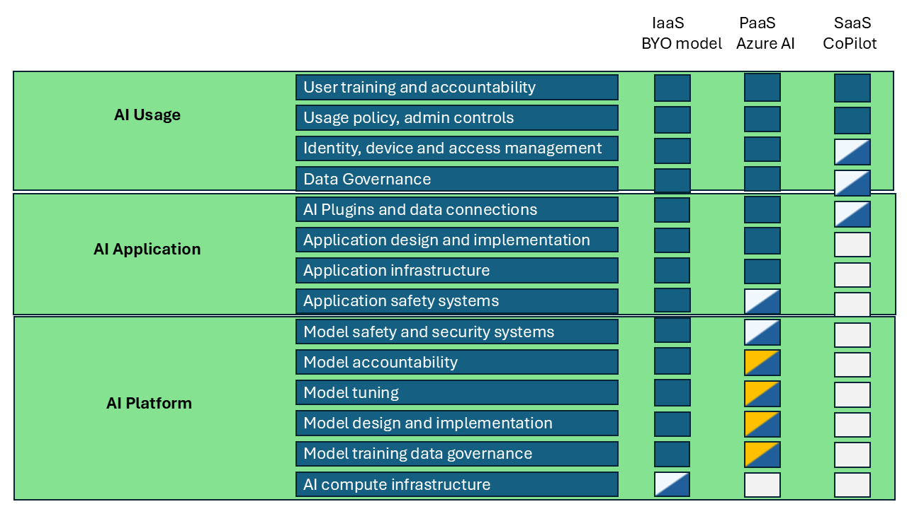
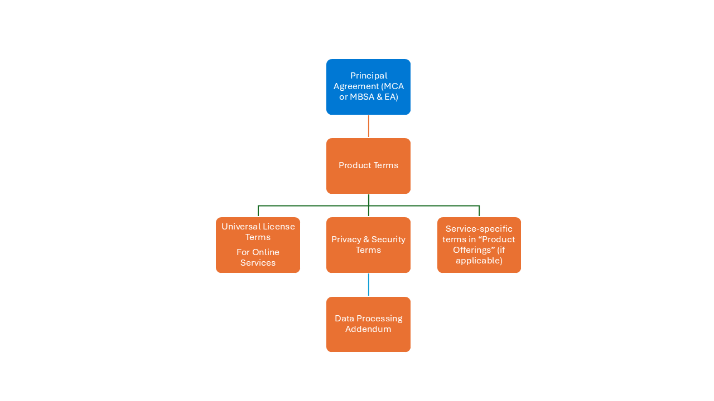
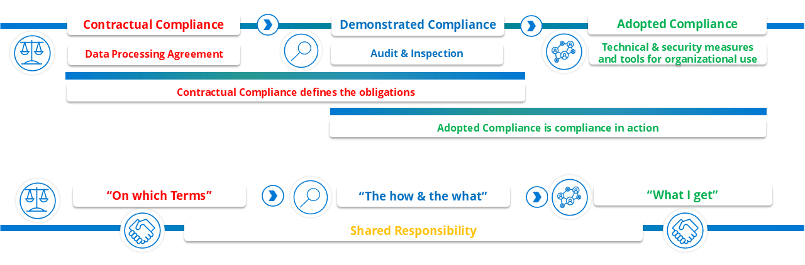

# A data platform - Cloud Environments

In the ever-evolving world of technology, cloud computing has emerged as a beacon of innovation, offering various service models to meet diverse business needs. Imagine a vast digital landscape where companies can choose from different paths, each leading to a unique set of capabilities and controls. These paths are known as Infrastructure as a Service (IaaS), Platform as a Service (PaaS), and Software as a Service (SaaS). Each path offers a different level of control, flexibility, and management, much like choosing between building your own house, renting a fully furnished apartment, or staying in a hotel.

## Infrastructure as a Service (IaaS)

Picture yourself as an architect with a blank canvas. IaaS provides you with the virtualized building blocks over the internet. You have the freedom to create and manage virtual machines, each with its own operating system. It's like having a plot of land where you can build your dream house from scratch.

### Key Features

- Virtual Machines: Imagine creating and managing your own digital homes.
- Storage: Think of scalable storage solutions as vast digital warehouses.
- Networking: Envision virtual networks, load balancers, and IP addresses as the roads and bridges connecting your digital city.
- Flexibility: Scale your resources up or down based on demand, like expanding your house when guests arrive.
- Pay-as-you-go: Pay only for what you use, much like utilities in a real home.

### Use Cases

- Development and Testing: Quickly set up and dismantle development environments, like building and demolishing temporary structures.
- Website Hosting: Host websites and web applications, akin to setting up shops in your digital city.
- Data Storage and Backup: Store large amounts of data with high availability, like having a secure vault.
- Disaster Recovery: Implement disaster recovery solutions with minimal upfront costs, like having an emergency plan for your city.

### Examples

- Microsoft Azure Virtual Machines
- Amazon Web Services (AWS) EC2
- Google Cloud Compute Engine

## Platform as a Service (PaaS)

Now, imagine moving into a fully furnished apartment. PaaS provides a platform that allows you to develop, run, and manage applications without worrying about the underlying infrastructure. It's like having a ready-to-use space where you can focus on your creative endeavors.

### Key Features

- Development Tools: Integrated development environments (IDEs) and tools for coding, testing, and deploying applications, like having a fully equipped workshop.
- Middleware: Software that connects different applications and services, akin to the plumbing and wiring in your apartment.
- Database Management: Managed database services for storing and retrieving data, like having a built-in library.
- Scalability: Automatic scaling of applications based on demand, like having expandable rooms.
- Integration: Easy integration with various services and APIs, like having seamless connections to utilities and services.

### Use Cases

- Application Development: Develop and deploy web and mobile applications, like crafting digital masterpieces.
- API Development: Create and manage APIs for different services, akin to building bridges between digital islands.
- Analytics and Business Intelligence: Build and deploy analytics applications, like setting up observatories to gain insights.
- IoT Applications: Develop and manage Internet of Things (IoT) applications, like creating a smart home.

### Examples

- Google App Engine
- Microsoft Azure App Services
- Heroku

## Software as a Service (SaaS)

Finally, imagine staying in a luxurious hotel. SaaS delivers software applications over the internet on a subscription basis. You access the software via a web browser, and the provider manages everything else. It's like enjoying all the amenities without any of the responsibilities.

### Key Features

- Accessibility: Access applications from any device with an internet connection, like having a key to every room in the hotel.
- Maintenance: The provider handles updates, security, and maintenance, like having a dedicated staff.
- Subscription-Based: Pay for the software on a subscription basis, often monthly or annually, like paying for your stay.
- Scalability: Easily scale the number of users and features as needed, like booking more rooms for guests.
- Integration: Integrate with other SaaS applications and services, like enjoying all the hotel amenities.

### Use Cases

- Business Applications: CRM, ERP, and HR management systems, like having a concierge service.
- Collaboration Tools: Email, instant messaging, and project management tools, like having a conference room.
- Content Management: Manage and distribute digital content, like having a media center.
- E-commerce: Online shopping platforms and payment gateways, like having a shopping arcade.

### Examples

- Microsoft Office 365
- Google Workspace (formerly G Suite)
- Salesforce

## Shared responsibility in a cloud environment

It is important to understand who has the responsibility regarding the different layers in the infrastructure when you use either on-premise or a cloud, and in the cloud understand this across Infrastructure as a Service (IaaS), Platform as a Service (Paas) and Software as a Service (SaaS).

In figure 1 differences between on-premise, IaaS, PaaS, and SaaS in terms of the responsibilities of the cloud provider and the customer are shown.

On a more detailed level this then means the following:

### On-Premise

**Customer Responsibility**:

- Infrastructure - The customer is responsible for purchasing, managing, and maintaining all hardware, including servers, storage, and networking equipment.
- Software -The customer installs, configures, and updates all software, including operating systems, middleware, and applications.
- Security - The customer is responsible for all aspects of security, including physical security, network security, and data protection.
- Data - The customer manages all data, including backups and disaster recovery.

**Cloud Provider Responsibility**:

- None - In an on-premise setup, there is no involvement from a cloud provider.

### Infrastructure as a Service (IaaS)

**Customer Responsibility**:

- Applications - The customer installs, configures, and manages applications.
- Data - The customer is responsible for managing data, including backups and disaster recovery.
- Runtime - The customer manages the runtime environment for applications.
- Middleware - The customer installs and manages middleware.
- Operating System - The customer installs, configures, and updates the operating system.

**Cloud Provider Responsibility**:

- Virtualization - The cloud provider manages the virtualization layer.
- Servers - The cloud provider maintains the physical servers.
- Storage - The cloud provider manages storage infrastructure.
- Networking - The cloud provider handles networking infrastructure.
- Physical Security - The cloud provider ensures the physical security of the data centers.

### Platform as a Service (PaaS)

**Customer Responsibility**:

- Applications - The customer develops, deploys, and manages applications.
- Data - The customer manages data, including backups and disaster recovery.

**Cloud Provider Responsibility**:

- Runtime - The cloud provider manages the runtime environment.
- Middleware - The cloud provider provides and manages middleware.
- Operating System - The cloud provider installs, configures, and updates the operating system.
- Virtualization - The cloud provider manages the virtualization layer.
- Servers - The cloud provider maintains the physical servers.
- Storage - The cloud provider manages storage infrastructure.
- Networking - The cloud provider handles networking infrastructure.
- Physical Security - The cloud provider ensures the physical security of the data centers.

### Software as a Service (SaaS)

**Customer Responsibility**

- Data - The customer manages data, including backups and disaster recovery (to the extent allowed by the SaaS provider).

**Cloud Provider Responsibility**

- Applications - The cloud provider develops, deploys, and manages applications.
- Data - The cloud provider ensures data security and compliance.
- Runtime - The cloud provider manages the runtime environment.
- Middleware - The cloud provider provides and manages middleware.
- Operating System - The cloud provider installs, configures, and updates the operating system.
- Virtualization - The cloud provider manages the virtualization layer.
- Servers - The cloud provider maintains the physical servers.
- Storage - The cloud provider manages storage infrastructure.
- Networking - The cloud provider handles networking infrastructure.
- Physical Security - The cloud provider ensures the physical security of the data centers.

This division of responsibilities helps organizations choose the right cloud service model based on their needs and capabilities.
This choice can/should/must differ from project to project, so that a customer always achieves to optimal solution based on functionality and costs.

## Shared responsibility in an AI cloud environment
'

In the context of AI, the responsibilities of the cloud provider and the customer differ significantly across Infrastructure as a Service (IaaS), Platform as a Service (PaaS), and Software as a Service (SaaS).

Here’s an overview of these differences:

### Infrastructure as a Service (IaaS) - Bring Your Own Model

**Customer Responsibilities**

- AI Model Development - Customer are responsible for developing, training, and deploying their AI models. This includes selecting and configuring the necessary software and tools.
- Data Management - Customer handle data preparation, storage, and management, including ensuring data quality and compliance with relevant regulations.
- Runtime Environment - Customer manage the runtime environment, including the operating system, middleware, and runtime libraries.
- Security - Customer are responsible for securing their applications and data, including implementing access controls and monitoring for security threats.

**Cloud Provider Responsibilities**

- Infrastructure - The cloud provider manages the underlying infrastructure, including physical servers, storage, and networking.
- Virtualization - The provider handles the virtualization layer, ensuring that virtual machines are available and functioning correctly.
- Basic Security - The provider ensures the physical security of data centers and the security of the infrastructure.

### Platform as a Service (PaaS) - Azure AI

**Customer Responsibilities**

- AI Model Development - Customer focus on developing and deploying AI models using the tools and frameworks provided by the PaaS.
- Data Management - Customer manage their data, including data preparation and ensuring compliance with relevant regulations.
- Application Logic - Customer are responsible for the logic and functionality of their AI applications.

**Cloud Provider Responsibilities**

- Infrastructure and Runtime - The cloud provider manages the underlying infrastructure, operating system, middleware, and runtime environment.
- AI Tools and Frameworks - The provider offers pre-built AI tools, frameworks, and services that Customer can use to develop and deploy their models.
- Security - The provider ensures the security of the platform, including patching and updating the operating system and middleware.

### Software as a Service (SaaS) - CoPilot

**Customer Responsibilities**

- Data Input - Customer provide the data that the AI service will process.
- Configuration - Customer configure the AI service to meet their specific needs, such as setting parameters and defining workflows.
- Usage - Customer use the AI service to achieve their business objectives, such as generating insights or automating tasks.

**Cloud Provider Responsibilities**

- Everything Else - The cloud provider manages the entire stack, including the infrastructure, runtime environment, AI models, and application logic.
- AI Service Delivery - The provider ensures that the AI service is available, reliable, and secure. This includes maintaining and updating the AI models and the underlying infrastructure.
- Data Security - The provider ensures the security and compliance of the data processed by the AI service.

## **The contracts**

> [!NOTE]
> The provided description is for informational purpose **ONLY** and do not in any way replace using the original documents.
> These documents can be found [here](<https://www.microsoft.com/en-us/licensing>) and [here][<https://servicetrust.microsoft.com/>]

The foundation of understanding who has what responsibility requires documents describing how this handled.

The rest of this section describes the structure within Microsoft and hence a data platform based on Azure. Please consult similar documentation depending on the infrastructure in question.

The different aspects of shared responsibility in Microsoft are handled in multiple documents.

This is shown in figure 4.

The **Principal Agreement (MCA or MBSA & EA)** is the "main" contract describing the "purchasing conditions"

The **Product Terms** provides more detailed information about the rights and restrictions associated with the use of Microsoft products and services. 

**Product Terms** addresses several key aspects including:

- **Purpose and Scope**
   - The primary purpose of the Product Terms is to explain the rights granted to Customer for using Microsoft products (the "use rights") and any restrictions or limitations on their use .
   - The Product Terms may also include other obligations that the customer may have with respect to a product, which are not covered in upstream agreements .

- **Content**

   - The Product Terms cover various aspects such as licensing terms, privacy and security terms, data processing addendum, and service-specific terms.
   - They also include universal license terms for online services and specific terms for different product offerings.

- **Generative AI Services**
   - The Product Terms include specific provisions for the use of Microsoft Generative AI Services, such as restrictions on using these services to generate synthetic training data for developing AI models with similar functionality to Microsoft AI services.
   - Customer may use the Azure OpenAI Service to create synthesized data solely for fine-tuning certain model types.

- **Updates and Accessibility**
   - The Product Terms are regularly updated to reflect changes in Microsoft's product offerings and services .
   - They are accessible through the website with [Product Terms](<https://www.microsoft.com/en-us/licensing>),, where Customer can find detailed information about the terms applicable to their specific products .

Overall, the Microsoft Product Terms are designed to provide clear, concise, and comprehensive information about the use rights and obligations associated with Microsoft products and services, ensuring that customers have a clear understanding of their licensing terms and conditions.

The **Product Terms** is further "unfolded" in three documents:

- Privacy & security Terms
- Universal License Terms for Online Services
- Service-Specific Terms in "Product Offerings"

### Privacy & Security Terms

The Privacy & Security Terms contain several key elements designed to ensure the protection of **personal data** and compliance with relevant regulations. Here is an overall description of what they include:

- Data Protection and Privacy 
   - Privacy Standards - The terms outline the privacy standards that Microsoft adheres to, ensuring that personal data is collected, used, and shared in a manner that respects individuals' privacy rights.
   - Data Taxonomy and Use Framework - This framework helps categorize and manage data based on its sensitivity and intended use.
   - Privacy Incidents - Procedures for handling privacy incidents, including reporting and mitigation steps, are detailed to ensure swift and effective responses.
- Security Measures
   - Information Security - The terms include requirements for handling confidential information, ensuring that access to Microsoft and customer data is granted only on a legitimate business need basis.
   - Security Controls - Guidelines for maintaining security controls, such as not sharing user account credentials and securing devices when not in use, are provided to prevent unauthorized access.
   - Compliance with Standards - Microsoft complies with various security standards and certifications, such as ISO 27001, ISO 27018, and ISO 27701, to ensure robust data protection.
- Use of Customer Data
   - Data Processing - The terms govern how customer data is processed, stored, and disclosed, with commitments to privacy and security.
   - Third-Party Software - Any use of third-party software must follow a governance process to mitigate risks and ensure proper review.
- Responsible AI
   - Ethical AI Use - The approach to responsible AI focuses on fairness, inclusiveness, transparency, privacy, security, reliability, and safety.
   - Compliance with AI Regulations - The terms ensure that the use of AI technologies complies with relevant regulations.
- Employee Data
   - Privacy Principles - The same privacy principles applied to customer data are also applicable to employee data, ensuring consistent protection across all personal data.
- Supplier Security & Privacy Assurance
   - Supplier Requirements: Suppliers handling personal data on Microsoft's behalf must adhere to privacy and security requirements, ensuring compliance and protection.

These elements ensure that The Privacy & Security Terms are comprehensive, clear, and compliant with relevant regulations, making it easier for customers to understand and trust the data handling practices.

**Universal License Terms for Online Services**

The Universal License Terms for Online Services contain several key elements designed to ensure clarity, consistency, and compliance with relevant regulations. Here is an overall description of what they include:

- Definitions - The terms provide clear definitions for key concepts and terminology used throughout the document. This ensures that all parties have a common understanding of the terms and conditions.
- Customer’s Use Rights - Customer are granted specific use rights for the online services they have licensed. These rights are contingent upon compliance with the volume licensing agreement and the specific terms outlined in the product terms. Customer need a license for each product and separately licensed functionality used on a device or by a user.
- Compliance with Laws - The terms ensure that the use of online services complies with applicable laws and regulations, including import/export services, acceptable use policies, and technical limitations.
- Data Protection and Privacy - The terms include commitments to data protection and privacy, ensuring that customer data is handled in compliance with relevant regulations such as GDPR. This includes details on how data is processed, stored, and disclosed.
- Security Measures - The terms outline the security measures that must be in place to protect customer data. This includes requirements for handling confidential information and maintaining security controls to prevent unauthorized access.
- Service Level Agreements - Many online services offer SLAs that outline performance and availability guarantees provided to Customer. These agreements specify the commitments for uptime and connectivity.
- Use of Customer Data - The terms govern the use of customer data, including how it is processed, stored, and disclosed. This includes commitments to privacy and security, as well as specific terms for the use of customer data in different regions.
- Responsible AI - The approach to responsible AI focuses on fairness, inclusiveness, transparency, privacy, security, reliability, and safety. The terms ensure that the use of AI technologies complies with relevant regulations.
- Updates and Changes - The terms may be updated to reflect changes in regulatory requirements, new features, or other relevant updates. Customer are informed of these changes and how they impact their use of the online services.

These elements ensure that The Universal License Terms for Online Services are comprehensive, clear, and compliant with relevant regulations, making it easier for customers to understand and use the services effectively.

### Service-Specific Terms in Product Offerings

In case their is a need for special terms to a given service (normal due to the nature of what this service does), the Service-specific terms Product Offerings documents this.
This document contains several key elements designed to provide clarity and detailed information about the specific service in question.

Here is an overall description of what they include:

- Service Definitions - These terms provide clear definitions for each service offered, ensuring that Customer understand the scope and nature of the services they are using.
- Usage Rights and Restrictions - Detailed information about the usage rights granted to Customer for each service, including any restrictions or limitations on how the services can be used.
- Service Level Agreements (SLAs) - Specific performance and availability guarantees for each service, outlining the commitments we make regarding uptime, response times, and other key performance indicators.
- Data Protection and Privacy - Information on how customer data is handled, including data processing, storage, and disclosure practices. This section ensures compliance with relevant data protection regulations and outlines The commitments to maintaining customer privacy.
- Security Measures - Details on the security measures in place to protect customer data and ensure the integrity and confidentiality of the services. This includes information on access controls, encryption, and other security protocols.
- Compliance with Laws - Assurance that the use of The services complies with applicable laws and regulations, including import/export controls, acceptable use policies, and technical limitations.
- Updates and Changes - Information on how updates and changes to the services will be communicated to Customer, including any potential impacts on service usage or performance.
- Support and Maintenance - Details on the support and maintenance services available to Customer, including how to access support, response times, and any associated costs.
- Termination and Suspension - Conditions under which services may be terminated or suspended, including customer responsibilities and any notice periods required.

### Data Processing Addendum

The document Privacy & Security Terms is "supported" by the critical document Data Processing Addendum (DPA) which outlines the terms and conditions related to the processing and protection of personal data.
Here is an overall description of what The Data Processing Addendum contains:

- Definitions - The DPA provides clear definitions for key terms such as "Data Controller," "Data Processor," "Personal Data," and "Data Subject." These definitions ensure that all parties have a common understanding of the terms used throughout the document.
- Data Processing Terms - This section outlines the specific terms and conditions under which personal data will be processed. It includes details on the nature, purpose, and duration of the data processing activities, as well as the types of personal data and categories of data subjects involved.
- Compliance with Laws - The DPA ensures that all data processing activities comply with applicable data protection laws and regulations, such as the General Data Protection Regulation (GDPR) and the California Consumer Privacy Act (CCPA). This includes commitments to adhere to data protection principles and to implement appropriate technical and organizational measures to protect personal data.
- Data Security - This section details the security measures that must be in place to protect personal data. It includes requirements for maintaining the confidentiality, integrity, and availability of personal data, as well as procedures for handling security incidents and breaches.
- Data Subject Rights - The DPA outlines the rights of data subjects, such as the right to access, rectify, erase, and restrict the processing of their personal data. It also includes procedures for responding to data subject requests and ensuring that data subjects can exercise their rights.
- Subprocessors - This section provides information on the use of subprocessors, including the conditions under which subprocessors may be engaged and the responsibilities of the Data Processor in relation to subprocessors. It also includes requirements for ensuring that subprocessors comply with the same data protection obligations as the Data Processor.
- Data Transfers - The DPA addresses the transfer of personal data to third countries or international organizations, ensuring that such transfers are conducted in compliance with applicable data protection laws. This includes the use of appropriate safeguards, such as Standard Contractual Clauses or Binding Corporate Rules.
- Data Retention and Deletion - This section outlines the policies and procedures for retaining and deleting personal data. It includes requirements for ensuring that personal data is only retained for as long as necessary to fulfill the purposes for which it was collected and for securely deleting personal data when it is no longer needed.
- Audit Rights - The DPA grants the Data Controller the right to conduct audits and inspections to verify the Data Processor's compliance with the terms of the DPA and applicable data protection laws. This includes provisions for providing access to relevant records and information.
- Liability and Indemnification - This section outlines the liability and indemnification obligations of the parties in relation to data protection breaches and non-compliance with the DPA. It includes provisions for compensating data subjects for damages resulting from data protection violations.

These elements ensure that The Data Processing Addendum is comprehensive, clear, and compliant with relevant data protection regulations, providing a robust framework for the processing and protection of personal data.

## Data Security and compliance

Based on the nature of the cloud services (IaaS, PaaS, and SaaS) being used in ones data platform and the contractual items that are being used a process defining ones security posture should be established.

In this process it should be clear how has the responsibility for the different elements in the platform.

The first step should be "on which terms" do we operate, that is the **Contractual Compliance** defining the obligations between the parties and that also sets out how adherence with obligations must be demonstrated.

When we has established on which terms we operate, the next step would be to **demonstarte compliance** that is kind of the "the how and the what", where we demonstrate *shared responsibility* in practice. This means the ability do auditing and inspection.

The last step is then to **Adopt Compliance**, that is having compliance in action. This affects the Compliance, Security and Risk posture related to organizational use of data.

## Microsoft Approach for Data Security and Data Compliance in Online Services

**Contractual Compliance**

- Product Terms and DPA

- DPA has the general obligations
   - Product-specific terms and Product Documentation has specific terms and guidance.
   - One general DPA for Products (Online Services and Software) and Professional Service
      - With different terms for:
         - Online Services Previews vs. Online Services
         - Online Services vs. Core Online Services
         - Core Online Service vs. EU Data Boundary Online Service

Important to remember that their might be Product-specific terms. And that Product Documentation describes specific data use scenarios and
features for customer configuration

**Demonstrated Compliance**

- Service Assurance
   - Learn descriptions of Datacenter operations & controls design to safeguards customer data
   - Learn Training & education paths

- Third-party Certification & Audits
   - Microsoft controls based on various standards
   - Third-party Certification & Audits Third-party attestation & certification (ISO, SOC etc.)

- Penetration Testing
   - Third-party testing and/or by customers

- Compliance Program
   - White glove service available for annual fee

**Adopted Compliance**

- Technical & security measures and tools for organizational use
   - Data security tools
   - Encryption, Customer Lockbox etc.

