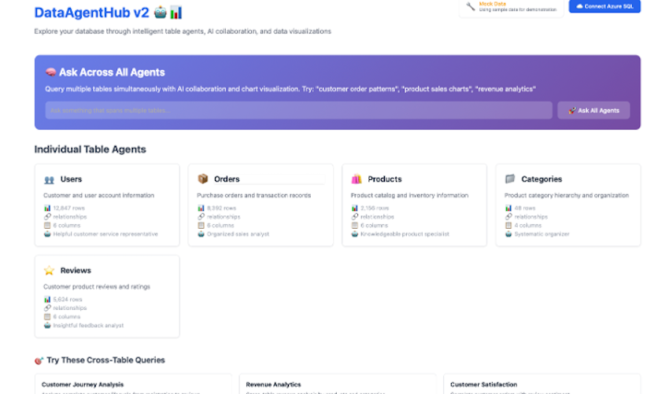

# Vibe Programming used with the Data Platform - an example

## For inspiration

I have made a setup myself for a customer using VIBE programming. Here can you read more about VIBE in a Microsoft context.
(https://learn.microsoft.com/en-us/training/modules/introduction-vibe-coding/)

I used this stating my idea as follows (using CoPilot):

---
  
*I am participating in a creative Prompt to Prototype challenge where the end goal is to build a web-based prototype in 4 modules:*  
*1. Research*  
*2. Product Requirements Document (PRD)*  
*3. Branding & Logo*  
*4. Prototype*  
*Here is my idea: I would like to create a setup where tables in an AzureSQL Database each are represented by an agent. Each agent provides information*  
*about what the content represent, what columns can be returned and which if these columns could be used to join with other tables also provided through*  
*agents. In this way each agent would be able to return the appropriate part of information needed to answer an overall task request. Notice that each*  
*agent must be able to connect to AzureSQL database.*  
*Please help me scope it by filling out the following details:*  
*1. Scenario (theme or context)*  
*2. Audience (target users)*  
*3. Vibe Words (2–3 adjectives for style and tone)*  
*4. Format (type of web experience — app, game, dashboard, interactive toy, quiz etc.)*  
*5. Concept (short description)*  
*6. Goal (what it aims to achieve)*  
*7. Title (placeholder name)*  
*8. MVP Features (small, completable in <2 hours)*  
*9. Stretch Goals (2–3 enhancements)*  
*Output the result in a table with these columns: Scenario | Audience | Vibe Words | Format | Concept | Goal | Title | MVP Features | Stretch Goals.*  
  
---

I then used Visual Studio Code to create an application using Github Copilot:

---

*Attached is my Product Requirements document named DataAgentHub-vs_PRD.md. Please refine and update this document to be optimized*  
*for vibe coding a lightweight client-side web application.*  
  
*Make the purpose clear, identify core features for a simple prototype, outline key user flows, and ensure it supports building with limited time.*  
  
*Update the document directly with your improvements.*
  
---

And got this application

