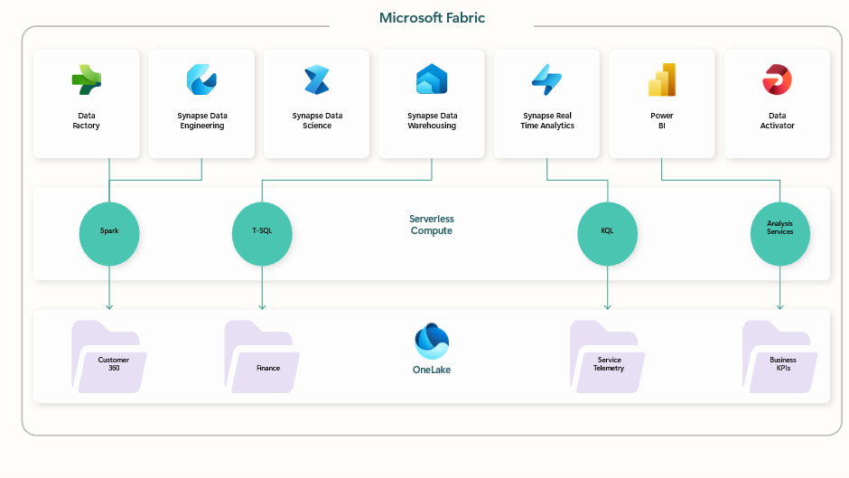

# Fabric based.

Microsoft Fabric is an all-in-one analytics solution that covers everything from *data* movement to *data* science, Real-Time Analytics, and business intelligence. 
The platform is built on a foundation of Software as a Service (SaaS), which handles all integration between the different components being used in the data platform.
Microsoft Fabric brings together new and existing components from Power BI, Azure Synapse, and Azure *data* Factory into a single integrated environment. These components are then presented in various customized user experiences.

 
Figure 1

You can build a data platform using Fabric but due to the nature of Fabric being a SaaS solution this will not provide you with a technology independent solution.
Fabric could fit very well in the **consume area** where it could be used as a “copy-cat” of the data platform itself. Hence you could provide similar functionality to organizations that would like to do more advanced analytics and be able to bring their own data, but still having this in a “controlled” environment.
