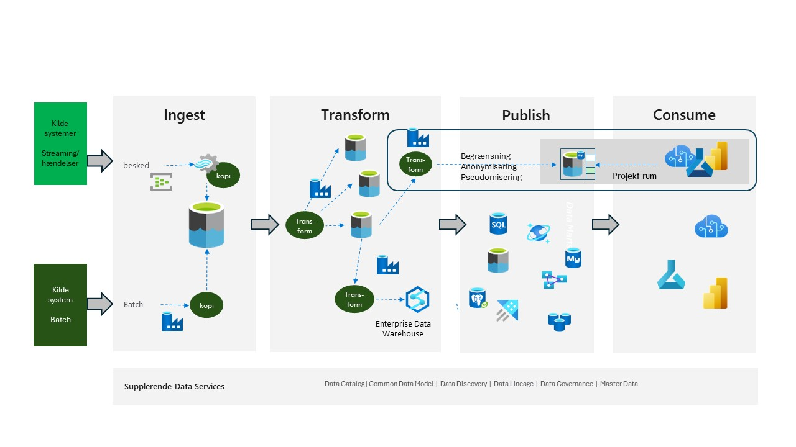

# Baseret på Azure-tjenester.

Implementering af dataplatformen ved hjælp af Azure-tjenester resulterer i en meget fleksibel og agil tilgang. Dette vil opfylde alle emner, der er anført i kapitlet ”Overordnet paradigme".

Figur 1 viser de Azure-tjenester, der normalt bruges i denne tilgang.

Figur 1

I **Ingest** området finder man *Azure Event Hub* og *Azure Real-Time Analytics* til håndtering af indgående meddelelser samt *Azure Data Factory* til håndtering af batch kopierings-processen. Som datalager bruges *Azure Data Lake*.

I **Transform** området vil ETL-processen håndteres af *Azure Data Factory Data Flow* (alt Azure Databricks*), og datalager vil også være *Azure Data Lake*. Ønsker man eventuelt at oprette et Enterprise Data Warehouse, kan dette håndteres af *Synapse DW'.

I **publish** området finder man forskellige Azure-databaseteknologier, for eksempel relations databaserne *Azure SQL Database*, *Azure PostgresDB* og *Azure MySQL*. Også databaser som *Azure Cosmos DB*, *Azure Analytical Services* og *Azure Data Explorer* er kandidater sammen med *Azure Data Lake*.

I **consume** området finder man *PowerBI/Fabric* sammen med *Azure Machine Learning* og *Azure AI Foundry*.