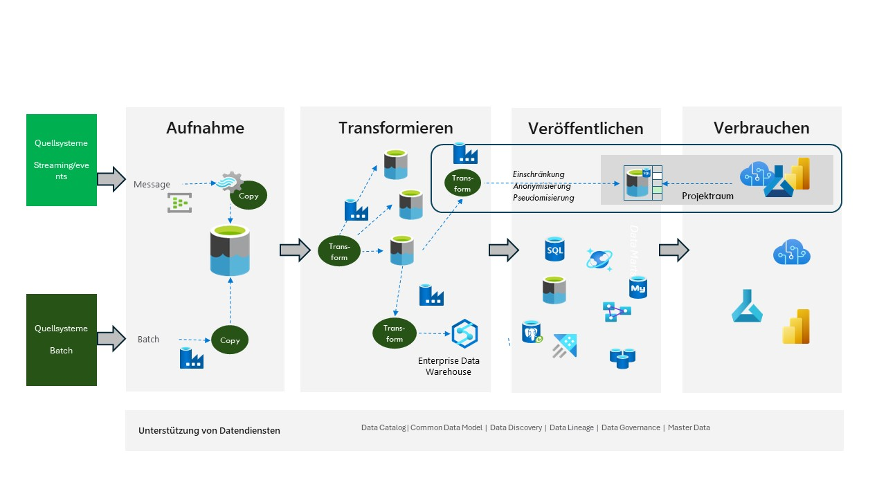

# Eine Data Platform - Basierend auf Azure-Diensten

Die Implementierung der Datenplattform mithilfe von Azure-Diensten führt zu einem sehr flexiblen und agilen Ansatz. Damit sind alle Themen erfüllt, die im Kapitel "Gesamtparadigma" aufgeführt sind.

Abbildung 1 zeigt die Azure-Dienste, die normalerweise bei diesem Ansatz verwendet werden.

Abbildung 1

Im Bereich **Aufnahme** befinden sich *Azure Event Hub* und *Azure Real Time Analytics* zum Verarbeiten eingehender Nachrichten sowie *Azure Data Factory* zum Verarbeiten des Batchkopiervorgangs. Die Speicherebene ist *Azure Data Lake*.

Im Bereich **Transformieren** würde der Prozess dann von *Azure Data Factory Data Flow* (alt. *Azure Databricks*) verarbeitet, und die Speicherschicht wäre ebenfalls *Azure Data Lake*. Wenn Sie ein *Enterprise Data Warehouse* erstellen möchten, kann dies von *Synapse DW* verarbeitet werden.

Im **Veröffentlichungsbereich** finden Sie verschiedene Azure-Datenbanktechnologien, nämlich die relationalen Datenbanken *Azure SQL Database*, *Azure PostgresDB* und *Azure MySQL*. Auch Datenbanken wie *Azure Cosmos DB*, *Azure Analytical Services* und *Azure Data Explorer* sind neben *Azure Data Lake* Kandidaten.

Im Bereich **Verbrauchen** finden Sie *PowerBI/Fabric* zusammen mit *Azure Machine Learning* und *Azure AI Foundry*.

