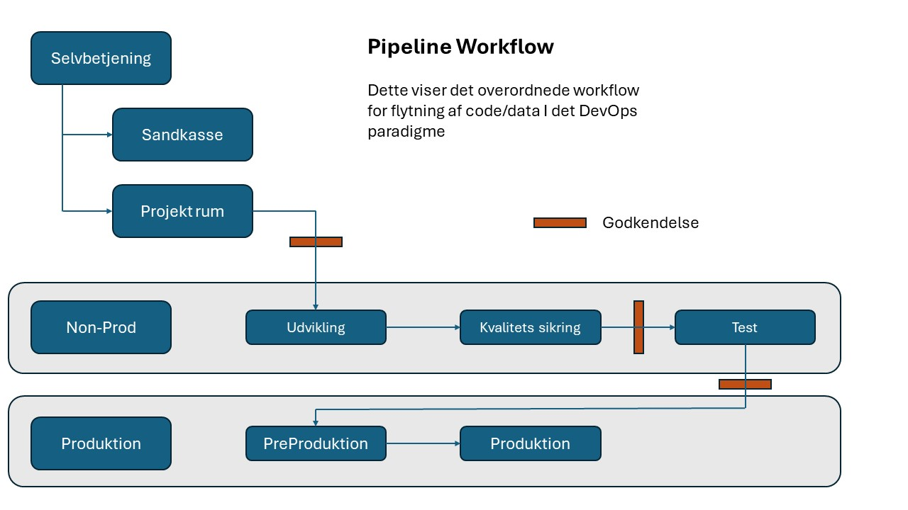

# Baseret på Azure-tjenester.

Implementering af dataplatformen ved hjælp af Azure-tjenester resulterer i en meget fleksibel og agil tilgang. Dette vil opfylde alle emner, der er anført i kapitlet ”Overordnet paradigme".

Figur 1 viser de Azure-tjenester, der normalt bruges i denne tilgang.

Figur 1

I **Ingest** området finder man Azure Event Hub og Real-Time Analytics til håndtering af indgående meddelelser samt Data Factory til håndtering af batch kopierings-processen. Som datalager bruges Azure Data Lake.

I **Transform** området vil ETL-processen håndteres af Data Factory Data Flow, og datalager vil også være Azure Data Lake. Ønsker man eventuelt at oprette et Enterprise Data Warehouse, kan dette håndteres af Synapse DW.

I **publish** området finder man forskellige Azure-databaseteknologier, for eksempel relations databaserne Azure SQL Database, Azure PostgresDB og Azure MySQL. Også databaser som Azure Cosmos DB, Azure Analytical Services og Azure Data Explorer er kandidater sammen med Azure Data Lake.

I **consume** området finder man PowerBI sammen med Azure Machine Learning og Azure AI Studio.