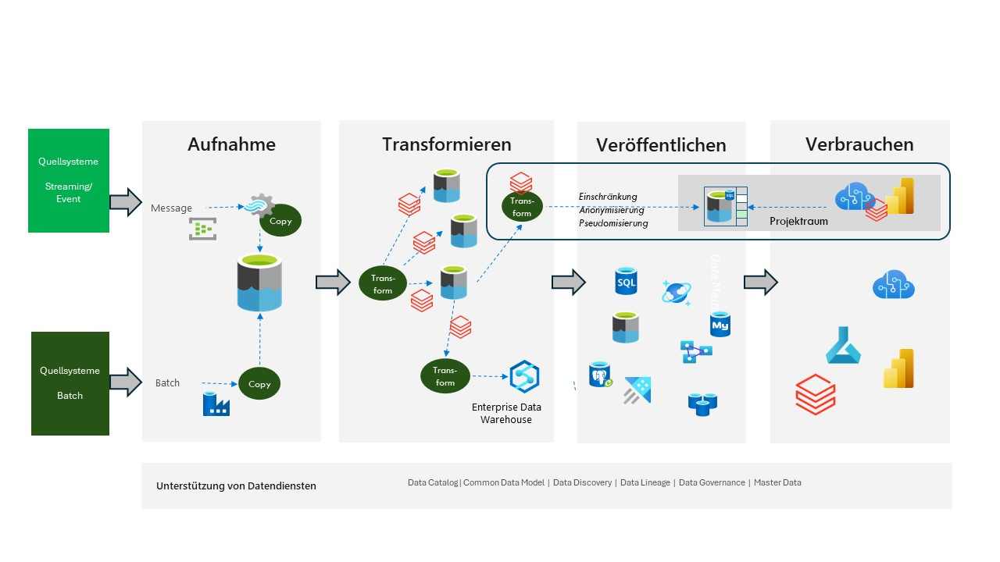

# Azure Databricks-basiert

Dieser Ansatz ähnelt dem Azure-basierten Ansatz, mit der Ausnahme, dass Databricks anstelle von Data Factory Data Flow und möglicherweise Synapse DW verwendet wird.

Wenn Sie möchten, können Sie auch Databricks anstelle von SQL Server verwenden.

Die technologische Unabhängigkeit liegt darin, dass Databricks auf Python und Spark basiert. Aber Sie werden einen Ansatz haben, bei dem ein größerer Teil der "Programmierung" im selben Tool erledigt wird.

Abbildung 1

Abbildung 1 zeigt, wo Databricks am ehesten hineinpassen würde. Dieser Ansatz passt auch sehr gut zum Medaillon-Ansatz, der sehr häufig in einem Databricks Lakehouse-Ansatz verwendet wird.

Weitere Informationen zu Azure Databricks finden Sie hier [Azure Databricks Info](https://azure.microsoft.com/de-de/products/databricks)