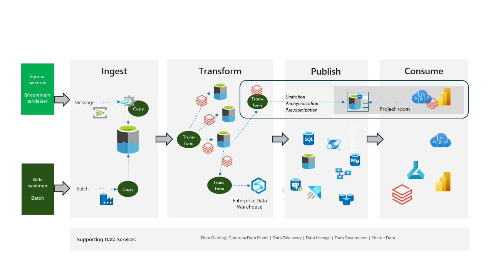

# Azure Databricks based

This approach is actually similar to the Azure Based approach, except that Databricks is being used instead of Data Factory Data Flow and maybe Synapse DW.

You can also use Databricks instead of SQL Server if you want.

Technological independence is in the fact that Databricks is based on Python and Spark. But you will have an approach where more of the “programming” is done in the same tool.

Figure 1

Figure 1 shows where Databricks most likely would fit in. This approach also fits very well with the medallion approach very often used in a Databricks Lakehouse approach.

More information about Azure Databricks can be found here [Azure Databricks Info](https://azure.microsoft.com/en-us/products/databricks)