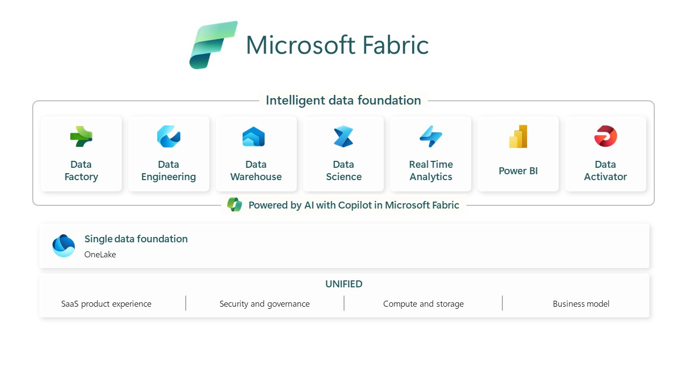

# A Data Platform - Microsoft Fabric based

*Microsoft Fabric* er en alt-i-én-analyseløsning, der dækker alt fra dataflytning til datavidenskab, realtidsanalyse og Business Intelligence.

*Microsoft Fabric* er en Software as a Service (SaaS), som håndterer al integration mellem de forskellige komponenter, der bruges i platformen.

*Microsoft Fabric* samler nye og eksisterende komponenter som *Power BI*, *Azure Synapse* og *Azure Data Factory* i et enkelt integreret miljø. Disse komponenter præsenteres derefter i forskellige tilpassede brugeroplevelser.

*Figur 1*

Man kan bygge en dataplatform ved hjælp af *Microsoft Fabric*, men på grund af at *Microsoft Fabric* er en SaaS-løsning vil dette - naturligvis - ikke give en teknologiuafhængig løsning.
*Microsoft Fabric* er dog stadig en åben platform med API'er, der kan bruges til at interagere med den fra andre værktøjer.

I *figur 2* illustreres forskellige måder at bruge *Microsoft Fabric* på inden for dataplatformskonceptet.

*Figur 2*

Øverst på figuren passer *Microsoft Fabric* rigtig godt ind i **consume area** , hvor det kunne bruges som en "copy-cat" af selve dataplatformen. Her vil man kunne levere lignende funktionalitet til afdelinger/projekter/organisationer, der gerne vil lave mere avancerede analyser og/eller være i stand til at bringe deres egne data, men stadig have dette i et "kontrolleret" miljø.

Og nederst i figuren ses en implementering, hvor *Microsoft Fabric* er selve dataplatformen.

I mellem disse to lag er det så muligt at lave den kombination der passer bedst til den givne use-case.

Du kan finde flere oplysninger om Microsoft Fabric her (<https://www.microsoft.com/en-us/microsoft-fabric>)

