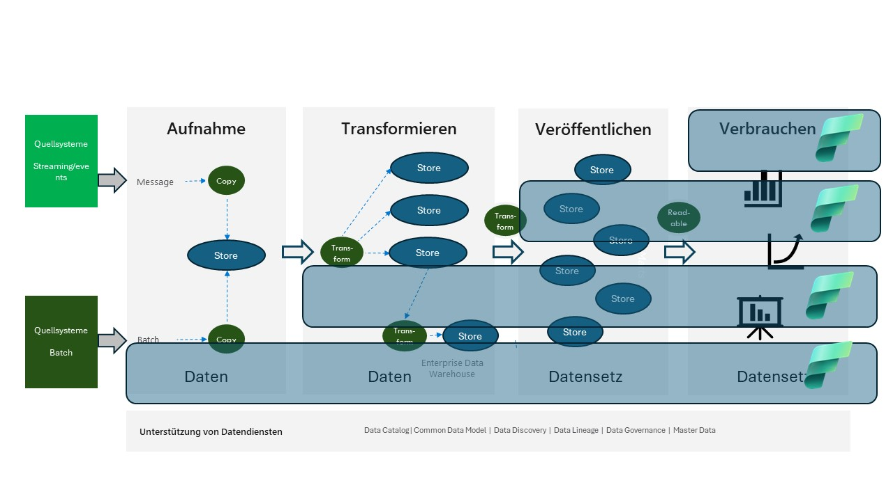

# Microsoft Fabric-basiert.

Microsoft Fabric ist eine All-in-One-Analyselösung, die alles abdeckt, von Datenbewegungen über Data Science bis hin zu Echtzeitanalysen und Business Intelligence.

Die Plattform basiert auf einer Software-as-a-Service (SaaS), die die gesamte Integration zwischen den verschiedenen Komponenten übernimmt, die in der Datenplattform verwendet werden.

Microsoft Fabric vereint neue und vorhandene Komponenten aus Power BI, Azure Synapse und Azure Data Factory in einer einzigen integrierten Umgebung. Diese Komponenten werden dann in verschiedenen maßgeschneiderten Benutzererlebnissen präsentiert.

 
 
Abbildung 1

Sie können mit Fabric eine Datenplattform erstellen, aber da es sich bei Fabric um eine SaaS-Lösung handelt, erhalten Sie dadurch natürlich keine technologieunabhängige Lösung.

Dies sind mögliche Möglichkeiten, Microsoft Fabric innerhalb des Datenplattformkonzepts zu nutzen.

Oben in der Abbildung passt Microsoft Fabric sehr gut in den **Verbrauchenbereich**, wo es als "Nachahmer" der Datenplattform selbst verwendet werden könnte. Daher könnten Sie Abteilungen/Projekten/Organisationen, die fortschrittlichere Analysen durchführen und in der Lage sein möchten, ihre eigenen Daten einzubringen, eine ähnliche Funktionalität bereitstellen, diese jedoch immer noch in einer "kontrollierten" Umgebung haben.

Und zum unteren Rand der Abbildung, wo Microsoft Fabric die Datenplattform selbst ist.

Weitere Informationen zu Microsoft Fabric finden Sie hier [Microsoft Fabric Info](https://www.microsoft.com/de-de/microsoft-fabric)
