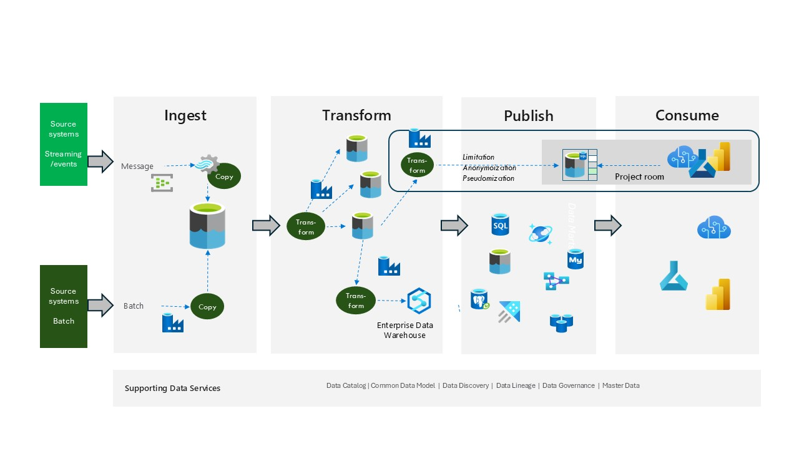

# A Data Platform - Microsoft Fabric based

Microsoft Fabric is an all-in-one analytics solution that covers everything from data movement to data science, Real-Time Analytics, and Business Intelligence.

Fabric is a Software as a Service (SaaS), which handles all integration between the different components being used in the platform.

Microsoft Fabric brings together new and existing components like Power BI, Azure Synapse, and Azure Data Factory into a single integrated environment. These components are then presented in various customized user experiences.

*Figure 1*

You can build a data platform using Fabric but due to the nature of Fabric being a SaaS solution this will - naturally - not provide you with a technology independent solution.
Fabric is however still an open platform with API's that can be used to interact with it from other tools.

In *figure 2* different ways of using Microsoft Fabric within the data platform concept are illustrated.

*Figure 2*

At the top of the figure Microsoft Fabric fits very well in the **consume area** where it could be used as a “copy-cat” of the data platform itself. Hence you could provide similar functionality to departments/projects/organizations that would like to do more advanced analytics and/or be able to bring their own data, but still having this in a “controlled” environment.

And to the bottom of the figure we have an implementation where Microsoft Fabric is the data platform itself.

More information about Microsoft Fabric can be found here [Microsoft Fabric Info](https://www.microsoft.com/en-us/microsoft-fabric)

