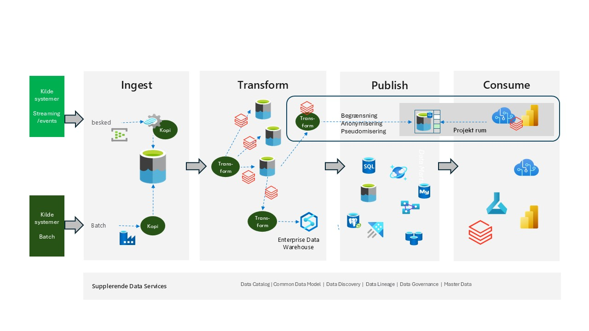

# Synapse baseret

Azure Synapse er en virksomhedsanalysetjeneste, der fremskynder tiden til indsigt på tværs af data warehouses og big data-systemer. Azure Synapse samler det bedste fra SQL-teknologier, der bruges i virksomhedsdatalagring, Spark-teknologier, der bruges til big data, Data Explorer til log- og tidsserieanalyse, pipelines til dataintegration og ETL/ELT samt dyb integration med andre Azure-tjenester som Power BI, CosmosDB og AzureML.

Brugen af Synapse vil være på linje med den Azure-baserede tilgang, men i dette tilfælde er man ikke teknologisk uafhængig i **ingest**, **transform** og **publish** områderne, fordi man kommer til udføre al "programmering" i Synapse-tjenesten.