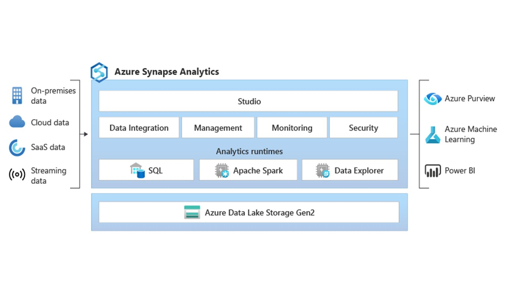

# Eine Datenplattform - Azure Synapse

*Azure Synapse* ist ein Analysedienst für Unternehmen, der die Zeit bis zum Gewinnen von Erkenntnissen in Data Warehouses und Big Data-Systemen verkürzt. *Azure Synapse* vereint die besten SQL-Technologien, die im Data Warehousing von Unternehmen verwendet werden, Spark-Technologien für Big Data, Daten-Explorer für Protokoll- und Zeitreihenanalysen, Pipelines für die Datenintegration und ETL/ELT sowie eine tiefe Integration in andere Azure-Dienste wie *Power BI*, *CosmosDB* und *Azure Machine Learning*.

Die Verwendung von *Azure Synapse* wird in den Linien des Azure-basierten Ansatzes liegen, aber in diesem Fall sind Sie im **Aufnahme**, **Transformieren** und **Veröffentlichen** technologisch nicht unabhängig, da Sie die gesamte "Programmierung" innerhalb des Synapse-Dienstes vornehmen werden.

Weitere Informationen zu *Azure Synapse* finden Sie hier (<https://learn.microsoft.com/en-us/azure/synapse-analytics/overview-what-is>)

