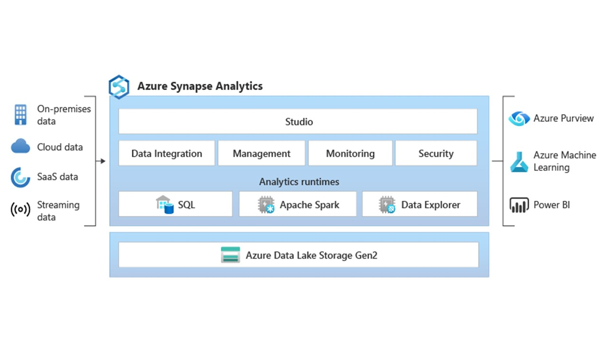

# A data platform - Azure Synapse

*Azure Synapse* is an enterprise analytics service that accelerates time to insight across data warehouses and big data systems. *Azure Synapse* brings together the best of SQL technologies used in enterprise data warehousing, Spark technologies used for big data, Data Explorer for log and time series analytics, Pipelines for data integration and ETL/ELT, and deep integration with other Azure services such as *Power BI*, *CosmosDB*, and *Azure Machine Learning*.

The usage of *Azure Synapse* will be in the lines of the Azure based approach, but in this case you are not technologically independent in the **ingest**, **transform** and **publish area** because you will do the all the “programming” within the *Azure Synapse* service.

More information about *Azure Synapse* can be found here (<https://learn.microsoft.com/en-us/azure/synapse-analytics/overview-what-is>)

