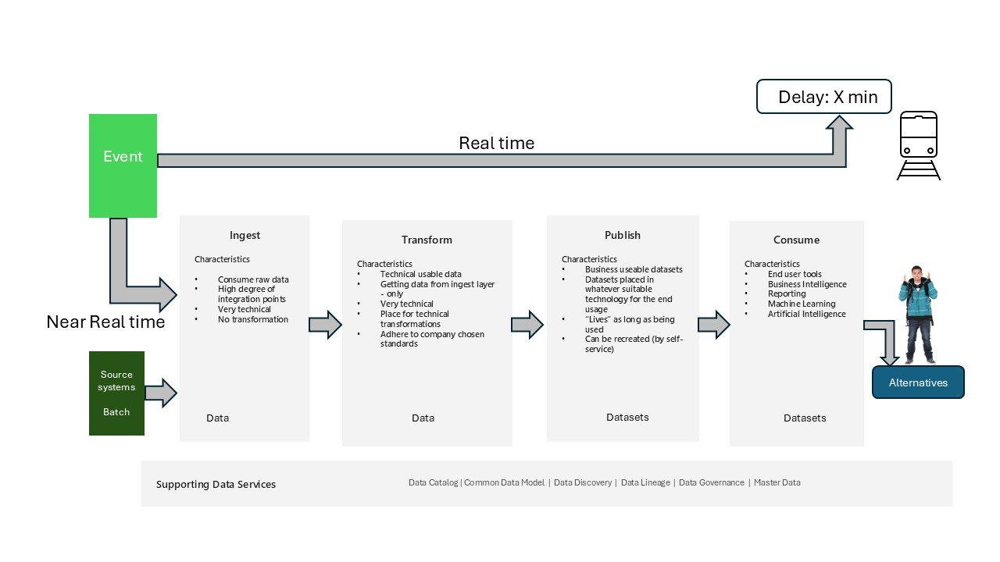

# A data platform - Operations (Work in Progress/CoPilot generated content/lacks human editing)

In the era of digital transformation, cloud computing has become the backbone of modern IT operations. While the cloud offers scalability, flexibility, and cost-efficiency, ensuring **data protection** and **operational resilience** remains critical. This section discusses elements to consider regarding best practices, strategies, and tools for managing IT operations in the cloud with a focus on **backup** and **resilience**.

## Understanding Cloud IT Operations

Cloud IT operations encompass the management of infrastructure, applications, and services hosted in cloud environments. These operations include:

- **Provisioning and scaling resources**
- **Monitoring performance and availability**
- **Ensuring security and compliance**
- **Managing backups and disaster recovery**
- **Automating routine tasks**

## The Importance of Backup and Resilience

### Backup

Backups are essential for protecting data and code against accidental deletion, corruption, ransomware, and system failures. In the cloud, backups should be:

- **Automated**: Scheduled and policy-driven
- **Redundant**: Stored across multiple locations or regions
- **Secure**: Encrypted in transit and at rest
- **Recoverable**: Easily restorable with minimal downtime

Especially for data platforms with larger amounts of data a backup should also adhere to:

- **Divided**: It must be possible to restore data in a way that operations can begin even though all data has not been restored
- **Code-aware**: It must be possible to restore code for recreation of the platform independently of the data itself.

### Resilience

Resilience refers to the system’s ability to **withstand and recover** from failures. This includes:

- **High availability (HA)**: Minimizing downtime through redundancy
- **Disaster recovery (DR)**: Rapid recovery from catastrophic events to a operations state
- **Fault tolerance**: Continuation of operations despite component failures

These elements are discussed in further details in the context of the data platform, please see here - [Data Resilience](../Operations/Ops-Data-Resilience.md).

## Backup Strategies in the Cloud

### Types of Backups

- **Full Backup**: A complete copy of all data and code
- **Incremental Backup**: Only changes since the last backup
- **Differential Backup**: Changes since the last full backup
- **Snapshot Backup**: Point-in-time image of a system or volume

### Backup Best Practices

- **Follow the 3-2-1 Rule**: 3 copies of data and code, 2 different media, 1 offsite
- **Use Cloud-Native Tools**: Azure Backup, AWS Backup, Google Cloud Backup
- **Automate Retention Policies**: Define how long backups are kept
- **Test Restores Regularly**: Ensure backups are usable when needed
- **Organize data for restore**: Especially for larger data sets it should be possible to start being operational without having to wait for a full-restore, which in many
                                 cases can be a question of days.
--**Inform about SLA**: Make sure that the end-users is informed upfront about your SLA and when they can expect to be operational. And during a restore inform them continously about
                        the progress.

## Building Resilient Cloud Architectures

### Design for Failure

- Assume components will fail and design systems to handle it gracefully.
- Use **auto-scaling** and **load balancing** to distribute workloads.

### Multi-Zone and Multi-Region Deployments

- Deploy applications across **availability zones** and **regions** to avoid single points of failure.

### Use Managed Services

- Leverage cloud provider services with built-in resilience (e.g., Amazon RDS, Azure SQL Database).

### Implement Disaster Recovery Plans

- Define **Recovery Time Objective (RTO)** and **Recovery Point Objective (RPO)**.
- Use **pilot light**, **warm standby**, or **multi-site active-active** DR strategies.

## Monitoring and Automation

### Monitoring Tools

- Use cloud-native tools like **Amazon CloudWatch**, **Azure Monitor**, or **Google Cloud Operations Suite**.
- Monitor metrics such as uptime, latency, error rates, and backup success.

### Automation Tools

- Use **Infrastructure as Code (IaC)** tools like Terraform or Microsoft BiCep.
- Automate backup creation, validation, and deletion using scripts or orchestration tools.

## Security and Compliance Considerations

- **Encrypt backups** using customer-managed or provider-managed keys.
- **Control access** with IAM policies and role-based access control (RBAC).
- **Audit logs** to track backup and restore activities.
- Ensure compliance with regulations like **GDPR**, **HIPAA**, or **ISO 27001**.

## Common Pitfalls to Avoid

- Relying on a single backup location
- Not testing backup restores
- Ignoring RTO/RPO requirements
- Overlooking security of backup data
- Failing to update DR plans as systems evolve

## An example of a Data Platform strategy

Based on the "standard" Data Platform as shown in figure 1 the following discusses a strategy on what to take a backup of and how to restore.

Because the discussed data platform relies on automation and infrastructure as code, code besides of the data itself is an important part of the backup strategy.

The data part of the backup **must** take a backup of the ingest lake. And then it might be worth considering if there are data elements in the **publish area** you
could benefit from having a backup of also that could be useful being able to quickly restore in case of a restore scenario. Simply to gain time in the case of an emergency.

The code part **must** be able to restore independently of the data part and in parallel. And it is important that this restore can be done quickly so that you are able to start the restore 
of data and hence the re-establish of the services you had in the **transform area** and in the **publish area** as soon as it makes sense.

## Conclusion

Effective IT operations in the cloud require a proactive approach to **backup and resilience**. By leveraging cloud-native tools, automating processes, and designing for failure,
organizations can ensure business continuity, protect critical data, and maintain trust with stakeholders.

