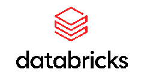

                               

# Partnerløsning – Azure Databricks-baseret – under udvikling

## Indledning

Denne fremgangsmåde svarer faktisk til den Azure-baserede tilgang, bortset fra at Databricks bruges i stedet for Data Factory Data Flow og måske Synapse DW.

Du kan også bruge Databricks i stedet for SQL Server, hvis du vil.

Teknologisk uafhængighed ligger i, at Databricks er baseret på Python og Spark. Men du vil have en tilgang, hvor mere af "programmeringen" udføres i det samme værktøj.

! [figur 1](.. /.. /billeder/dansk/Slide6.JPG)

Figur 1

Figur 1 viser, hvor Databricks højst sandsynligt ville passe ind. Denne tilgang passer også meget godt til medaljontilgangen, der meget ofte bruges i en Databricks Lakehouse-tilgang.

Du kan finde flere oplysninger om Azure Databricks her [Azure Databricks Info](https://azure.microsoft.com/en-us/products/databricks)

Azure Databricks spiller en central rolle i at understøtte opbygningen af en lakehouse-arkitektur, der kombinerer de bedste funktioner i datasøer og data warehouses for at skabe en samlet dataplatform. 

## Azure Databricks

Azure Databricks er en cloudbaseret dataanalyseplatform, der udnytter Apache Spark til at levere et skalerbart og effektivt miljø til big data-behandling og maskinel indlæring. Lakehouse-arkitekturen er på den anden side et moderne datastyringssystem, der kombinerer fordelene ved datasøer og datavarehuse og tilbyder skalerbare lagrings- og behandlingsmuligheder, samtidig med at datakvalitet og styring sikres.

## Nøglekomponenter i Azure Databricks i Lakehouse-arkitektur

1) Delta Lake: Delta Lake er et optimeret lagerlag, der understøtter ACID-transaktioner og håndhævelse af skemaer. Det sikrer datapålidelighed og konsistens, hvilket gør det til en afgørende komponent i lakehouse-arkitekturen. Delta Lake giver mulighed for effektiv dataindtagelse, -behandling og -forespørgsler, hvilket giver et robust fundament for et Lakehouse.
2) Unity Catalog: Unity Catalog er en samlet styringsløsning til data og AI. Det tilbyder finkornet adgangskontrol, dataafstamning og revisionsfunktioner, hvilket sikrer, at dataadgang administreres og er sikker. Unity Catalog spiller en afgørende rolle i opretholdelsen af datastyring i et Lakehouse.
3) Apache Spark: Azure Databricks er bygget på Apache Spark, et effektivt program, der muliggør meget skalerbar databehandling. Apache Sparks muligheder er afgørende for at håndtere store mængder data og udføre komplekse analyseopgaver i et Lakehouse.

## Fordele ved at bygge et søhus med Azure Databricks

1) Unified Data Platform: Lakehouse-arkitekturen giver en enkelt kilde til sandhed for alle data, hvilket eliminerer overflødige systemer og sikrer dataaktualitet. Azure Databricks understøtter denne samlede platform ved at integrere forskellige datakilder og behandle arbejdsbelastninger problemfrit.
2) Skalerbarhed og ydeevne: Azure Databricks tilbyder oprindelig integration med Azure-tjenester, hvilket giver regional tilgængelighed og optimering af ydeevnen. Dette sikrer, at et Lakehouse kan skaleres til at imødekomme kravene til moderne dataanalyse.
3) Datastyring og sikkerhed: Med Unity Catalog sikrer Azure Databricks, at datastyring og -sikkerhed opretholdes på tværs af et Lakehouse. Detaljeret adgangskontrol og dataafstamningsfunktioner hjælper med at beskytte følsomme data og overholde lovmæssige krav.

## Integrationsmuligheder

Azure Databricks kan integreres med forskellige Azure-tjenester, hvilket forbedrer lakehouse-arkitekturens funktioner. Nogle bemærkelsesværdige integrationer inkluderer:

1) Azure Synapse: Azure Databricks kan problemfrit integreres med Azure Synapse, hvilket muliggør avancerede analyse- og datalagerfunktioner. Denne integration giver mulighed for effektiv dataflytning og -behandling mellem et Lakehouse og Synapse.
2) Microsoft Fabric: Med lanceringen af Microsoft Fabric kan Azure Databricks-kunder udvide deres analysesystemer med Generativ AI oven på det samme åbne og styrede søhus. Denne integration reducerer fragmentering af dataejendomme og forbedrer analysefunktionerne.
3) Azure Data Factory: Azure Databricks kan også bruges sammen med Azure Data Factory, hvorfra Azure Databricks-notesbøger kan bruges sammen med Azure Data Factoriess "egne" processer.

## Konklusion

Azure Databricks er et effektivt værktøj, der understøtter konstruktionen af en lakehouse-arkitektur ved at levere skalerbar lagerplads, effektiv databehandling og robust datastyring. Dens integration med forskellige Azure-tjenester forbedrer lakehouse's muligheder yderligere, hvilket gør det til en omfattende løsning til moderne datastyring og -analyse. Ved at udnytte Azure Databricks kan organisationer opbygge en samlet, skalerbar og sikker dataplatform, der opfylder deres analysebehov og skaber forretningssucces.

