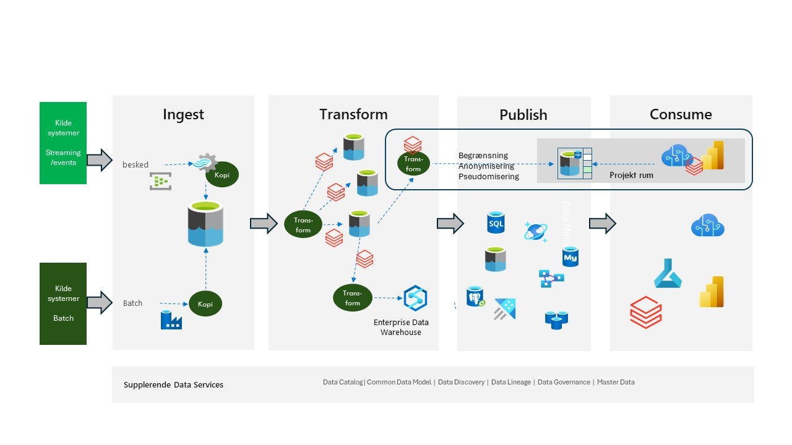

# Partner løsning - Baseret på Azure Databricks - Under konstruktion

## Introduktion

Tilgangen er den samme som for den Azure-baserede tilgang, bortset fra at Azure Databricks bruges i stedet for Data Factory Data Flow og Synapse DW. Man kan også bruge Databricks i stedet for SQL Server.

Den teknologiske uafhængighed ligger i, at Databricks er baseret på Python og Spark.

Databricks tilgangen er mere programmerings-tung.

*Figur 1*

Figur 1 viser hvor Databricks kunne passe ind i data platformen. 

Denne tilgang passer også meget fint med den ”medallion” arkitektur som meget ofte bruges i en Databricks Lakehouse arkitektur.

Mere information om Azure Databricks findes her [Azure Databricks Info](https://azure.microsoft.com/en-us/products/databricks)

