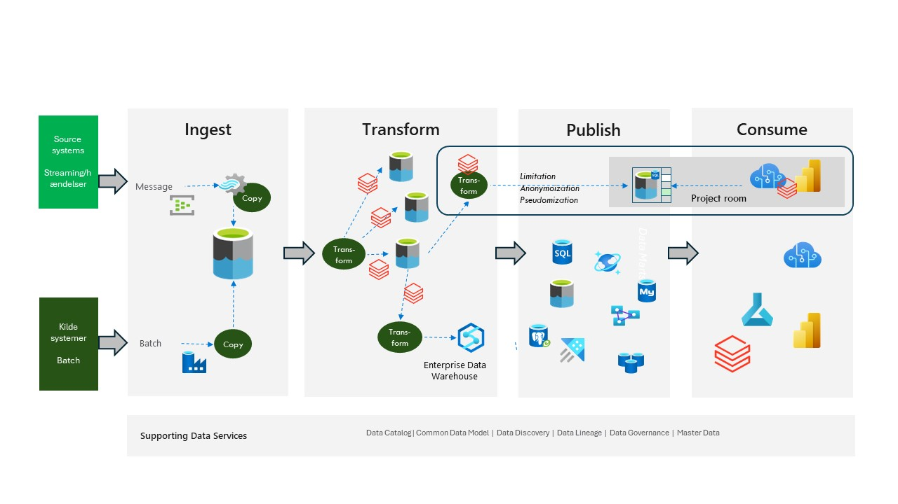

# A Data Platform - Partner solution - Azure Databricks

  

## Introduction

This approach is actually similar to the Azure Based approach, except that *Azure Databricks* is being used instead of *Azure Data Factory Data Flow* and maybe *Azure Synapse DW*.

You can also use *Azure Databricks* instead of *Azure SQL Server* if you want.

Technological independence is in the fact that Databricks is based on *Python* and *Spark*. But you will have an approach where more of the “programming” is done in the same tool.

Figure 1

Figure 1 shows where *Azure Databricks* most likely would fit in. This approach also fits very well with the medallion approach very often used in a *Databricks* Lakehouse approach.

More information about *Azure Databricks* can be found here [*Azure Databricks* Info](https://azure.microsoft.com/en-us/products/databricks)

*Azure Databricks* plays a pivotal role in supporting the construction of a lakehouse architecture, which combines the best features of data lakes and data warehouses to create a unified data platform.

## *Azure Databricks*

*Azure Databricks* is a cloud-based data analytics platform that leverages *Apache Spark* to provide a scalable and efficient environment for big data processing and machine learning. The lakehouse architecture, on the other hand, is a modern data management system that merges the advantages of data lakes and data warehouses, offering scalable storage and processing capabilities while ensuring data quality and governance.

## Key Components of *Azure Databricks* in a Lakehouse Architecture

1) Delta Lake: Delta Lake is an optimized storage layer that supports ACID transactions and schema enforcement. It ensures data reliability and consistency, making it a crucial component of the lakehouse architecture. Delta Lake allows for efficient data ingestion, processing, and querying, providing a robust foundation for the lakehouse.
2) *Unity Catalog*: *Unity Catalog* is a unified governance solution for data and AI. It offers fine-grained access control, data lineage, and audit capabilities, ensuring that data access is managed and secure. *Unity Catalog* plays a vital role in maintaining data governance within the lakehouse and can be integrated with *Microsoft Purview*.
3) *Apache Spark*: *Azure Databricks* is built on *Apache Spark*, a powerful engine that enables massively scalable data processing. *Apache Spark's* capabilities are essential for handling large volumes of data and performing complex analytics tasks within the lakehouse.

## Benefits of Building a Lakehouse with *Azure Databricks*

1) Unified Data Platform: The lakehouse architecture provides a single source of truth for all data, eliminating redundant systems and ensuring data freshness. *Azure Databricks* supports this unified platform by integrating various data sources and processing workloads seamlessly.
2) Scalability and Performance: *Azure Databricks* offers native integration with Azure services, providing regional availability and performance optimization. This ensures that the lakehouse can scale to meet the demands of modern data analytics.
3) Data Governance and Security: With *Unity Catalog*, *Azure Databricks* ensures that data governance and security are maintained across the lakehouse. Fine-grained access control and data lineage capabilities help protect sensitive data and comply with regulatory requirements.

## Integration Capabilities

*Azure Databricks* integrates with various Azure services, enhancing the lakehouse architecture's capabilities. Some notable integrations include:

1) *Azure Synapse*: *Azure Databricks* can seamlessly integrate with Azure Synapse, enabling advanced analytics and data warehousing capabilities. This integration allows for efficient data movement and processing between the lakehouse and Synapse.
2) *Microsoft Fabric*: With *Microsoft Fabric*, *Azure Databricks* customers can augment their analytics systems with Generative AI on top of the same open and governed lakehouse. This integration reduces data estate fragmentation and enhances analytics capabilities.
3) *Azure Data Factory*: *Azure Databricks* can also be used together with *Azure Data Factory* from which *Azure Databricks* notebooks can be used together with *Azure Data Factories* "own" processes.

## Conclusion

*Azure Databricks* is a powerful tool that supports the construction of a lakehouse architecture by providing scalable storage, efficient data processing, and robust data governance. Its integration with various Azure services further enhances the lakehouse's capabilities, making it a comprehensive solution for modern data management and analytics. By leveraging *Azure Databricks*, organizations can build a unified, scalable, and secure data platform that meets their analytics needs and drives business success.

