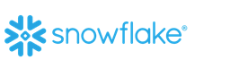

# En data platform - Partner løsning - Snowflake - Under Construction

## Indledning

I dagens datadrevne verden søger virksomheder konstant effektive og skalerbare løsninger til at administrere og analysere deres data. *Snowflake*, en cloud-baseret dataplatform, er dukket op som et populært valg for organisationer, der ønsker at udnytte kraften i deres data. Når det kombineres med *Microsoft Azure*,  tilbyder *Snowflake* en robust, sikker og alsidig løsning til datastyring, analyse og AI-applikationer.

## Oversigt over Snowflake og Microsoft Azure

*Snowflake* er en cloud-baseret dataplatform, der leverer datalagring, datasøer og datadelingsfunktioner. Den er designet til at håndtere forskellige datasæt og tilbyder høj ydeevne, skalerbarhed og sikkerhed. *Microsoft Azure* er på den anden side en omfattende cloud computing-platform, der tilbyder en bred vifte af tjenester, herunder datalagring, analyse, AI og maskinlæring.

## Integration af Snowflake med Azure

Integrationen af *Snowflake* med *Microsoft Azure* giver virksomheder mulighed for at udnytte styrkerne ved begge platforme. *Microsoft Azure* leverer den infrastruktur og de tjenester, der er nødvendige for at gemme, behandle og analysere data, mens *Snowflake* tilbyder avancerede datastyrings- og analysefunktioner. Denne kombination gør det muligt for organisationer at skabe effektive dataløsninger, der kan drive forretningsindsigt og innovation.

## Fordele ved at bruge Snowflake med Azure

1) Skalerbarhed og ydeevne: *Snowflakes* arkitektur er designet til at skalere problemfrit, hvilket giver virksomheder mulighed for at håndtere store mængder data uden at gå på kompromis med ydeevnen. Når *Snowflake* udrulles på *Microsoft Azure*,  udnytter  *Snowflake* *Microsofts Azures* skalerbare infrastruktur for at sikre optimal ydeevne.
2) Sikkerhed og overholdelse: Både *Snowflake* og *Microsoft Azure* prioriterer sikkerhed og overholdelse. *Snowflake* tilbyder robust datakryptering, adgangskontrol og revisionsfunktioner, mens *Microsoft Azure* giver et sikkert miljø med overholdelsescertificeringer til forskellige brancher. Dette sikrer, at data er beskyttet og opfylder lovkrav.
3) Dataintegration og -analyse: *Azure Data Factory* er et komplet dataintegrationsværktøj, der kan bruges til at overføre data fra lagre som *Azure Blob Storage* eller *Azure Data Lake Storage* til *Snowflake*. *Azure Data Factory* understøtter aktiviteter som f.eks. kopiér, opslag og script, hvilket gør det nemt at indtage, transformere og analysere data i *Snowflake*.
4) AI og maskinlæring: Partnerskabet mellem *Snowflake* og *Microsoft Azure* strækker sig til AI- og maskinlæringsapplikationer. *Snowflakes* arktiske model, der er tilgængelig i *Azure AI-modelkataloget*, tilbyder avancerede funktioner til generering af SQL-kode, instruktionsfølgning og dataanalyse. Denne integration giver virksomheder mulighed for at udnytte AI til at få dybere indsigt fra deres data.

## Brugssager og applikationer

1) Data Lakes: *Snowflake* på *Microsoft Azure* kan bruges til at oprette datasøer, der gemmer data i deres oprindelige format. Dette giver fleksibilitet til avancerede analyseapplikationer og giver virksomheder mulighed for at analysere data i stor skala effektivt.
2) Data Warehousing: *Snowflakes* SaaS-byggede data warehouse på Azure håndterer forskellige datasæt i et enkelt, oprindeligt system. Dette muliggør sikker datalagring, analyse i realtid og datadeling i hele virksomheden.
3) Datadeling og indtægtsgenerering: Spejling i *Microsoft Fabric* giver en nem oplevelse til at undgå kompleks ETL (Extract Transform Load) og integrere dine eksisterende *Snowflake*-lagerdata med resten af dine data i *Microsoft Fabric*. Du kan løbende replikere dine eksisterende *Snowflake*-data direkte til *Microsoft Fabric's OneLake*. I *Microsoft Fabric* kan du låse op for effektive scenarier for business intelligence, kunstig intelligens, datateknik, datavidenskab og datadeling.

## Konklusion

Integrationen af *Snowflake* med *Microsoft Azure* giver en effektiv løsning til virksomheder, der ønsker at administrere, analysere og udnytte deres data. Med de kombinerede styrker ved begge platforme kan organisationer opnå skalerbarhed, sikkerhed og avancerede analysefunktioner. Uanset om det drejer sig om at skabe datasøer, datavarehuse eller udnytte kunstig intelligens til dataindsigt,  tilbyder *Snowflake* og *Microsoft Azure* en omfattende og alsidig dataplatform, der kan skabe forretningssucces.

