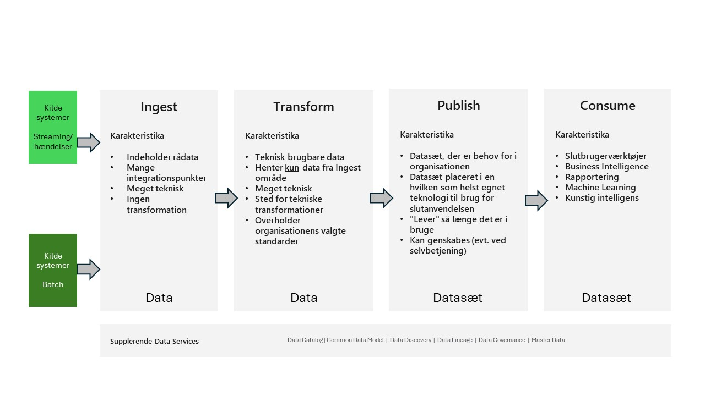
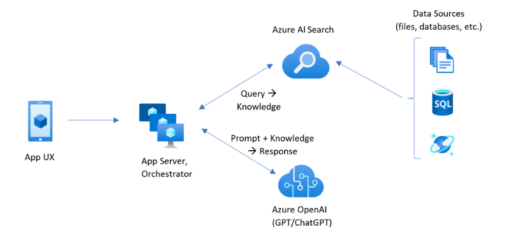
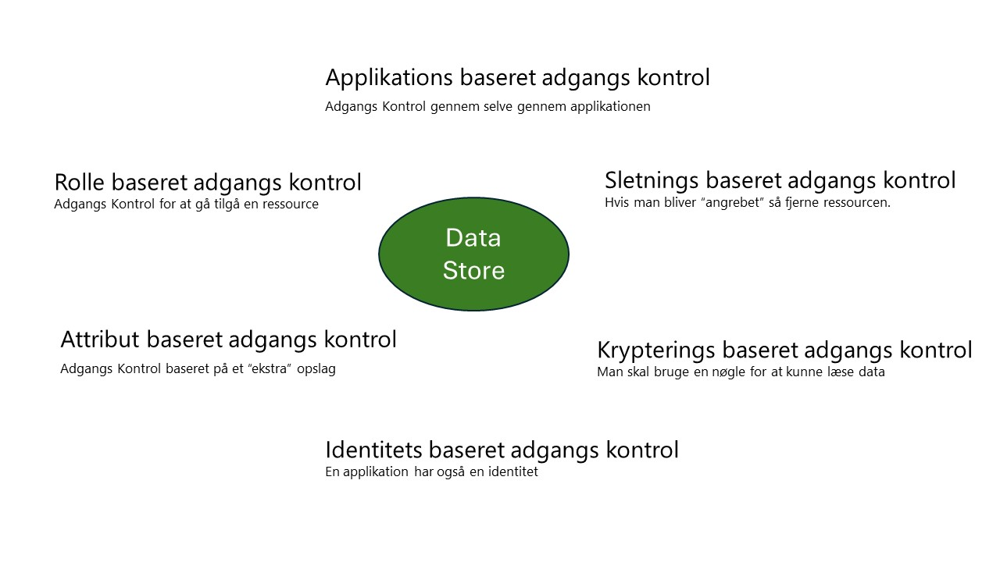
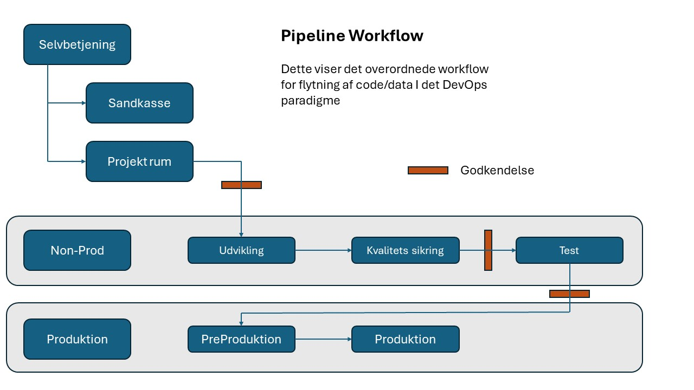

# En data platform - *"fremtidssikret"*

## Introduktion

IT-verdenen gennemgår betydelige ændringer i disse tider (2024-) hovedsageligt på grund af "ChatGPT'erne", der tilbyder en lang række nye funktioner omkring tekst, lyd, billeder og endda videoer 
under overskriften Generativ AI - eller simpelthen GenAI. Derfor er det mere afgørende end nogensinde at sikre, at de rigtige data med den rigtige kvalitet benyttes samen med sådanne tjenester 
for at drage fuld fordel af disse funktioner.

Men hvordan kunne man for et år siden forudsige, hvad er muligt i dag, og hvilken stor forandring det rent faktisk er, og dermed planlægge at kunne støtte dette. Det korte svar er - det kunne 
man ikke. Og hvilke nye "udfordringer" vil morgendagen bringe. Vi ved det nok virkelig ikke, det eneste, vi ved, er, at der vil være ændringer, og de vil sandsynligvis vil ske før snarere end 
senere.

Dette dokument beskriver, hvordan man kan oprette en dataplatform, der vil være i stand til at håndtere "hvad der måtte komme" og dermed give mulighed for i det mindste fra et dataperspektiv at 
navigere i disse muligheder / udfordringer.

Dokumentet tager ikke udgangspunkt i hvad er "bedste praksis", men er tænkt som "det bør man overveje", hvis man vil lave en dataplatform.

Indholdet er baseret på erfaringerne fra forskellige Microsoft-kunder, der ønskede at strømline oprettelsen af en dataplatform ved hjælp af cloud-tjenester til analytiske opgaver.

>[!Note]
>Dette dokument er for evigt *under udarbejdelse*, de vi hele tiden lærer nye ting.
>De næste emner bliver nok Governance/Compliance og GenAI, efterhånden som vi lærer mere om dette i forbindelse
>med dataplatforme som er i brug.

>[!Note]
> Dokumentet er hovedsageligt baseret på Microsoft-teknologikomponenter.

>[!Note]
>Brugen af ordene "data" og "datasæt" henviser til enhver repræsentation af information (tekst/billeder/lyd/tal....)

## Indhold

Udover at dække hovedemnet om, hvordan man opretter en dataplatform og de direkte discipliner, der bør overvejes, dækkes også andre emner i forbindelse med dataplatformen. Disse er følgende (i egne sektioner):

- [Sikkerhed](./Security/Security-da.md)
- [Lovgivning](./Security/Legislation-da.md)
- [Exit-strategi](./Security/Exit-and-risc-strategies-da.md)
- [Risikovurdering](./Security/Exit-and-risc-strategies-da.md)
- [Data-modellering](./DataModelling/DataModel-da.md)
- [Drift/Modstandsdygtighed](./Operations/Operations-da.md)
- [Data-operations](./DataOps/DataOps-da.md)
- [Data Mesh](./DataOps/Data-mesh-da.md)
- [Selvbetjening](./DataOps/Self-service-da.md)
- [GenAI og data platformen](./DataOps/GenAI-da.md)
- [Cloud-miljøer](./DataOps/Cloud-env-da.md)
- [Navngivnings-standard](./DataOps/Naming-standards-da.md)
- [Meta Data håndtering](./DataOps/Data-mesh-da.md)

## Baggrund

Diskussionen i dette dokument handler om, hvad data kan bruges til, og hvordan du sikrer, at du altid er forberedt på enhver ny situation, hvor 
data. Og at denne tilgang også udføres på en kompatibel såvel som en styret måde, der afspejler dine retningslinjer og politik for databrug.

Et overordnet budskab om indholdet i dette dokument er muligheden for at kunne sige til dine brugere, der anmoder om data -
 
                   Hvis data ikke er tilgængelig i dag, vil de være tilgængelige i morgen.

Lad os se nærmere på brugsmønstrene for data, der er dækket her.

Som vist i figur 1 har vi i midten et "stykke data", det vil sige enhver information, som vi gerne vil bruge *et sted*.

Dette "stykke" data bliver højst sandsynligt brugt på forskellige måder. Her er skitseret følgende:

1. **Rapportering** , hvor vi leverer dataene gennem en applikation, der gør det muligt for mig at læse "noget" ud af "tallene". Mest sandsynligt ville dette være en slags graf.
2. **Analytics** i denne situation bliver dataene mere aktive, da de vil blive brugt af slutbrugeren til at arbejde videre og få svar på nye spørgsmål. Dette gøres højst sandsynligt ved hjælp af et BI-værktøj som PowerBI.
3. **AI/ML/GenAI** her bruges dataene til "simuleringer/forudsigelser". Og programmering finder sted, både programmering ved hjælp af kode såvel som no-code/low-code værktøjer. Programmeringen sker i de fleste tilfælde ved hjælp af Python, og de værktøjer, du vil møde her, dækker over produkter som Visual Studio/Eclipse over Azure AI Foundry til CoPilot Studio. Og jo mere du bruger no-code-værktøjer, jo mere skifter sproget fra Python til naturligt sprog ("ChatGPT-tale").
4. **Delbar** : Når du har data, som du finder interessante, vil du højst sandsynligt gerne kunne dele dem. I de fleste tilfælde skal dette være en kontrolleret operation, så vi er sikre på, at den modtagende part er korrekt, hvilket afspejler den politik, vi bør have til at dække dette.
5. **Adgangskontrol** er den simple kendsgerning, at vi er nødt til at kontrollere, hvem der ser hvad. Dette er i dette dokument, der er dækket af emnerne *data* og *datasæt*.
6. **Compliance/Governance** dækker over evnen til at dokumentere, hvem der har adgang til hvad, og sikre, at dette forbliver inden for vores definerede politik.
7. **Selvbetjening** er "Nirvana" for håndtering af data. Det betyder, at slutbrugerne selv kan anmode om adgang til og oprettelse, hvis nye datasæt selv opstår, og at hans proces håndteres automatisk af dataplatformen.
8. **Kilder** dækker, hvordan og hvilke data der bringes ind i dataplatformen. Se næste figur.

*Figur 1*

Når vi diskuterer, hvor data kommer fra, hvor de bliver brugt, vil det være sådan, at (højst sandsynligt) mange applikationer, du har, allerede indeholder en form for rapporterings-/analysedel.
I dette tilfælde er det meget værd at træffe en beslutning om, hvordan du udnytter dette på den rigtige måde til dine formål.

*Figur 2*

De emner, der skal diskuteres, vil så være (måske pr. applikation):

1. Rapporteringsmulighederne eksponeres direkte fra applikationen til slutbrugeren - måske gennem en fælles "grænseflade" som vist på figuren.
2. Alle data skubbes/trækkes ind i dataplatformen og eksponeres derefter herfra.
3. Kun data, der skal kombineres med andre applikationsdata, skubbes/trækkes ind i dataplatformen.

Enhver kombination af disse er "korrekt", det vigtige er, at det er dokumenteret, hvad der skal gøres.

>[!Note]
>Det er nødvendigt at få 2 og 3 til at fungere, at du har sikret, at du nemt og uden yderligere omkostninger (licenser) kan få dig data ud af disse applikationer og 
>at der er en dokumenteret og vedligeholdt grænseflade baseret på en standard som REST API, SQL eller Python til at gøre dette.

## Visionen
Visionen for dataplatformen, der er beskrevet i dette dokument, er at være en platform, hvor Governance og Compliance er de vigtigste drivkræfter.

Derfor er konceptet med et selvkonsistent datasæt et nøgleelement i denne tilgang.

Desuden skal platformen platform også kunne dække "hvad der måtte komme" og give en situation, hvor du kan sige - *hvis det ikke er i platformen i dag, vil det være der i morgen*.

Når det er sagt, kan den beskrevne dataplatform bruges i flere forskellige scenarier og naturligt nok tilpasses til den faktiske brugssituation.

## Overordnet paradigme

For at sikre at en dataplatform kan understøtte ”hvad der end måtte komme”, er det vigtigt at vi sætter nogle retningslinjer for, hvad der skal være gældende.

Dette overordnede paradigme skal sikre at en dataplatform opfylder følgende egenskaber.

1. **Konsistens** - Løsningsdesignet er konsistent for at gøre det nemt at betjene og udvikle løsninger yderligere. Konsistensniveauet for ethvert dataobjekt er altid klart. Dette er for at sikre, at værdien af dataene altid kan formidles.

2. **Dataindkapsling** - Dataene i datainfrastrukturen kan kun tilgås via en grænseflade, der styrer, hvem der har adgang til hvad og hvornår. Grænsefladen skal give dig mulighed for at ændre datainfrastrukturen uden at påvirke eksterne systemer.

3. **Moduleret** - Løsningerne i dataplatformen skal bygges som moduler med en klart defineret grænseflade, således det er nemt at erstatte, tilføje eller fjerne ressourcer og tjenester.

4. **Teknologiuafhængig** - Arkitekturen afhænger ikke af den anvendte teknologi. Det betyder, at processerne, funktionaliteten og lagene forbliver de samme, uanset hvilken teknologi der bruges.

5. **Skalerbarhed** - Skalerbarhed (vandret/lodret) er en del af løsningsdesignet fra starten, så implementeringen og driften ikke påvirkes af flaskehalse, nedetid eller uventede licenskøb.

6. **Skal kunne genskabes** - Alle tjenester, der bruges i løsningen, skal kunne sættes på pause/stoppes og endda slettes. Og derfor også kunne startes/genskabes. Og dette uden datatab, ændring i funktionalitet samt tilgang (api’er).

7. **Sporbarhed** - Alle tjenester, der bruges i løsningen, skal kunne spores individuelt til brug - både af sikkerhedsmæssige og omkostningsmæssige årsager.

8. **Agilitet** - Fokus skal være på en tilgang baseret på Minimal Viable product (MVP) samt løbende feedback til tidligere trin i data flowet.

9. **Sikkerhed** - Sikkerhed skal integreres i den generelle arkitektur og de specifikke løsningsdesign, både for informationssikkerhed og privatliv. Udskiftning af komponenter må ikke berøre sikkerhedsaspekterne. Overholdelse og styring skal opretholdes på tværs af de forskellige lag over tid.

10. **Genbrug** - Løsninger skal designes til genbrug. Arkitekturen bør indeholde skabeloner til løsningsdesign, der fremskynder time-to-market og sikrer standardisering.

11. **Feedback** - Arkitekturen skal løbende justeres og forbedres baseret på feedback fra brugen af dataplatformen.

## *Data* og *datasæt*

Begreberne *data* og *datasæt* er dataplatformens "kernekomponenter".

Et meget vigtigt aspekt af især *data*, men også til en vis grad *datasæt* er, at et givet objekt skal kunne håndteres, vedligeholdes og sikres i sig selv, det vil sige ikke gennem nogen teknologikomponent som en database, derfor er **fil** håndtering det overordnede aspekt af dette.

Når udtrykket *data* bruges, refererer det til et enkelt dataobjekt som en fil eller en tanel, der kun indeholder dataene fra et givent objekt. Det kan f.eks. være en kildetabel som debitorer eller fakturaer.

På den anden side, når udtrykket *datasæt* bruges, betyder det en samling af tabeller eller filer, der er forbundet med hinanden. Dette kan for eksempel være et Data Mart med kunde-, produkt- og tidsdimensioner og samt salgstal, også kendt som et stjerneskema.

*Datasættet* er nøglekomponenten i dataplatformen, og det har nogle specifikke egenskaber:

- *Datasættet* er selvforsynende, hvilket betyder, at det ikke afhænger af andre kilder. Den indeholder alle de data, der er behov for at understøtte den stillede opgave.
- Kun de kolonner/rækker, der er relevante for den opgave, der udføres, er til stede i *datasættet*.
- Et *datasæt* tilhører en gruppe og ikke bestemte personer – i en Azure-konfiguration vil ejeren derfor være en gruppe med et Entra-id.
- Et *datasæt* bør have yderligere to grupper tilknyttet, én til oprettelse af indholdet og en anden med læse-adgang til data.
- Adgang til et *datasæt* gives ved at føje enkeltpersoner til gruppen/grupperne, afhængigt af den opgave, de skal udføre.
- Et *datasæt* er ikke bundet til en bestemt teknologi som for eksempel en relations database. Datasættet gemmes som filer, ofte som komma separeret (csv) eller parquet filer. Det kan derefter leveres via den teknologi der passer bedst til den pågældende opgave - som så kunne være en relations database.

## Cloud-tilgang

Den dataplatform der beskrives i dette dokument, er baseret på cloud teknologier.

Og den beskrevne tilgang til en dataplatform har nogle funktioner, der kun kan opnås med en sådan cloud-tilgang.

*Figur 3*

Som vist på *figur 3* giver brug af cloud teknologier adgang til forskellige typer tjenester.

**Infrastruktur som en service** (IaaS) - Dette giver mulighed for at oprette forskellige typer tilgangen virtuelle maskiner og installere al software, der er nødvendig på dem. I dette garanterer cloud-leverandøren tjenesten op til operativsystemets niveau.  I IaaS tilgangen har vi fokus på, hvilke produkter vi ønsker at bruge og dermed levere de rigtige "maskiner" til dette.

**Platform som en service** (PaaS) - Dette er til tjenester som databaser. Vi behøver ikke bekymre os om infrastrukturen bag disse tjenester. Cloud-leverandøren sikrer alle de nødvendige komponenter bag selve tjenesten. Dette inkluderer opdateringer, nye versioner og tilgængelighed. I PaaS-opsætningen fokuserer vi kun på, hvilken funktionalitet vi har brug for, og ikke på hvilket "produkt" vi har brug for at gøre dette.

**Software som en service** (SaaS) – en SaaS-service er en komplet løsning som et ERP- eller HR-system. Her sikrer cloud-leverandøren adgang til en komplet pakke af applikationer, databaser og infrastruktur, der er nødvendig for, at SaaS-tjenesten kan fungere.

Den diskuterede dataplatform er ”kun” baseret på PaaS- og/eller SaaS-tjenester og dermed i meget begrænset omfang IaaS.

I kapitlet "Eksempler på Implementeringer" er der beskrevet forskellige måder at gøre dette på med forskellige PaaS- eller SaaS-tjenester.

Et andet centralt aspekt af skyen er, at "alt er software". Det betyder, at når vi for eksempel skal oprette en ny server, genereres de forskellige komponenter, som serveren bruger - som diske, netværkskort osv. - ved at sende kommandoer til cloud-infrastrukturen. Så vi kan altså bruge software til at producere disse komponenter.

Dette er kendt som *Infrastruktur som kode* (IaC). I den beskrevne dataplatform bruges dette til for eksempel at oprette en relations database og herefter indlæse et givent datasæt i denne database, alt samme ved hjælp af kode.

Denne model rejser også en diskussion om, hvilke elementer i den underliggende infrastruktur cloud-udbyderen såvel som kunden er ansvarlig for i de forskellige "siloer" af on-prem, IaaS, PaaS og SaaS. Dette diskuteres yderligere i dette [afsnit](DataOps/Cloud-env.md)

Operationerne i denne model - kendt som Data Operations eller DataOps - diskuteres yderligere i dette afsnit [afsnit](DataOps/DataOps.md).

## Logisk arkitektur

Dataplatformen arrangerer *data* og *datasæt* i forskellige områder i henhold til en logiske arkitektur, som vist på *Figur 2*. Dette er for at sikre, at vi kan overholde
paradigmets "regler" som tidligere nævnt. 
 

*Figur 4*

Områderne repræsenterer forskellige tilstande af rejsen fra data til datasæt og dermed til rapportering og analyse.
Med henvisning til *figur 4* kan de forskellige områder beskrives som følger:

**Kildesystemer** er ethvert system, hvor data skal udtrækkes (batch) fra, eller hvor data sendes fra (streames).

**Ingest området** er der, hvor data fra kildesystemerne placeres. Data opbevares i deres oprindelige format. Hvis dataene er "tabeldata", foretages der ingen ændringer i nogen rækker eller kolonner, ikke engang af selve dataformatet. Data gemmes i filer - normalt i komma separeret eller parquet eventuel i deres binære format - som for eksempel vil gælde video, billede eller lyd. Ingest området vil have en mappestruktur, der gør det nemt at identificere datakilden. Der sker ikke en opdatering eller overskrivning af eksisterende filer - hvilket betyder, at et nyt load vil oprette nye filer. Om dette load er et ”full load” eller der hentes ”ændringer siden sidst” afhænger af behov samt muligheder i de givne kilder.

Over tid skal filer i Ingest området arkiveres eller slettes, hvis lovkrav kræver dette (såsom GDPR).

I **Transform området** hentes data fra Ingest området og ændres til et ”teknisk brugbart” format.

En opgave er derfor at transformere data således at de har det samme format – det kan for eksempel være at ”standardisere” de "vanskelige" datatyper, såsom datoer (f.eks. opdeling af tid fra datoen i en separat kolonne) og decimaltal ("." eller ",." som separatorer).

De enkelte data elementer i *Transform* området er ”selvstændige objekter”. Det betyder, at de ikke har en blanding af data fra et eller flere kildesystemer, ikke forfines på en måde så den oprindelige information ikke er til stede og at der ikke laves en begrænsning i antallet af rækker eller kolonner. Man kan dog evt. overveje at adskille ”dårlige rækker” i et selvstændigt data objekt.  

*Data* i **Transform** området forefindes således som "rene" objekter, der er praktiske at arbejde med, når de bruges til at danne *datasæt*.

En anden opgave er at sikre, at de forskellige data, vi ønsker at have tilgængelige på dette område, let kan sammenføjes, hvilket betyder, at det enkelte dataobjekt har de "referencenøgler", der er nødvendige for at kunne forbinde med andre dataobjekter.

I *publish* området skabes de *datasæt*, der er nødvendige for at opfylde de forskellige forretningsbehov, der har behov for data fra dataplatformen. Her anvendes modeller som for eksempel stjerneskemaer og leverance af disse datasæt sker oftest via data marts (relations databaser).

*Publish* området er det sted, hvor slutbrugerne af dataplatformen får adgang til de datasæt de skal bruge og ved hjælp af de værktøjer, de finder mest egnede.

>[!NOTE]
>Dette paradigme er i dag måske bedre kendt som *"medallion data architecture"*, hvor *bronze* er **ingest området**, *sølv* er **transform** og *guld* er **publish**. *Medallion* arkitekturen indeholder ikke et **consume område**. Dette dokument vil bruge begreberne **ingest**, **transform**, **publish**, og **consume** da det afspejler hvad de kunder der er inspiration til dette dokument oftest bruger.

### Dataplatform og Data Mesh-paradigmet

Data mesh er et arkitektonisk paradigme, der er designet til at løse udfordringerne ved skalering af datastyring og -analyse i store, komplekse organisationer. Det skifter fra centraliserede datasøer og lagre til en decentraliseret tilgang, der gør det muligt for forskellige teams at administrere og bruge data uafhængigt.

Dette emne i forbindelse med **dataplatformen** diskuteres mere detaljeret i dette [afsnit](DataOps/Data-mesh-da.md)

### Grænseflader

*Figur 3* angiver, at grænsefladen mellem de forskellige områder er lige så vigtig som indholdet af områderne. Disse grænseflader skal sikre den teknologiske uafhængighed, vi ønsker i platformen – det skal være nemt at ændre/tilføje nye services – samt sikre, at vi kender de veje data flyder af.

De fleste virksomheder/institutioner foretrækker at bruge en eller flere af følgende muligheder for grænseflade.  

**REST API** - den "grundlæggende" grænseflade, som de fleste (alle) nye tjenester bruger til at tilbyde deres funktionalitet. Dette niveau er meget teknisk og er ikke egnet til low code/no-code tilgange.

**SQL** – standard dataforespørgsels sprog, der er meget udbredt og understøttet af mange forskellige database systemer. Mange er bekendt med SQL fra dets anvendelse i relationelle databaser, men det er også tilgængeligt i andre typer af databasesystemer som for eksempel NoSQL databaser.

Hvis man "kun" bruger de funktioner i SQL som er en del af SQL-sprog standarden, vil det give en høj grad af fleksibilitet. Det betyder, at man ikke vil bruge specifikke funktioner, som et givent databaseprodukt har udvidet en SQL-implementering med – især brugen af de proceduresprog, der findes i for eksempel MS SQL Server eller Oracle DB.

**Python** – det "nye" databehandlingssprog. Python er meget udbredt og afspejler den nuværende måde at håndtere data på. Python er et programmeringssprog på højt niveau, der fortolkes ved afvikling.
Pythons syntaks er relativ enkel og dermed nem at lære og giver også en god grad af læsbarhed, hvilket bør sænke omkostningerne ved programvedligeholdelse. Python understøtter brugen af moduler og pakker, hvilket fremmer en modul til gang til programmering og genbrug af kode.

Pythons virkelig gode understøttelse af data samt et omfattende standardbibliotek gør det meget populært i forbindelse med dataplatforme.  Desuden elsker programmører Python, fordi de føler det gør dem mere produktive. 

### Understøttende datatjenester

En yderligere komponent i implementeringen, som *figur 2* viser, er understøttende datatjenester. Disse er yderligere beskrevet i denne [sektion](Supporting_Data_Services/SupportingDataServices-da.md)

### Data model

Håndteringen af modellering af data i forhold til ovenstående diskutteres videre i denne [sektion](DataModelling/DataModel-da.md).

## Et særligt tilfælde – Real Time 

Vi vil anse databehandling i realtid som et særligt tilfælde og undersøge det ud fra dette perspektiv.

Realtid kommer i forskellige varianter, i dette dokument vil vi bruge følgende termer

- Realtid – *data*, der leveres umiddelbart efter afhentning.
- Næsten realtid – *data*, der er "forsinket" på grund af kommunikation eller behandling.
- Dynamiske data – *data*, der opdateres og kræver opmærksomhed.

Dataplatformsmetoden i dette dokument er **ikke** egnet til realtidssituationen, men den fungerer godt til næsten realtid og dynamiske data. Dynamiske data – som er baseret på hændelser – behandles på samme måde som Near Real Time-data i dataplatformen.

Den generelle tilgang er, at alle eller alle *data i realtid* også opbevares i **consume** området for mere behandling.
Dette gør det muligt for dataplatformen at have funktioner, der kan understøtte en realtidsproces, hvor det er relevant, men også at styre al viden, der kan genereres over tid fra realtidssituationer.
Dette kan så hjælpe med at undgå, at en uønsket hændelse opstår - såsom en togforsinkelse.

Eller giv mere detaljerede oplysninger om en målbegivenhed i en fodboldkamp og derefter være i stand til at ændre odds hurtigt baseret på de historiske data, der er tilgængelige i dataplatformen.

For at illustrere dette kan du forestille dig et tog, der er forsinket. Systemet, der viser oplysningerne til passagererne på stationen, vil modtage realtidsdata om forsinkelsen med det samme og opdatere skiltene i overensstemmelse hermed. I denne proces behandles selve dataene ikke meget.

*Figur 5*

Disse *data* gemmes dog **også** i dataplatformen, hvor der er noget tid, men ikke meget, til at generere et forslag til alternative ruter for de enkelte passagerer, der venter på det forsinkede tog. Disse oplysninger kan derefter sendes til en app på deres smartphones.

## Endnu et særligt tilfælde - ChatGPT/CoPilot

I takt med at AI/ML/GenAI bliver mere og mere tilgængelige, bliver kravene og dermed udfordringerne på de dataelementer, der bruges i sådanne løsninger, endnu vigtigere.

En typisk tilgang til at bringe dine egne data ind i omfanget af især en GenAI-løsning er at bruge en metode kendt som RAG, der står for Retrieval Augmented Generation.

RAG er en arkitektur, der udvider mulighederne i en Large Language Model (LLM) som ChatGPT ved at tilføje et informationshentningssystem, der giver **grounding** data. Tilføjelse af et 
informationshentningssystem giver dig kontrol over jordingsdata, der bruges af en LLM, når den formulerer et svar. For en virksomhedsløsning betyder RAG-arkitektur, at du kan begrænse generativ 
AI til dit virksomhedsindhold, der stammer fra **vektoriserede** dokumenter og billeder og andre dataformater, hvis du har integreringsmodeller for det pågældende indhold.

*Figur 6*

Beslutningen om, hvilket informationssøgningssystem der skal bruges, er afgørende, fordi det bestemmer inputtene til LLM. Informationssøgningssystemet skal indeholde:

1. Indekseringsstrategier, der indlæses og opdateres i stor skala for alt dit indhold med den frekvens, du har brug for.

1. Forespørgselsfunktioner og relevansjustering. Systemet bør returnere relevante resultater i de korte formater, der er nødvendige for at opfylde kravene til tokenlængde for LLM-input.

1. Sikkerhed, global rækkevidde og pålidelighed for både data og drift.

1. Integration med indlejringsmodeller til indeksering og chatmodeller eller sprogforståelsesmodeller til hentning.

Azure AI Search er et eksempel på en sådan "database", der giver indekserings- og forespørgselsfunktioner med infrastrukturen og sikkerheden i Azure-cloudmiljøet.

Gennem kode og andre komponenter kan du designe en omfattende RAG-løsning, der inkluderer alle elementerne til generativ AI over dit proprietære indhold.

På baggrund af ovenstående skal vi sikre, at de data, vi leverer til de skabte løsninger, passer præcis til det, brugeren har adgang til, så jordforbindelsen og dermed vektordatabasen kun indeholder dette. Dette kan gøres via publiceringslaget, da dette lag repræsenterer datasæt med det nøjagtige indhold. Så opgaven er at "indlæse" de vektordatabaser, der bruges - og sørge for, at disse stoppes/fjernes efter brug.

## Roller

Dataplatformen ligger op til at bruge roller som en mekanisme til at kontrollere adgangen til data og datasæt i platformen. Disse roller bruges til at give de rigtige ansvarsområder til personer, der arbejder med platformen.

Hvordan rollerne er forbundet med de enkelte personer og on nogle af disse har mere end én rolle, er op til den enkelte virksomhed/institution samt det givne behov og tilgængelige ressourcer.

Det vigtigste er, at processerne ved håndtering af data overholder "reglerne" i paradigmet.

Dette er en liste over mulige roller, baseret på hvad virksomheder/institutioner, der har bygget en dataplatform som beskrevet, har benyttet:

1. Projekt ejer
   - Interface til styregruppe/ledelse.
   - Kommer typisk fra "Forretningen"

2. Projekt leder
   - Leder af det enkelte projekt.
   - Kommer typisk fra “IT”

3. Data Engineer
   - Definerer og danner de processer der henter data fra kildesystemerne og til ingest området.
   - Kommer typisk fra “IT”

4. Designer
   - Definere og danner de datasæts som skal dannes for at understøtte forretningens behov
   - Kommer typisk fra “Forretningen”

5. Transform engineer (ETL-programmør)
   - Danner de transformations-processer (ETL) der anvendes i **transform** og **publish** områderne.
   - Kommer typisk fra “IT”

6. Data Governance
   - Sikre en ens forståelse mellem IT og forretningen i forhold til sikkerhed.
     Samt at disse passer til de overordnede sikkerheds principper virksomheden/institutionen følger.
   - Kommer typisk fra “IT/Forretningen”

7. Super-bruger/Ambassadør
   - Definere og danner rapporter/dashboard og andre slut-brugs scenarier
   - Kommer typisk fra “Forretningen”

8. System ejer
   - Bibringer viden om hvorledes kildesystemerne anvendes/er organiseret
   - Kommer typisk fra “Forretningen”

9. Arkitekt
   - Sikrer at principper omkring IT-arkitektur følges
   - Kommer typisk fra “IT”

Afhængigt af projektets størrelse, virksomhedens/institutionens størrelse og/eller et eventuelt anvendt framework kan man også møde roller som Scrum Master, Product Owner, Program Owner, Styregruppe medlem m.fl.

Behovene i de forskellige roller vil naturligvis variere gennem et projekt. Følgende er et eksempel på, hvordan "arbejdsbyrden" kunne se ud:

|Rolle|Ideation|Iteration 1|Iteration 2|Iteration 3|Iteration 4|Iteration ….|Vision state|
|----|--------|-----------|-----------|-----------|-----------|------------|------------|
|Projekt ejer|100 %|25%|25%|25%|25%|25%|100%|
|Projekt leder|100%|100%|100%|100%|100%|100%|100%|
|Data Engineer|100%|50%|25%|5%|5%|5%|0%|
|Designer|100%|10%|10%|25%|25%|40%|0%|
|Transform Engineer|100%|30%|30%|30%|30%|30%|0%|
|Data Governance|100%|25%|25%|10%|10%|10%|10%|
|Super-bruger/Ambassadør|100%|5%|5%|20%|20%|50%|100%|
|System ejer|100%|25%|10%|0%|0%|0%|10%|
|Arkitekt|100%|50%|25%|10%|10%|10%|10%|

1. Ideation – Projekt start der sætter rammerne og ønsket resultat for et projekt.
2. Iteration X – de individuelle “versioner” – typisk ny version hver 3 måned 
3. Vision State – Det ønskede endelige resultat.

## Miljøer

Dette afsnit afsøger, hvordan man kunne bruge seks miljøer til implementering af et dataplatformsprojekt. Afhængigt af præferencer kan man selvfølgelig bestemme, hvor mange af disse miljøer man ønsker at have, og hvordan man fordeler de opgaver, som beskrives blandt færre eller flere miljøer.

1. Sandkasse - dette miljø bruges til MVP-test.
2. Projektrum - udviklingsmiljøer.
3. Udvikling – kode der ligger til grund for et produktionsmiljø.
4. Test - funktionel test.
5. Kvalitetssikring – kode gennemgang.
6. Pre-produktion - test på produktionsdata.
7. Produktion - produktionsdata.

## Datapolitikker

For at kontrollere de data-politikker man ønsker at bruge, skal der sikres en forståelse af hvilken type miljø et givent arbejde udføres. Dette dokument bruger 5 miljøtyper i diskussionen af processerne.

1. Sandkasse – miljø, der bruges til at teste funktionaliteten for de enkelte tjenester. Disse miljøer indeholder IKKE nogen forretnings-/virksomhedsdata.
2. Projektrum – Disse miljøer bruges til at etablere miljøer, der indeholder værktøjer og data, der bruges til at udføre en udviklingsopgave.
3. Ikke-produktion – miljøer, der indeholder udviklings-, kvalitetssikrings- og testscenarier.
4. Produktion – miljøer, der understøtter præproduktions- og produktionsscenarier.
5. Fortroligt – miljøer, der understøtter databehandling af meget fortrolige data.

## Data og sikkerhed

Datasikkerhed er et kritisk element i driften af enhver organisation. Det omhandler beskyttelsen af data mod ulovlig adgang, forringelse eller tyveri over hele dataenes levetid. Med indførelsen af robuste datasikkerhedstiltag kan firmaer sikre deres vigtige ressourcer, opnå overholdelse af regler og fastholde kundetilliden til, hvordan de håndterer data.

Datasikkerhed er kritisk, da den sikrer organisationer mod cyberangreb, insidertrusler og menneskelige fejl, som kan resultere i databrud. De væsentlige faktorer inden for datasikkerhed omfatter fortrolighed, integritet, tilgængelighed og overholdelse. Med voksende trusler mod data skal organisationer beskytte deres data ved kilden for at kunne opretholde datasikkerheden og hurtigt genoprette data efter et angreb. Formålet med datasikkerhed er at beskytte data imod alle former for misbrug, inklusive cyberangreb og menneskelige fejl.

For at konkludere er det væsentligt for datasikkerhed at bevare fortroligheden, integriteten og tilgængeligheden af en organisations oplysninger. Det understøtter beskyttelsen af vigtige ressourcer, hjælper med at imødekomme de specificerede standarders compliance krav og fastholder kundetillid.

I afsnittet [Sikkerhed](Security/Security-da.md) findes en meget mere detaljeret diskussion om sikkerhedsaspektet.
Dette afsnit fortsætter med nogle flere tekniske muligheder.

*Figur 7* viser forskellige metoder til databeskyttelse tilgængelige i Azure. Det dækker dog ikke generelle emner som netværkssikkerhed eller multifaktorgodkendelse, da det antages, at disse allerede er implementeret.

*Figur 7*

**Applikationsbaseret adgangskontrol** - dækker over, at en applikation som SAP, Snowflake, Fabric, Dynamics osv. kræver et login og dermed giver den korrekte adgang til de underliggende data, der bruges i applikationen. Ofte er det underliggende datalager en (relationel) database, som der er adgang til fra programmet ved hjælp af en tjenestekonto. 
Rollebaseret adgangskontrol – også kendt som RBAC. Dette styrer adgangen til en given ressource, og hvordan den kan bruges. Så populært sagt - kan man komme til lagerkontoen?

**Attributbaseret adgangskontrol** – også kendt som ABAC - giver ofte ekstra mekanisme til at give adgang til at foretage et "opslag" i et andet system. For eksempel kan man muligvis komme til en storage-konto, men deres kan være en mappe, der kræver, at man er en del af et givet projekt. I dette tilfælde kan man lave et ABAC "opslag", der kontrollerer dette, før man giver adgang - afhængigt af dette resultat.

**Identitetsbaseret adgangskontrol** - dækker den mulighed, som en given ressource kan tildeles en identitet (bliver "et menneske"). Og så sørger man for, at adgang til en given lagerkonto kun gives til dette "menneske", og derfor skal man bruge denne applikation til at komme til dataene.

**Krypteringsbaseret adgangskontrol** - dette er ikke rigtig adgangskontrol, fordi datalagringen vil være tilgængelig, men man kan kun læse / bruge dataene, hvis man har nøglen til dekryptering. Så det kan (bør) være en del af dit forsvar.

**Sletningsbaseret adgangskontrol** – denne tilgang er kun muligt i **publish** rområdet. Denne tilgang bruger det aspekt af **publish** området, at et *datasæt* kun "lever så længe det bruges", i dette tilfælde "... bliver brugt korrekt". Fordi denne tilgang kræver evnen til at kunne genskabe et givet *datasæt*, kan dette også bruges som en forsvarsmekanisme. Så hvis et angreb realiseres, er den nemmeste måde at stoppe dette på blot at fjerne ressourcen under angreb, hvis der er risiko for tab af data.

## DataOps

Ifølge Wikipedia er DataOps en samling af praksis, processer og teknologier, der kombinerer et holistisk og procesorienteret syn på data med automatisering og metoder fra agil softwareudvikling for at forbedre kvalitet, hastighed og samarbejde og fremme en kultur med løbende forbedringer omkring dataanalyse.

A mere detaljeret diskussion om DataOps er tilgængelig i denne [sektion](DataOps/DataOps-da.md)

### Miljøer og krypteringspolitikker

I forskellige miljøer kunne visse politikker vedrørende kryptering håndhæves. Følgende tabel er et eksempel på, hvordan dette kunne se ud.
|Miljø/politik|Sandkasse|Projektrum|Ikke-produktion|Produktion|Fortrolig|
|-------------|---------|----------|---------------|----------|---------|
|Kryptering i hvile|Revision|Revision|Revision|Kræves|Kræves|
|Kryptering under overførsel|Revision|Revision|Revision|Kræves|Kræves|
|Kryptering under behandling|Ikke relevant|Ikke relevant|Ikke relevant|Ikke relevant|Kræves|

- Revision – krypteringstilstande rapporteres, men brugen af ”ikke krypteret” område forhindres ikke.
- Kræves - politikken forhindrer oprettelse af datalagring af enhver art uden kryptering.
- Ikke relevant – Ikke relevant.

### Miljøer og tags

I de forskellige miljøer skal forskellige tags bruges til at identificere miljøets natur. Følgende tabel er eksempler på mærker, der kan knyttes til de forskellige miljøer.

|Miljø/Tag|Sandkasse|Projektrum|Ikke-produktion|Produktion|Fortrolig|Værdier|
|---------|---------|----------|---------------|----------|---------|-------|
|Data ejer|Revision|Kræves|Kræves|Kræves|Kræves|Ejerens navn|
|Miljø|Kræves|Kræves|Kræves|Kræves|Kræves|Type af miljø som f.eks. "Sandkasse"|
|Kost Center|Kræves|Kræves|Kræves|Kræves|Kræves|Kost center|

- Revision – tag bær være på plads.
- Påkrævet – -tagget skal være til stede, hvis ikke, nægtes installationen.
- Ikke relevant – Ikke relevant.

## Udviklingsmiljø - Projektrum

En måde at etablere et sikkert udviklingsmiljø på kunne være at bruge et projektrum.

Disse projektrum repræsenterer et isoleret miljø, der normalt ejes af en gruppe.

I projektrummet etableres/vedligeholdes data, værktøjer og kode fuldstændig isoleret. Adgang til et projektrum sker ved at tilføje eller tilbagekalde personer fra de tilsvarende grupper.

I følgende figur vises et eksempel på et projektrum i dataplatformsmiljøet.

 

*Figur 8*

Udvikling, der foregår i et projektrum, kan derefter "checkes ind" i den samlede dataplatform ved hjælp af f.eks. en CI/CD-proces. Et eksempel på dette kan ses i kapitlet ”CI/CD-eksempel”. 

Alle data, der er nødvendige for at udføre udviklingen, kan/bør gennemgå en proces, der gør det til en "ikke-produktion" data/datasæt.

Hvis data/datasæt i disse projektrum skal være skrivebeskyttede, skal ejerskabet tildeles en anden, men unik gruppe.
I de sjældne situationer, hvor der er behov for en integrationsforbindelse mellem forskellige projektrum, bør ejerskabet placeres i en gruppe for sig selv, der stadig er unik for disse projektrum.

## Etablering af data

Vejledende principper

1. Lovgivning som den europæiske GDPR eller CCPA fra Californien skal overholdes.
2. Data kan kun bruges i den sammenhæng, de indsamles i.
3. Udvikling kan ikke ske på produktionsdata.
4. Skelne mellem lagring af data - "sikkerhed" - og brugen af data - "privatliv".

De vigtigste tekniske mekanismer, man kan bruge til at sikre korrekt håndtering i miljøerne, er følgende:

1. Dataklassificering - gør det muligt at forstå arten af de data, man har med at gøre.
2. Miljøadskillelse - ved at adskille miljøerne kan blanding af data undgås. Dette muliggør en enklere styringsproces.
3. Datapolitikker - brug af politikker sikrer, at generelle rammeværk som ISO27XXX, NIST eller lignende følges i alle miljøer.
4. Mærkning – hjælper med at identificere vigtige elementer i hvert miljø, f.eks. ejer og miljøtype.
5. Kryptering - brugen af kryptering, måske ved hjælp af egne nøgler, kan være en metode sikkerhedsmæssigt.

Proces til oprettelse af datasæt, der ikke er til produktion

Processen med at oprette data, der kan bruges i ikke-produktionsmiljøer, kan være en (eller flere) af følgende:
1. Kopi af produktionsdata.
2. Datagenerering af falske data.
3. Anonymisering.
4. Pseudonymisering.
5. Kryptering + ordbog.
6. Datasæt af typen "Ingen relationer".

Den eller de metoder, der anvendes, vil normalt afhænge af klassificeringen af de forskellige dataelementer. Med henblik på at fastlægge klassificeringen af forskellige data/datasæt bør der føres en "database" med disse oplysninger. Dette skal derefter være "opslagsstedet" for at etablere den rigtige databehandling.

### Databehandling i detaljer

I dette afsnit diskuterer vi de forskellige muligheder, der kan bruges til at etablere et eller flere datasæt i et ikke-produktionsmiljø. Man vil højst sandsynligt skulle bruge en kombination af disse.
Vigtigt for EU-reglement: pseudonymisering og anonymisering af data behandles forskelligt i henhold til GDPR, EU's databeskyttelseslov.
Henvisning til EU-dokument

#### Kopi af produktionsdata

Selvom dette ikke er en anbefalet fremgangsmåde, er det nogle gange muligt og tilladt at bruge (eventuel en delmængde af) produktionsdata i et ikke-produktionsmiljø. Disse datasæt vil sandsynligvis blive markeret som skrivebeskyttede.
En Azure-tjeneste, der er egnet til denne opgave, kan være Data Factory-Copy Pipelines.

#### Datagenerering af falske data

I denne proces opretter man falske data baseret på oplysningerne om datatype, længde, mønster, indhold osv., disse data skal overholde. Det er vigtigt, at dette er ægte falske data og ikke data, der er et forfalsket produktionsdatasæt.
Oprettelse af et falsk datasæt er oftest en vanskelig opgave, så det er værd at sørge for, at processen, der etableres, kan genanvendes, automatiseres, skaleres og er parameterstyret.

Værktøjer til at oprette falske data ved brug af Python kan være
- Faker
- SDV
- Gretel

#### Anonymisering

Anonymisering kan bruges, når man kan kryptere et produktionsdatasæt og overføre det til et ikke-produktionsmiljø. Anonyme data er data, der er blevet ændret, så genidentifikation af data ikke er mulig.
Krypteringen kan udføres på mange måder ved hjælp af forskellige teknikker som støj i data, substitution og aggregering.

Det er vigtigt at bemærke, at anonymisering er en "envejsproces", hvor man vil - og skal - miste evnen til at spore tilbage til de oprindelige data. Man må heller ikke kunne bruge disse data til at oprette forbindelse til og bruge data fra andre produktionsdatasæt.

Data Factory-dataflows/Azure Databricks kan bruges til dette med udvidelsen af Microsoft Presidio.

#### Pseudonymisering

Pseudonymisering er i det væsentlige den samme proces som anonymisering, med en stor forskel. Pseudonyme data er data, der er blevet afidentificeret fra dataenes oprindelse, men som kan identificeres igen, hvis det er nødvendigt.
Tokeniserings- og hashfunktioner kan bruges til at pseudonymisere data.

Data Factory-dataflows/Azure Databricks kan bruges til dette.

#### Kryptering med nøgle

I dette tilfælde beskytter man ens data med en krypteringsnøgle, og kun personerne der har adgang til nøglen kan anvende data.

Denne nøgle kan opbevares i en Azure Key Vault.

>[!Note]
>Dette er ikke en gyldig GDPR "beskyttelsesmekanisme", fordi den "kun" beskytter adgangen til dataene, ikke brugen af dataene.

#### Datasæt af typen "Ingen relationer"

I denne tilgang opretter man datasæt, der indeholder "rigtige" data på kolonneniveau. 

For eksempel hvis man har en postnummerkolonne, ville postnumrene her være ægte, og hvis man i samme post har et gadenavn, ville det også være ægte gadenavne.

Tilgangen "ingen relationer" kommer i spil, når data ses fra ud fra den enkelte række. I ovenstående tilfælde ville gadenavn, husnummer og postnummer logisk set give mening, men det vil ikke eksistere ”i virkeligheden”.
Så en tilgang kunne være at opbygge sæt af forskellige data, der repræsenterer elementer, der er personrelateret - kunne være en database med gadenavne i et sæt, alle postnumre i et andet sæt, de 20 mest almindelige fornavne i et tredje, de 20 mest anvendte efternavne i et fjerde og så videre.

Og når man opretter en ny række, tages tilfældige værdier fra de enkelte sæt og bruges til at oprette disse elementer i forbindelse med en "person".

Data Factory-dataflows/Azure Databricks kan bruges til dette.

## CI/CD-eksempel

Som nævnt ovenfor bør man overveje at bruge CI/CD-principper (Continuous Integration/Continuous Deployment) for at sikre, at kodning i dataplatformen håndteres ensartet. 
Sådanne processer har pipeline-strukturer, der beskriver, hvilke processer kode gennemgår, når denne udrulles i produktionen.

Figur 9 viser et – forenklet- eksempel på en sådan arbejdsgang.

 

*Figur 9*

I forbindelse med den løbende udvikling og test har man ofte brug for at kunne håndtere data i ikke-produktionsmiljøer. Man har sandsynligvis ikke tilladelse til eller ønsker ikke at bruge produktionsdata i disse miljøer. Til testformål kan man også introducere defekte data i datasæt for at kunne håndtere eventuelle scenarier i forbindelse med undtagelser.

## En praktisk tilgang

Baseret på diskussionerne i dette dokument viser *figur 10*, hvordan dette kunne se ud i "det virkelige liv". Til venstre i denne figur ser man kildesystemerne, der ejes af "nogen", normalt kendt som system-ejerne. Disse system-ejere er ansvarlige for at sikre, at dataplatformen har adgang til de rigtige systemer. Så på figuren har vi 3 systemer kaldet App 1, App 2 og App 3, og de ejes hver især af en systemejer hvis navn er System ejer 1 til 3. 

I midten finder vi dataplatformen med området ingest, transform og publish. I området ingest ser man, at data tages en-til-en fra de forskellige app 1 til 3. Derefter har vi en transformationsproces, der forfiner disse rå data til en brugbare tilstand. 
På højre side af figuren ses, hvad der kræves af slutbrugerne i publish området. Den første bruger, der kaldes Data-bruger 1, har brug for data, der kun kommer fra App 1, så det nødvendige datasæt kaldet Data produkt A er en ligetil proces. 

Data-brugeren 2 har brug for data, der kommer fra både App 1 og 2, men data, der findes i App 3, skal frasorteres dette datasæt, så i dette tilfælde er processen lidt mere kompliceret, men fordi transform området repræsenterer et område, hvor data let kan kombinere (og også udelukkes), er fundamentet for at gøre dette på plads, derfor gøres det ret nemt.

Det samme gælder Data produkt C, som repræsenterer data fra App 2 eksklusive data i App 3.

*Figur 10*

Dette repræsenterer også, hvordan dataplatformen skal være i stand til at understøtte forretningsbehovene hurtigt og problemfrit. Så den samlede tilgang kunne være - hvis et datasæt ikke er tilgængelig i dag, bliver det klar til i morgen.

## Eksempler på implementeringer

Følgende er eksempler på måder man kan implementere en dataplatform ved hjælp af forskellige tjenester. 
Husk, at det overordnede paradigme er teknologisk uafhængighed, derfor bør man "blande og matche", hvad der passer bedst i forhold til de muligheder og udfordringer man måtte have.

>[!Note]
>Disse områder indeholder pt. kun yderligere beskrivende information men vil senere ligeledes indeholder eksempler på Infrastructure-as-Code.

[Azure Baseret](Microsoft/Azure/Azure-da.md) - en data platform lavet v.h.a. Azure PaaS Services

[Synapse baseret](Microsoft/Synapse/Synapse-da.md) - løsningen bygget v.h.a. Azure PaaS servicen Synapse

[Fabric baseret](Microsoft/Fabric/Fabric-da.md) - en data platform v.h.a. SaaS læsningen Microsoft Fabric

[DataBricks baseret](Partners/Databricks/Databricks-da.md) - Azure Databricks som udgangspunkt for løsningen

[Snowflake baseret](Partners/Snowflake/Snowflake-da.md) - brugen af SaaS løsningen Snowflake sammen med Azure PaaS services

[Microsoft Purview og data platformen](Microsoft/Purview/Purview-da.md) - Governance og Compliance af løsningen sammen med Microsoft Purview

