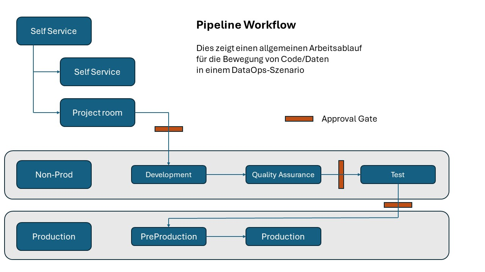

# Eine Datenplattform - *"zukunftssicher"*

 

## Einführung

Die IT-Welt befindet sich in diesen Zeiten (2024) in einem erheblichen Wandel, vor allem aufgrund der "ChatGPTs", die unter der Überschrift Generative AI – oder einfach GenAI – eine breite Palette neuer Funktionen rund um Text, Audio, Bilder und sogar Videos bieten.   Daher ist es wichtiger denn je, sicherzustellen, dass die richtigen Daten mit der richtigen Qualität neben solchen Diensten verwendet werden, um diese Funktionen voll auszuschöpfen.

Aber wie konnte man vor einem Jahr vorhersagen, was heute möglich ist und was für eine große Veränderung es tatsächlich ist, und damit planen, dies unterstützen zu können? Die kurze Antwort lautet: Sie könnten es nicht.
Und welche neuen "Herausforderungen" morgen mit sich bringen. Wir wissen es wahrscheinlich wirklich nicht, wir wissen nur, dass es Veränderungen geben wird, und sie werden wahrscheinlich eher früher als später eintreten.

In diesem Dokument wird beschrieben, wie eine Datenplattform geschaffen werden kann, die in der Lage ist, "was auch immer kommen mag" zu bewältigen und somit zumindest aus Datensicht zu ermöglichen, diese Chancen/Herausforderungen zu bewältigen.

Das Dokument basiert nicht auf dem, was "Best Practice" ist, sondern ist als "was Sie beachten sollten", wenn Sie eine Datenplattform erstellen möchten.

> [!Hinweis]
> Dieses Dokument ist ständig *in Vorbereitung*, da wir ständig neue Dinge lernen.
> Die nächsten Themen werden wohl Governance/Compliance und GenAI sein, da wir diese im Zusammenhang mit einer Datenplattform allmählich besser kennen

## Hintergrund

Dieses Dokument basiert auf den Erfahrungen verschiedener Microsoft-Kunden, die die Erstellung einer Datenplattform mithilfe von Clouddiensten für analytische Aufgaben optimieren möchten.

Dieses Konzept einer Datenplattform kann auf andere Datenplattformansätze angewendet werden, ist aber (derzeit) nicht abgedeckt.

> [!Hinweis]
> Das Dokument basiert auf Microsoft-Technologiekomponenten.

## Gesamtparadigma

Um sicherzustellen, dass eine Datenplattform "was auch immer kommen mag" unterstützen kann, ist es wichtig, dass wir einige Richtlinien festlegen, was gelten sollte.

Dieses übergeordnete Paradigma soll sicherstellen, dass eine Datenplattform die folgenden Merkmale erfüllt.

1. **Konsistenz** - Das Lösungsdesign ist konsistent, um die Bedienung und Weiterentwicklung von Lösungen zu vereinfachen. Der Konsistenzgrad eines Datenobjekts ist immer klar. Damit soll sichergestellt werden, dass der Wert der Daten immer kommuniziert werden kann.

2. **Datenkapselung** - Auf die Daten in der Dateninfrastruktur kann nur über eine Schnittstelle zugegriffen werden, die steuert, wer wann Zugriff auf was hat. Die Schnittstelle sollte es Ihnen ermöglichen, die Dateninfrastruktur zu modifizieren, ohne externe Systeme zu beeinträchtigen.

3. **Moduliert** - Die Lösungen in der Datenplattform sollten als Module mit einer klar definierten Schnittstelle aufgebaut sein, damit es einfach ist, Ressourcen und Dienste zu ersetzen, hinzuzufügen oder zu entfernen.

4. **Technologieunabhängig** - Die Architektur hängt nicht von der verwendeten Technologie ab. Das bedeutet, dass die Prozesse, Funktionen und Schichten unabhängig von der verwendeten Technologie gleich bleiben.

5. **Skalierbarkeit** - Skalierbarkeit (horizontal/vertikal) ist von Anfang an Teil des Lösungsdesigns, sodass Implementierung und Betrieb nicht durch Engpässe, Ausfallzeiten oder unerwartete Lizenzkäufe beeinträchtigt werden.

6. **Muss wiederherstellbar sein** - Alle in der Lösung verwendeten Dienste müssen angehalten/gestoppt und sogar gelöscht werden können. Und daher auch gestartet/neu erstellt werden können. Und das ohne Datenverlust, Änderung der Funktionalität und des Zugriffs (APIs).

7. **Nachvollziehbarkeit** - Alle in der Lösung verwendeten Dienste müssen für die Nutzung einzeln nachvollziehbar sein - sowohl aus Sicherheits- als auch aus Kostengründen.  Agilität - Der Fokus muss auf einem Ansatz liegen, der auf Minimal Viable Product (MVP) basiert, sowie auf kontinuierlichem Feedback zu früheren Schritten im Datenfluss.

8. Sicherheit – Sicherheit muss in die Gesamtarchitektur und spezifische Lösungsdesigns integriert werden, sowohl für die Informationssicherheit als auch für den Datenschutz. Der Austausch von Komponenten darf die Sicherheitsaspekte nicht beeinträchtigen. Compliance und Governance müssen im Laufe der Zeit über die verschiedenen Ebenen hinweg aufrechterhalten werden.

9. **Recycling** - Lösungen müssen für das Recycling konzipiert sein. Die Architektur sollte Vorlagen für das Lösungsdesign enthalten, die die Markteinführung beschleunigen und die Standardisierung gewährleisten.

10. Feedback - Die Architektur muss basierend auf dem Feedback aus der Nutzung der Datenplattform kontinuierlich angepasst und verbessert werden.

## *Daten* und *Datensatz*

Die Konzepte *data* und *dataset* sind die "Kernkomponenten" der Datenplattform.

Wenn der Begriff *data* verwendet wird, bezieht er sich auf ein einzelnes Datenobjekt, z. B. eine Tabelle oder Datei, die nur die Daten eines bestimmten Objekts enthält. Dies kann z. B. eine Quelltabelle wie Debitorenbuchhaltung oder Rechnungen sein.

Wenn hingegen der Begriff *Datensatz* verwendet wird, bedeutet dies eine Sammlung von Tabellen oder Dateien, die miteinander verbunden sind. Das kann zum Beispiel ein Data Mart mit Kunden-, Produkt- und Zeitdimensionen sowie Verkaufszahlen sein, auch Sternkarte genannt.   Der Datensatz ist die Schlüsselkomponente der Datenplattform und weist einige spezifische Merkmale auf:

- Der Datensatz ist in sich geschlossen, d. h. er ist nicht von anderen Datenquellen abhängig. Es enthält alle Daten, die zur Unterstützung der anstehenden Aufgabe benötigt werden.
- Nur die Spalten/Zeilen, die für die ausgeführte Aufgabe relevant sind, sind im *Datensatz* vorhanden.
- Ein *Datensatz* gehört zu einer Gruppe und nicht zu bestimmten Personen – daher ist der Besitzer in einer Azure-Konfiguration eine Gruppe mit einer Entra ID.
- Einem *Datensatz* sollten zwei zusätzliche Gruppen zugeordnet sein, eine für die Erstellung des Inhalts und eine andere mit Lesezugriff auf Daten.
- Der Zugriff auf einen *Datensatz* wird gewährt, indem Personen zu der/den Gruppe(n) hinzugefügt werden, je nachdem, welche Aufgabe sie ausführen müssen.
- Ein *Datensatz* ist nicht an eine bestimmte Technologie wie eine relationale Datenbank gebunden. Das Dataset wird als Dateien gespeichert, häufig als durch Kommas getrennte Dateien (csv) oder Parquet-Dateien. Es kann dann über die Technologie bereitgestellt werden, die am besten zu der jeweiligen Aufgabe passt - das kann dann eine Beziehungsdatenbank sein.

## Cloud-Zugang

Die in diesem Dokument beschriebene Datenplattform basiert auf Cloud-Technologien.

Und dieser Ansatz für eine Datenplattform hat einige Funktionen, die nur mit einem solchen Cloud-Ansatz erreicht werden können.

*Abbildung 1*

Wie in Abbildung 1 dargestellt, bietet die Verwendung von Cloud-Technologien Zugriff auf verschiedene Arten von Diensten.

Infrastructure as a Service (IaaS) – Dies ermöglicht die Erstellung verschiedener Arten von virtuellen Maschinen und die Installation der gesamten darauf benötigten Software. Dabei garantiert der Cloud-Anbieter den Service bis auf Betriebssystemebene.  Beim IaaS-Ansatz fokussieren wir uns darauf, welche Produkte wir einsetzen wollen und liefern so die passenden "Maschinen" dafür.

Platform-as-a-Service (PaaS): Dies gilt für Dienste wie Datenbanken. Wir müssen uns keine Sorgen um die Infrastruktur hinter diesen Diensten machen. Der Cloud-Anbieter stellt alle notwendigen Komponenten hinter dem Service selbst sicher. Dazu gehören Updates, neue Versionen und Verfügbarkeit. Im PaaS-Setup konzentrieren wir uns nur darauf, welche Funktionalität wir benötigen, und nicht darauf, welches "Produkt" wir dafür benötigen.

Software as a Service (SaaS) – Ein SaaS-Service ist eine Komplettlösung wie ein ERP- oder HR-System. Hier stellt der Cloud-Anbieter den Zugriff auf eine vollständige Suite von Anwendungen, Datenbanken und Infrastrukturen sicher, die für das Funktionieren des SaaS-Dienstes erforderlich sind.

Die diskutierte Datenplattform basiert "nur" auf PaaS- und/oder SaaS-Diensten und damit in sehr begrenztem Umfang auf IaaS. 

Im Kapitel "Beispiele für Implementierungen" werden verschiedene Möglichkeiten beschrieben, dies mit verschiedenen PaaS- oder SaaS-Diensten zu tun.

Ein weiterer wichtiger Aspekt der Cloud ist, dass "alles Software ist". Das bedeutet, dass beim Erstellen eines neuen Servers beispielsweise die verschiedenen Komponenten, die der Server verwendet - wie Festplatten, Netzwerkkarten usw. - durch Senden von Befehlen an die Cloud-Infrastruktur generiert werden. Wir können also Software verwenden, um diese Komponenten herzustellen.

Dies wird als Infrastructure as Code (IaC) bezeichnet. In der beschriebenen Datenplattform wird dies beispielsweise verwendet, um eine relationale Datenbank zu erstellen und dann einen bestimmten Datensatz mithilfe von Code in diese Datenbank zu laden.

## Logische Architektur

Die Datenplattform ordnet *Daten* und *Datensätze* in verschiedenen Regionen gemäß einer logischen Architektur an, wie in Abbildung 2 dargestellt. 
Damit soll sichergestellt werden, dass wir uns an die "Regeln" des Paradigmas halten können, wie bereits erwähnt. 
 

*Abbildung 2*

Die Bereiche repräsentieren verschiedene Zustände der Reise von Daten zu Datensätzen und damit zu Berichten und Analysen.
In Bezug auf Abbildung 2 können die verschiedenen Bereiche wie folgt beschrieben werden:

Quellsysteme sind alle Systeme, aus denen Daten extrahiert (gebatcht) oder von denen Daten gesendet (gestreamt) werden sollen.

Der Aufnahmebereich ist der Ort, an dem Daten aus den Quellsystemen abgelegt werden. Die Daten werden in ihrem ursprünglichen Format gespeichert. Wenn es sich bei den Daten um "Tabellendaten" handelt, werden keine Änderungen an Zeilen oder Spalten vorgenommen, nicht einmal am Datenformat selbst. Die Daten werden in Dateien gespeichert - in der Regel durch Kommas getrennt oder Parkett möglicherweise in ihrem Binärformat - die beispielsweise für Video, Bild oder Audio gelten würden. Der Aufnahmebereich verfügt über eine Ordnerstruktur, die die Identifizierung der Datenquelle erleichtert. Es gibt keine Aktualisierung oder Überschreibung bestehender Dateien - was bedeutet, dass bei einem neuen Laden neue Dateien erstellt werden. Ob es sich bei dieser Last um eine "Volllast" oder "Änderungen seit dem letzten Mal" handelt, hängt von den Bedürfnissen und Möglichkeiten der jeweiligen Quellen ab.

Im Laufe der Zeit müssen Dateien im Ingest-Bereich archiviert oder gelöscht werden, wenn dies gesetzlich vorgeschrieben ist (z. B. DSGVO).

Im Bereich **Transformieren** werden Daten aus dem Bereich Ingest abgerufen und in ein "technisch nutzbares" Format geändert.

Eine Aufgabe besteht daher darin, Daten so zu transformieren, dass sie das gleiche Format haben – zum Beispiel könnte es sein, die "schwierigen" Datentypen wie Datumsangaben (z. B. das Teilen der Uhrzeit vom Datum in eine separate Spalte) und Dezimalzahlen ("." oder ",." als Trennzeichen) zu "standardisieren".

Die einzelnen Datenelemente im Bereich *Transform* sind "unabhängige Objekte". Das bedeutet, dass sie keinen Mix aus Daten aus einem oder mehreren Quellsystemen haben, nicht so verfeinert werden, dass die ursprünglichen Informationen nicht vorhanden sind, und dass keine Begrenzung in der Anzahl der Zeilen oder Spalten vorgenommen wird. Sie können jedoch in Betracht ziehen, "fehlerhafte Zeilen" in ein separates Datenobjekt zu trennen.  

*Daten* im Bereich **Transformieren** existieren also als "reine" Objekte, mit denen man bequem arbeiten kann, wenn man sie zur Bildung von *Datensätzen* verwendet.

Eine weitere Aufgabe besteht darin, sicherzustellen, dass die verschiedenen Daten, die wir in diesem Bereich zur Verfügung haben möchten, einfach zusammengeführt werden können, was bedeutet, dass jedes Datenobjekt über die "Referenzschlüssel" verfügt, die erforderlich sind, um sich mit anderen Datenobjekten verbinden zu können.

Im Bereich *veröffentlichen* werden die *Datensätze* erstellt, die benötigt werden, um die verschiedenen Geschäftsanforderungen zu erfüllen, die Daten von der Datenplattform benötigen. Hier werden Modelle wie Sternschemata verwendet, und die Bereitstellung dieser Datensätze erfolgt meist über Data Marts (relationale Datenbanken).

Im Bereich "Veröffentlichen" können die Endbenutzer der Datenplattform auf die benötigten Datensätze zugreifen und die Tools verwenden, die sie für am besten geeignet halten.

> [!Hinweis]
> Das oben beschriebene Paradigma ist heute auch als Medaillon-Datenarchitektur bekannt, wobei Bronze der **Ingest-Bereich**, Silber **Transformieren** und Gold **Veröffentlichen** ist. Die Medaillonarchitektur reflektiert nicht den **Konsumbereich**. In diesem Dokument werden die Begriffe **Ingest**, **Transformieren**, **Veröffentlichen** und **Consume** verwendet, da dies die Verwendung bei den Kunden widerspiegelt, die die Inspiration für dieses Dokument sind.

### Schnittstellen

Abbildung 2 zeigt, dass die Schnittstelle zwischen den verschiedenen Bereichen genauso wichtig ist wie der Inhalt der Bereiche. Diese Schnittstellen müssen die technologische Unabhängigkeit gewährleisten, die wir in der Plattform wünschen – es muss einfach sein, neue Dienste zu ändern/hinzuzufügen – und sicherstellen, dass wir die Wege des Datenflusses kennen.

Die meisten Unternehmen/Institutionen bevorzugen die Verwendung einer oder mehrerer der folgenden Schnittstellenoptionen.  

**REST-API** - die "grundlegende" Schnittstelle, die die meisten (alle) neuen Dienste verwenden, um ihre Funktionalität anzubieten. Diese Stufe ist hochtechnisch und eignet sich nicht für Low-Code/No-Code-Ansätze.

**SQL** – die Standard-Datenabfragesprache, die von vielen verschiedenen Datenbanksystemen weit verbreitet ist und unterstützt wird. Viele kennen SQL von der Verwendung in relationalen Datenbanken, aber es ist auch in anderen Arten von Datenbanksystemen wie NoSQL-Datenbanken verfügbar.

Wenn Sie in SQL "nur" die Funktionen verwenden, die Teil des SQL-Sprachstandards sind, bietet dies ein hohes Maß an Flexibilität. Das bedeutet, dass Sie keine spezifischen Funktionen verwenden, mit denen ein bestimmtes Datenbankprodukt eine SQL-Implementierung erweitert hat – insbesondere die Verwendung der prozeduralen Sprachen, die beispielsweise in MS SQL Server oder Oracle DB zu finden sind.

**Python** – die "neue" Datenverarbeitungssprache. Python ist weit verbreitet und spiegelt die aktuelle Art des Umgangs mit Daten wider. Python ist eine allgemeine Programmiersprache, die zur Laufzeit interpretiert wird.
Die Syntax von Python ist relativ einfach und daher leicht zu erlernen und bietet auch ein gutes Maß an Lesbarkeit, was die Kosten für die Programmwartung senken sollte. Python unterstützt die Verwendung von Modulen und Paketen und fördert ein Modul zum Programmieren und Wiederverwenden von Code.

Die wirklich gute Unterstützung von Daten sowie eine umfangreiche Standardbibliothek machen Python im Kontext von Datenplattformen sehr beliebt.  Darüber hinaus lieben Programmierer Python, weil sie das Gefühl haben, dass es sie produktiver macht.

### Unterstützende Datendienste

Eine zusätzliche Komponente der Implementierung sind, wie Abbildung 2 zeigt, einige unterstützende Datendienste. Dazu gehören:

[Datenkatalog](Supporting_Data_Services/Data_Catalog/README-de.md) – eine "Verzeichnisdatenbank", in der wir aufzeichnen und erklären, welche Daten und Datensätze auf der Datenplattform verfügbar sind. Dazu gehören auch Elemente wie Eigentum, Nutzungsrichtlinien usw.

[Gemeinsames Datenmodell](Supporting_Data_Services/Common_Data_Model/README-de.md) – Insbesondere für den **publish**-Bereich können bestehende Branchendatenmodelle nützlich/relevant sein. 

[Datenermittlung](Supporting_Data_Services/Data_Discovery/README-de.md) - Ein Wissensprozess, der sich an Geschäftsanwender richtet und es ihnen ermöglicht, Daten visuell zu untersuchen und erweiterte Analysen anzuwenden, um Muster zu finden, Erkenntnisse zu gewinnen und spezifische Geschäftsfragen zu beantworten.

[Datenherkunft](Supporting_Data_Services/Data_Lineage/README-de.md) – Dokumentation, wie Daten zwischen den verschiedenen Bereichen "übertragen" und transformiert werden. Es kann sowohl die technische Verarbeitung sein, die stattgefunden hat - "welche Aktionen wurden mit den Daten durchgeführt" - als auch die Dokumentation für die eigenen Geschäftsanwender - "Woher kommen diese Daten?".

[Datenverwaltung] (Supporting_Data_Services/Data_Governance/README-de.md) - Prozesse, Richtlinien, Regeln und Berichte, um sicherzustellen, dass die Daten ordnungsgemäß verwaltet werden. Oft basierend auf Frameworks wie ISO27x oder NIST.

[Stammdaten] (Supporting_Data_Services/Master_Data/README-de.md) – Einige Daten/Datensätze können vorteilhaft als Stammdaten behandelt werden, so dass es nur "einen Datensatz" von z.B. einem Kunden gibt.

> [!Hinweis]
> Das Dokument wird laufend um eine Beschreibung dieser erweitert.

### Ein Sonderfall – Echtzeit 

Wir werden uns der Echtzeit-Datenverarbeitung als Einzelfall nähern und sie aus dieser Perspektive betrachten.

Real Time gibt es in verschiedenen Varianten, in diesem Dokument werden wir die folgenden Begriffe verwenden

- Echtzeit – *Daten*, die sofort nach der Abholung geliefert werden.
- Nahezu in Echtzeit – *Daten*, die aufgrund von Kommunikation oder Verarbeitung "verzögert" werden.
- Dynamische Daten – *Daten*, die aktualisiert werden und Aufmerksamkeit benötigen.

Die Datenplattformmethode in diesem Dokument ist **nicht** für die Echtzeitsituation geeignet, aber sie funktioniert gut für nahezu Echtzeit- und dynamische Daten. Dynamische Daten, die auf Ereignissen basieren, werden auf die gleiche Weise verarbeitet wie Near-Real-Time-Daten in der Datenplattform.

Der allgemeine Ansatz besteht darin, dass einige oder alle Echtzeit-*Daten* auch im **Ingest-Bereich** für eine weitere Verarbeitung gespeichert werden.
Dies ermöglicht es der Datenplattform, über Funktionen zu verfügen, die gegebenenfalls einen Echtzeitprozess unterstützen können, aber auch das gesamte Wissen zu verwalten, das im Laufe der Zeit aus den Echtzeitsituationen generiert werden kann.
Dies kann dann dazu beitragen, das Eintreten eines unerwünschten Ereignisses – wie z. B. eine Zugverspätung – zu vermeiden.

Oder geben Sie detailliertere Informationen über ein Torereignis in einem Fußballspiel und können Sie dann die Quoten auf der Grundlage der auf der Datenplattform verfügbaren historischen Daten schnell ändern.

Um dies zu veranschaulichen, stellen Sie sich einen Zug vor, der Verspätung hat. Das System, das den Fahrgästen am Bahnhof die Informationen anzeigt, erhält sofort die Echtzeitdaten über die Verspätung und aktualisiert die Schilder entsprechend. Dabei werden die Daten selbst nur wenig verarbeitet.

! [Abbildung 3](images/german/Slide3.JPG)

*Abbildung 3*

Diese *Daten* werden aber auch in der Datenplattform gespeichert, wo zwar etwas Zeit, aber nicht viel ist, um für die einzelnen Fahrgäste, die auf den verspäteten Zug warten, einen Vorschlag für alternative Routen zu generieren. Diese Informationen können dann an eine App auf dem Smartphone gesendet werden. Dieser Prozess könnte also wie folgt aussehen:

## Rollen

Die Datenplattform ist so eingerichtet, dass Rollen als Mechanismus verwendet werden, um den Zugriff auf Daten und Datensätze in der Plattform zu steuern. Diese Rollen werden verwendet, um Personen, die mit der Plattform arbeiten, die richtigen Verantwortlichkeiten zu übertragen.

Wie die Rollen mit den einzelnen Personen verbunden sind und ob einige von ihnen mehr als eine Rolle haben, hängt vom einzelnen Unternehmen/der Institution sowie den gegebenen Bedürfnissen und verfügbaren Ressourcen ab.

Das Wichtigste ist, dass sich die Prozesse des Umgangs mit Daten an die "Regeln" des Paradigmas halten.

Dies ist eine Liste möglicher Rollen, basierend auf dem, was Unternehmen/Institutionen, die eine Datenplattform wie beschrieben aufgebaut haben, verwendet haben:

1. Projektinhaber
   - Schnittstelle zum Lenkungsausschuss/Management.
   - Kommt typischerweise von "The Business"

2. Projektleiter
   - Leiter des einzelnen Projekts.
   - Kommt typischerweise von "IT"

3. Dateningenieur
   - Definieren und gestalten Sie die Prozesse, die Daten aus den Quellsystemen und in den Ingest-Bereich abrufen.
   - Kommt typischerweise von "IT"

4. Designer
   - Definieren und formen Sie die Datensätze, die gebildet werden müssen, um die Anforderungen des Unternehmens zu erfüllen
   - Kommt typischerweise von "The Business"

5. Transformationsingenieur (ETL-Programmierer)
   - Bildet die Transformationsprozesse (ETL), die in den Bereichen **transformieren** und **veröffentlichen** verwendet werden.
   - Kommt typischerweise von "IT"

6. Datenverwaltung
   - Stellen Sie ein einheitliches Verständnis zwischen IT und Unternehmen in Bezug auf Sicherheit sicher.
     Und dass diese zu den allgemeinen Sicherheitsprinzipien passen, die das Unternehmen/die Institution befolgt.
   - Kommt typischerweise aus "IT/Business"

7. Superuser/Botschafter
   - Definieren und Formen von Berichten/Dashboards und anderen Endanwendungsszenarien
   - Kommt typischerweise von "The Business"

8. Systembesitzer
   - Vermittelt Wissen darüber, wie die Quellsysteme verwendet/organisiert werden
   - Kommt typischerweise von "The Business"

9. Architekt
   - Stellt sicher, dass die Prinzipien der IT-Architektur eingehalten werden
   - Kommt typischerweise von "IT"

Abhängig von der Größe des Projekts, der Größe des Unternehmens/der Institution und/oder eines verwendeten Frameworks können Sie auch Rollen wie Scrum Master, Product Owner, Program Owner, Steering Committee Member usw. treffen.

Die Anforderungen der verschiedenen Rollen variieren natürlich während eines Projekts. Im Folgenden finden Sie ein Beispiel dafür, wie die "Workload" aussehen könnte:

|Rolle|Ideenfindung|Iteration 1|Iteration 2|Iteration 3|Iteration 4|Iteration ....|Zustand der Vision|
|----|--------|-----------|-----------|-----------|-----------|------------|------------|
|Bauherr|100%|25%|25%|25%|25%|25%|100%|
|Projektmanager|100%|100%|100%|100%|100%|100%|100%|100%|
|Dateningenieur|100%|50%|25%|5%|5%|5%|0%|
|Designer|100%|10%|10%|25%|25%|40%|0%|
|Transformationsingenieur|100%|30%|30%|30%|30%|30%|30%|0%|
|Data Governance|100%|25%|25%|10%|10%|10%|10%|10%|
|Superuser/Botschafter|100%|5%|5%|20%|20%|50%|100%|
|Systembesitzer|100%|25%|10%|0%|0%|0%|0%|10%|
|Architekt|100%|50%|25%|10%|10%|10%|10%|

1. Ideenfindung – Projektstart, der den Rahmen und das gewünschte Ergebnis für ein Projekt festlegt.
2. Iteration X – die einzelnen "Versionen" – in der Regel alle 3 Monate eine neue Version 
3. Visionszustand – Das gewünschte Endergebnis.

## Umgebungen

In diesem Abschnitt wird erläutert, wie sechs Umgebungen zum Implementieren eines Datenplattformprojekts verwendet werden können. Je nach Vorlieben können Sie natürlich entscheiden, wie viele dieser Umgebungen Sie haben möchten und wie Sie die beschriebenen Aufgaben auf weniger oder mehr Umgebungen verteilen.

1. Sandbox – diese Umgebung wird für MVP-Tests verwendet.
2. Projekträume - Entwicklungsumgebungen.
3. Entwicklung – Code, der die Grundlage einer Produktionsumgebung bildet.
4. Test - Funktionstest.
5. Qualitätssicherung – Code-Review.
6. Vorproduktion - Testen von Produktionsdaten.
7. Produktion - Produktionsdaten.

## Datenrichtlinien

Um die Datenrichtlinien zu steuern, die Sie verwenden möchten, müssen Sie sicherstellen, dass Sie die Art der Umgebung verstehen, die ein bestimmter Auftrag ausführt. In diesem Dokument werden 5 Arten von Umgebungen in der Diskussion der Prozesse verwendet.

1. Sandbox - Umgebung, die zum Testen der Funktionalität jedes Dienstes verwendet wird. Diese Umgebungen enthalten KEINE Geschäfts-/Firmendaten.
2. Projekträume – Diese Umgebungen werden verwendet, um Umgebungen einzurichten, die Tools und Daten enthalten, die zur Ausführung einer Entwicklungsaufgabe verwendet werden.
3. Nicht-Produktion – Umgebungen, die Entwicklungs-, Qualitätssicherungs- und Testszenarien enthalten.
4. Fertigung – Umgebungen, die Vorproduktions- und Produktionsszenarien unterstützen.
5. Vertraulich – Umgebungen, die die Verarbeitung streng vertraulicher Daten unterstützen.

## Daten und Sicherheit

Datensicherheit ist ein kritisches Element des Betriebs eines jeden Unternehmens. Es befasst sich mit dem Schutz von Daten vor unrechtmäßigem Zugriff, Verschlechterung oder Diebstahl über die gesamte Lebensdauer der Daten. Mit der Einführung robuster Datensicherheitsmaßnahmen können Unternehmen ihre kritischen Ressourcen sichern, Compliance erreichen und das Vertrauen der Kunden in den Umgang mit Daten erhalten.

Datensicherheit ist von entscheidender Bedeutung, da sie Unternehmen vor Cyberangriffen, Insider-Bedrohungen und menschlichem Versagen schützt, die zu Datenschutzverletzungen führen können. Zu den wesentlichen Faktoren für die Datensicherheit gehören Vertraulichkeit, Integrität, Verfügbarkeit und Compliance. Angesichts wachsender Bedrohungen für Daten müssen Unternehmen ihre Daten an der Quelle schützen, um die Datensicherheit aufrechtzuerhalten und Daten aus einem Angriff schnell wiederherzustellen. Der Zweck der Datensicherheit besteht darin, Daten vor allen Formen des Missbrauchs, einschließlich Cyberangriffen und menschlichem Versagen, zu schützen.

Zusammenfassend lässt sich sagen, dass die Wahrung der Vertraulichkeit, Integrität und Verfügbarkeit der Informationen eines Unternehmens für die Datensicherheit unerlässlich ist. Es unterstützt den Schutz kritischer Ressourcen, hilft bei der Erfüllung der Compliance-Anforderungen bestimmter Standards und erhält das Vertrauen der Kunden.

Abbildung 4 zeigt verschiedene Datenschutzmethoden, die in Azure verfügbar sind. Allgemeine Themen wie Netzwerksicherheit oder Multi-Faktor-Authentifizierung werden jedoch nicht behandelt, da davon ausgegangen wird, dass diese bereits implementiert sind.

*Abbildung 4*

**Anwendungsbasierte Zugriffskontrolle** - deckt die Tatsache ab, dass eine Anwendung wie SAP, Snowflake, Fabric, Dynamics usw. eine Anmeldung erfordert und somit den korrekten Zugriff auf die zugrunde liegenden Daten ermöglicht, die in der Anwendung verwendet werden. Häufig ist der zugrunde liegende Datenspeicher eine (relationale) Datenbank, auf die von der Anwendung aus über ein Dienstkonto zugegriffen werden kann. 
Rollenbasierte Zugriffskontrolle – auch bekannt als RBAC. Dies steuert den Zugriff auf eine bestimmte Ressource und wie sie verwendet werden kann. Also in populären Begriffen - können Sie auf das Speicherkonto zugreifen?

Die **attributbasierte Zugriffskontrolle** – auch bekannt als ABAC – bietet oft einen zusätzlichen Mechanismus, um Zugriff zu gewähren, um eine "Suche" in einem anderen System durchzuführen. Beispielsweise kann man auf ein Speicherkonto zugreifen, aber es kann sich um einen Ordner handeln, für den man Teil eines bestimmten Projekts sein muss. In diesem Fall können Sie einen ABAC-"Lookup" durchführen, der dies überprüft, bevor Sie den Zugriff gewähren - abhängig von diesem Ergebnis.

**Identitätsbasierte Zugriffskontrolle** – umfasst die Möglichkeit, einer bestimmten Ressource eine Identität zuzuweisen ("ein Mensch" zu werden). Und dann stellen Sie sicher, dass nur diesem "Menschen" Zugriff auf ein bestimmtes Speicherkonto gewährt wird, und daher müssen Sie diese Anwendung verwenden, um an die Daten zu gelangen.

**Verschlüsselungsbasierte Zugriffskontrolle** - Dies ist keine wirkliche Zugriffskontrolle, da der Datenspeicher verfügbar ist, man die Daten jedoch nur lesen/verwenden kann, wenn man den Schlüssel zur Entschlüsselung hat. Es kann (sollte) also Teil Ihrer Verteidigung sein.

**Löschbasierte Zugriffssteuerung** – dieser Ansatz ist nur im Consume verfügbar. Dieser Ansatz nutzt den Aspekt des Verbrauchsbereichs, dass ein Data Warehouse nur "so lange lebt, wie es genutzt wird", in diesem Fall "... richtig verwendet wird". Da dieser Ansatz die Fähigkeit erfordert, einen bestimmten Datenspeicher neu erstellen zu können, kann dies auch als Verteidigungsmechanismus verwendet werden. Wenn es also zu einem Angriff kommt, besteht der einfachste Weg, dies zu stoppen, darin, die Ressource während des Angriffs einfach zu entfernen, wenn die Gefahr eines Datenverlusts besteht.

### Umgebungen und Tags

In den verschiedenen Umgebungen müssen unterschiedliche Tags verwendet werden, um die Art der Umgebung zu identifizieren. Die folgende Tabelle enthält Beispiele für Tags, die verschiedenen Umgebungen zugeordnet werden können.

|Umwelt/Dach|Sandkasten|Projektraum|Nicht-Produktion|Produktion|Vertraulich|Werte|
|---------|---------|----------|---------------|----------|---------|-------|
|Eigentümer der Daten|Prüfung|Erforderlich|Erforderlich|Erforderlich|Erforderlich|Name des Eigentümers|
|Umwelt|Erforderlich|Erforderlich|Erforderlich|Erforderlich|Erforderlich|Die Art der Umgebung, die "Sandbox" |
|Diät-Zentrum|Erforderlich|Erforderlich|Erforderlich|Erforderlich|ErforderlichKostenstelle |

- Überarbeitung – Dachbeeren sind an Ort und Stelle.
- Erforderlich – Tag muss vorhanden sein, andernfalls wird die Installation verweigert.
- Nicht zutreffend – Nicht zutreffend.

## Entwicklungsumgebung - Projektraum

Eine Möglichkeit, eine sichere Entwicklungsumgebung einzurichten, könnte die Verwendung eines Projektraums sein.

Diese Projekträume stellen eine isolierte Umgebung dar, die sich in der Regel im Besitz einer Gruppe befindet.

Im Projektraum werden Daten, Tools und Code vollständig isoliert erstellt/gepflegt. Der Zugriff auf einen Projektraum erfolgt durch Hinzufügen oder Abrufen von Personen aus den entsprechenden Gruppen.

Die folgende Abbildung zeigt ein Beispiel für einen Projektbereich in der Datenplattformumgebung.

 

*Abbildung 5*

Entwicklungen, die in einem Projektraum stattfinden, können dann z.B. über einen CI/CD-Prozess in die einheitliche Datenplattform "eingecheckt" werden. Ein Beispiel hierfür finden Sie im Kapitel "CI/CD-Beispiel". 

Alle Daten, die für die Durchführung der Entwicklung benötigt werden, können/sollten einen Prozess durchlaufen, der sie zu "Nicht-Produktionsdaten/-datensätzen" macht.

Damit Daten/Datensätze in diesen Projektbereichen schreibgeschützt sind, muss der Besitz einer anderen, aber eindeutigen Gruppe zugewiesen werden.
In den seltenen Situationen, in denen eine Integrationsverbindung zwischen verschiedenen Projekträumen erforderlich ist, sollte das Eigentum in einer eigenen Gruppe platziert werden, die für diese Projekträume noch einzigartig ist.

## Daten ermitteln

Leitprinzipien

1. Gesetze wie die europäische DSGVO oder der CCPA aus Kalifornien müssen eingehalten werden.
2. Daten dürfen nur in dem Kontext verwendet werden, in dem sie erhoben werden.
3. Die Entwicklung kann nicht auf Produktionsdaten erfolgen.
4. Unterscheiden Sie zwischen der Speicherung von Daten - "Sicherheit" - und der Verwendung von Daten - "Datenschutz".

Die wichtigsten technischen Mechanismen, die verwendet werden können, um eine ordnungsgemäße Handhabung in den Umgebungen zu gewährleisten, sind die folgenden:

1. Datenklassifizierung - ermöglicht es, die Art der Daten zu verstehen, mit denen Sie es zu tun haben.
2. Trennung der Umgebung – Durch die Trennung der Umgebungen kann eine Vermischung von Daten vermieden werden. Dies ermöglicht einen einfacheren Verwaltungsprozess.
3. Datenrichtlinien – Die Verwendung von Richtlinien stellt sicher, dass allgemeine Rahmenbedingungen wie ISO27XXX, NIST oder ähnliches in allen Umgebungen befolgt werden.
4. Beschriftung – hilft bei der Identifizierung wichtiger Elemente jeder Umgebung, z. B. Besitzer und Umgebungstyp.
5. Verschlüsselung - Die Verwendung von Verschlüsselung, möglicherweise mit Ihren eigenen Schlüsseln, kann eine Sicherheitsmethode sein.

Nicht-Produktions-Datensatzerstellungsprozess

Der Prozess der Erstellung von Daten, die in Nicht-Produktionsumgebungen verwendet werden können, kann einer (oder mehrere) der folgenden sein:
1. Kopie der Produktionsdaten.
2. Datengenerierung von gefälschten Daten.
3. Anonymisierung.
4. Pseudonymisierung.
5. Verschlüsselung + Wörterbuch.
6. Datensatz "Keine Beziehungen".

Die verwendete(n) Methode(n) hängt in der Regel von der Klassifizierung der verschiedenen Datenelemente ab. Um die Klassifizierung verschiedener Daten/Datensätze zu bestimmen, sollte eine "Datenbank" dieser Informationen geführt werden. Dies sollte dann der "Nachschlagepunkt" sein, um die richtige Datenverarbeitung zu etablieren.

### Datenverarbeitung im Detail

In diesem Abschnitt werden die verschiedenen Optionen erläutert, mit denen ein oder mehrere Datensätze in einer Nicht-Produktionsumgebung erstellt werden können. Sie werden höchstwahrscheinlich eine Kombination davon benötigen.
Wichtig für EU-Vorschriften: Pseudonymisierung und Anonymisierung von Daten werden nach DSGVO, dem Datenschutzgesetz der EU, unterschiedlich behandelt.
Verweis auf EU-Dokument

#### Kopie der Produktionsdaten

Dies ist zwar keine empfohlene Vorgehensweise, aber manchmal ist es möglich und erlaubt, Produktionsdaten (möglicherweise eine Teilmenge von) in einer Nicht-Produktionsumgebung zu verwenden. Diese Datasets sind wahrscheinlich als schreibgeschützt markiert.
Ein Azure-Dienst, der für diese Aufgabe geeignet ist, können Data Factory-Copy-Pipelines sein.

#### Datengenerierung gefälschte Daten

In diesem Prozess erstellt man gefälschte Daten basierend auf den Informationen über Datentyp, Länge, Muster, Inhalt usw., denen diese Daten entsprechen müssen. Wichtig ist, dass es sich um echte gefälschte Daten handelt und nicht um Daten, die ein gefälschter Produktionsdatensatz sind.
Das Erstellen eines gefälschten Datensatzes ist oft eine schwierige Aufgabe, daher lohnt es sich, sicherzustellen, dass der etablierte Prozess wiederverwendet, automatisiert, skaliert und parametrisiert werden kann.

Tools zum Erstellen gefälschter Daten mit Python können sein
-Fälscher
-SDV
-Gretel

#### Anonymisierung

Die Anonymisierung kann verwendet werden, wenn Sie ein Produktionsdataset verschlüsseln und in eine Nicht-Produktionsumgebung übertragen können. Anonyme Daten sind Daten, die so verändert wurden, dass eine erneute Identifizierung von Daten nicht möglich ist.
Die Verschlüsselung kann auf viele Arten mit verschiedenen Techniken wie Datenrauschen, Substitution und Aggregation erfolgen.

Es ist wichtig zu beachten, dass die Anonymisierung ein "einseitiger Prozess" ist, bei dem man die Möglichkeit verliert, bis zu den Originaldaten zurückzuverfolgen. Sie können diese Daten auch nicht verwenden, um eine Verbindung mit anderen Produktionsdatasets herzustellen und diese zu verwenden.

Data Factory-Dataflows/Azure Databricks können dafür mit der Microsoft Presidio-Erweiterung verwendet werden.

#### Pseudonymisierung

Die Pseudonymisierung ist im Wesentlichen derselbe Prozess wie die Anonymisierung, mit einem großen Unterschied. Pseudonyme Daten sind Daten, die vom Ursprung der Daten anonymisiert wurden, aber bei Bedarf erneut identifiziert werden können.
Tokenisierungs- und Hashing-Funktionen können zur Pseudonymisierung von Daten verwendet werden.

Hierfür können Data Factory-Dataflows/Azure Databricks verwendet werden.

#### Verschlüsselung mit Schlüssel

In diesem Fall schützen Sie Ihre Daten mit einem Verschlüsselungsschlüssel, und nur die Personen, die Zugriff auf den Schlüssel haben, können die Daten verwenden.

Dieser Schlüssel kann in einem Azure Key Vault gespeichert werden.

**HINWEIS: Dies ist kein gültiger DSGVO-"Schutzmechanismus", da er "nur" den Zugriff auf die Daten schützt, nicht die Verwendung der Daten.

#### Datensatz "Keine Beziehungen"

Bei diesem Ansatz erstellen Sie Datasets, die "echte" Daten auf Spaltenebene enthalten. 

Wenn Sie beispielsweise eine Postleitzahlenspalte haben, wären die Postleitzahlen hier echt, und wenn Sie einen Straßennamen im selben Datensatz haben, wären es auch echte Straßennamen.

Der Ansatz "Keine Beziehungen" kommt ins Spiel, wenn Daten aus der einzelnen Zeile angezeigt werden. Im obigen Fall wären der Straßenname, die Hausnummer und die Postleitzahl logisch sinnvoll, aber sie würden "in Wirklichkeit" nicht existieren.
Ein Ansatz könnte also darin bestehen, Sätze verschiedener Daten zu erstellen, die Elemente darstellen, die personenbezogen sind – könnte eine Datenbank mit Straßennamen in einem Satz sein, alle Postleitzahlen in einem anderen Satz, die 20 häufigsten Vornamen in einem dritten, die 20 am häufigsten verwendeten Nachnamen in einem vierten und so weiter.

Und beim Erstellen einer neuen Zeile werden Zufallswerte aus den einzelnen Sätzen entnommen und verwendet, um diese Elemente im Kontext einer "Person" zu erstellen.

Hierfür können Data Factory-Dataflows/Azure Databricks verwendet werden.

## CI/CD-Beispiel

Wie oben erwähnt, sollte die Verwendung von CI/CD-Prinzipien (Continuous Integration/Continuous Deployment) in Betracht gezogen werden, um sicherzustellen, dass die Codierung in der Datenplattform konsistent gehandhabt wird. 
Solche Prozesse verfügen über Pipelinestrukturen, die beschreiben, welche Prozesse Code durchläuft, wenn er in der Produktion bereitgestellt wird.

Abbildung 6 zeigt ein – vereinfachtes – Beispiel für einen solchen Workflow.

 

*Abbildung 6*

Im Zusammenhang mit der laufenden Entwicklung und dem Testen müssen Sie häufig in der Lage sein, Daten in Nicht-Produktionsumgebungen zu verarbeiten. Wahrscheinlich haben Sie keine Berechtigung oder möchten Produktionsdaten in diesen Umgebungen verwenden. Zu Testzwecken können fehlerhafte Daten auch in Datensätze eingefügt werden, um mögliche Ausnahmeszenarien zu adressieren.

## Ein praktischer Ansatz

Basierend auf den Diskussionen in diesem Dokument zeigt Abbildung 6, wie dies im "wirklichen Leben" aussehen könnte. Links neben dieser Abbildung befinden sich die Quellsysteme, die "jemandem" gehören, der normalerweise als Systembesitzer bezeichnet wird. Diese Systembesitzer sind dafür verantwortlich, dass die Datenplattform Zugriff auf die richtigen Systeme hat. In der Abbildung haben wir also 3 Systeme namens App 1, App 2 und App 3, und sie gehören jeweils einem Systembesitzer mit dem Namen Systembesitzer 1 bis 3. 

In der Mitte befindet sich die Datenplattform mit dem Bereich Ingest, Transform und Publish. Im Aufnahmebereich sehen Sie, dass Daten eins zu eins aus den verschiedenen Apps 1 bis 3 übernommen werden. Dann haben wir einen Transformationsprozess, der diese Rohdaten in einen nutzbaren Zustand bringt. 
Auf der rechten Seite der Abbildung sehen Sie, was von den Endbenutzern im Veröffentlichungsbereich verlangt wird. Der erste Benutzer, Datenbenutzer 1 genannt, benötigt Daten, die nur aus App 1 stammen, sodass das erforderliche Dataset mit dem Namen Datenprodukt A ein unkomplizierter Prozess ist. 

Datenbenutzer 2 benötigt Daten, die sowohl aus App 1 als auch aus App 2 stammen, aber die in App 3 gefundenen Daten müssen aus diesem Datensatz herausgefiltert werden, so dass der Prozess in diesem Fall etwas komplizierter ist, aber da der Transformationsbereich einen Bereich darstellt, in dem Daten leicht kombiniert (und auch ausgeschlossen) werden können, ist die Grundlage dafür vorhanden.  Daher ist es recht einfach.

Gleiches gilt für Datenprodukt C, das Daten aus App 2 ohne Daten in App 3 darstellt.

*Abbildung 7*

Dies zeigt auch, wie die Datenplattform in der Lage sein sollte, die Geschäftsanforderungen schnell und nahtlos zu unterstützen. Der Gesamtansatz könnte also lauten: Wenn ein Datensatz heute nicht verfügbar ist, wird er für morgen bereit sein.

## Beispiele für Implementierungen

Im Folgenden finden Sie Beispiele für die Implementierung einer Datenplattform mit verschiedenen Microsoft-Diensten. Denken Sie daran, dass das übergreifende Paradigma die technologische Unabhängigkeit ist, daher sollte man "mischen und anpassen", was zu den eigenen Geschäftsmöglichkeiten und Herausforderungen passt.

> [! Hinweis]
> Diese Bereiche enthalten derzeit nur zusätzliche beschreibende Informationen, werden aber später auch Beispiele für Infrastructure-as-Code enthalten.

[Azure-basiert](Microsoft/Azure/README-de.md)

[Synapse-basiert](Microsoft/Synapse/README-de.md)

[DataBricks-basiert](Microsoft/Databricks/README-de.md)

[Fabric-basiert](Microsoft/Fabric/README-de.md)

[Microsoft Purview und die data platform](Microsoft/Purview/README-de.md)
