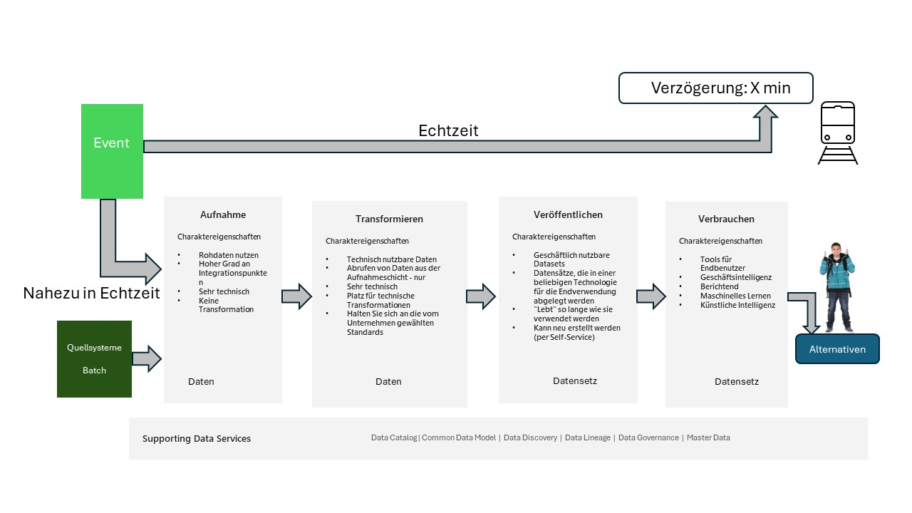

# Eine Datenplattform - *"zukunftssicher"*

## Einführung

Die IT-Welt befindet sich in diesen Zeiten (2024-) in einem erheblichen Wandel, vor allem aufgrund der "ChatGPTs", die unter der Überschrift Generative AI – oder einfach GenAI – eine breite 
Palette neuer Funktionen rund um Text, Audio, Bilder und sogar Videos bieten.   Daher ist es wichtiger denn je, sicherzustellen, dass die richtigen Daten mit der richtigen Qualität neben solchen 
Diensten verwendet werden, um diese Funktionen voll auszuschöpfen.

Aber wie konnte man vor einem Jahr vorhersagen, was heute möglich ist und was für eine große Veränderung es tatsächlich ist, und damit planen, dies unterstützen zu können? Die kurze Antwort 
lautet: Sie könnten es nicht.
Und welche neuen "Herausforderungen" morgen mit sich bringen. Wir wissen es wahrscheinlich wirklich nicht, wir wissen nur, dass es Veränderungen geben wird, und sie werden wahrscheinlich eher 
früher als später eintreten.

In diesem Dokument wird beschrieben, wie eine Datenplattform geschaffen werden kann, die in der Lage ist, "was auch immer kommen mag" zu bewältigen und somit zumindest aus Datensicht zu 
ermöglichen, diese Chancen/Herausforderungen zu bewältigen.

Das Dokument basiert nicht auf dem, was "Best Practice" ist, sondern ist als "was Sie beachten sollten", wenn Sie eine Datenplattform erstellen möchten.

Dieses Dokument basiert auf den Erfahrungen verschiedener Microsoft-Kunden, die die Erstellung einer Datenplattform mithilfe von Clouddiensten für analytische Aufgaben optimieren wollten.

>[!Hinweis]
>Dieses Dokument ist ständig *in Vorbereitung*, da wir ständig neue Dinge lernen.
>Die nächsten Themen werden höchstwahrscheinlich Governance/Compliance und GenAI sein, da wir mehr darüber im Zusammenhang mit > den verschiedenen Implementierungen erfahren, die wir von 
>Datenplattformen im Einsatz haben.

>[!Hinweis]
>Das Dokument basiert hauptsächlich auf Microsoft-Technologiekomponenten.

>[!Hinweis]
>Die Wörter "Daten" und "Datenset" wird verwendet, um sich auf jede Darstellung von Information (Text/Bilder/Ton/Zahlen...) zu beziehen.

## Inhalt

Neben dem Hauptthema der Erstellung einer Datenplattform und den direkten Disziplinen, die berücksichtigt werden sollten, werden auch andere Themen im Zusammenhang mit der Datenplattform behandelt. Dies sind die folgenden (in separaten Abschnitten):

|Sektion|Sektion|Section|Sektion|
|-------|-------|-------|-------|
|[Sicherheit](./Security/Security-de.md)|[Gesetzgebung](./Security/Legislation-de.md)|[Exit-Strategie](./Security/Exit-and-risc-strategies-de.md)|[Risikobewertung](./Security/Exit-and-risc-strategies-de.md)|
|[Daten-Modellierung](./DataModelling/DataModel-de.md)|[Daten-ermiteln](./Operations/establish-data-de.md)|[Project Rollen](./Operations/project-roles-de.md)|[Anwender Rollen](./Operations/user-roles-de.md)|
|[Operationen/Widerstandsfähigkeit](./Operations/Operations-de.md)|[Data-Operationen](./DataOps/DataOps-de.md)|[Data Mesh](./DataOps/Data-mesh-de.md)|[Selbstbedienung](./DataOps/Self-service-de.md)|
|[Generative AI](./GenAI/GenAI-de.md)|[Cloud-Umgebungen](./DataOps/Cloud-env-de.md)|[Namensstandards](./DataOps/Naming-standards-de.md)|[Meta data Handhabung](./DataOps/Data-mesh-de.md)|
|[Daten Agenten](./GenAI/Agent-de.md)|[Datenmarketsplatz](./GenAI/Marketplace-de.md)|||

## Hintergrund

In diesem Dokument geht es darum, wofür Daten verwendet werden können und wie Sie sicherstellen können, dass Sie immer auf jede neue Situation vorbereitet sind, in der 
Daten werden benötigt. Und dass dieser Ansatz auch auf eine konforme und geregelte Weise erfolgt, die Ihre Richtlinien und Richtlinien für die Datennutzung widerspiegelt.

Eine allgemeine Botschaft des Inhalts dieses Dokuments ist die Fähigkeit, Ihren Benutzern, die Daten anfordern, sagen zu können:

                   Wenn Data heute nicht verfügbar ist, wird es morgen verfügbar sein.

Werfen wir einen genaueren Blick auf die Nutzungsmuster der hier behandelten Daten.

Wie in Abbildung 1 gezeigt, haben wir in der Mitte ein "Stück Daten", d.h. alle Informationen, die wir *irgendwo* verwenden möchten.

Dieses "Stück" Daten wird höchstwahrscheinlich auf unterschiedliche Weise verwendet. Hier wird folgendes skizziert:

1. **Reporting** , bei dem wir die Daten über eine Anwendung bereitstellen, die es mir ermöglicht, "etwas" aus den "Zahlen" herauszulesen. Höchstwahrscheinlich wäre dies eine Art Diagramm.
2. **Analytics** In dieser Situation werden die Daten aktiver, da sie vom Endbenutzer verwendet werden, um weiter zu arbeiten und Antworten auf neue Fragen zu erhalten. Dies geschieht höchstwahrscheinlich mit einem BI-Tool wie PowerBI.
3. **AI/ML/GenAI** hier werden die Daten für "Simulationen/Vorhersagen" verwendet. Und es wird programmiert, sowohl mit Code als auch mit No-Code/Low-Code-Tools. Die Programmierung erfolgt in den meisten Fällen mit Python und die Tools, die Sie hier treffen würden, decken Produkte wie Visual Studio/Eclipse über Azure AI Foundry bis hin zu CoPilot Studio ab. Und je mehr Sie No-Code-Tools verwenden, desto mehr ändert sich die Sprache von Python zu natürlicher Sprache ("ChatGPT-Gespräch").
4. **Teilbar** Wenn Sie Daten haben, die Sie interessant finden, möchten Sie diese höchstwahrscheinlich teilen können. In den meisten Fällen muss dies eine kontrollierte Operation sein, damit wir sicher sind, dass der empfangende Teil korrekt ist und die Politik widerspiegelt, die wir darüber haben sollten.
5. **Zugriffskontrolle** ist die einfache Tatsache, dass wir kontrollieren müssen, wer was sieht. Dies wird in diesem Dokument in den Themen *Daten* und *Datensätze* behandelt.
6. **Compliance/Governance** umfasst die Möglichkeit, zu dokumentieren, wer auf was zugreift, und sicherzustellen, dass dies innerhalb unserer definierten Richtlinien bleibt.
7. **Self-Service** ist das "Nirwana" des Datenumgangs. Das bedeutet, dass der Endbenutzer den Zugriff auf und - vieleicht - die
Erstellung neuer Datensätze automatisch von der Datenplattform abgewickelt wird.
8. **Quellen** beschreibt, wie und welche Daten in die Datenplattform gebracht werden. Siehe nächste Abbildung.

*Abbildung 1*

Wenn wir darüber sprechen, woher Daten kommen und wo sie verwendet werden, dann wird es so sein, dass (höchstwahrscheinlich) viele Anwendungen, die Sie haben, bereits eine Art Berichts-/Analyseteil enthalten.
In diesem Fall lohnt es sich sehr, eine Entscheidung darüber zu treffen, wie Sie dies für Ihre Zwecke richtig einsetzen können.

! [Abbildung 2](images/german/Slide25.jpeg)

*Abbildung 2*

Die Themen, die diskutiert werden müssten, wären dann (evtl. pro Anwendung):

1. Die Berichtsfunktionen werden dem Endbenutzer direkt von der Anwendung zur Verfügung gestellt - möglicherweise über eine
gemeinsame "Schnittstelle", wie in der Abbildung gezeigt.
2. Alle Daten werden in die Datenplattform geschoben/gezogen und von hier aus offengelegt.
3. Nur Daten, die mit anderen Anwendungsdaten kombiniert werden müssen, werden in die Datenplattform gepusht/gezogen.

Jede Kombination davon ist "richtig", wichtig ist, dass dokumentiert ist, was zu tun ist.

>[! HINWEIS]
>Es ist erforderlich, dass 2 und 3 funktionieren, dass Sie sichergestellt haben, dass Sie problemlos und ohne weitere Kosten (Lizenzen) 
>Ihre Daten aus diesen Anwendungen herausholen können und dass es dafür eine dokumentierte und gepflegte Schnittstelle gibt, die auf
>einem Standard wie REST API, SQL oder Python SDK basiert ist.

## Die Vision
Die Vision der in diesem Dokument beschriebenen Datenplattform ist eine Plattform, bei der **Governance** und **Compliance** die Haupttreiber sind.

Daher ist das Konzept eines in sich konsistenten Datensatzes ein Schlüsselelement in diesem platform.

Stellen Sie auch eine Plattform bereit, die alles abdeckt, was kommt, und eine Situation schafft, in der Sie sagen können: „Wenn es heute nicht auf der Plattform ist, wird es morgen da sein.“

Allerdings kann die beschriebene Datenplattform in jedem Szenario eingesetzt und an den tatsächlichen Anwendungsfall angepasst werden muss.

## Gesamtparadigma

Um sicherzustellen, dass eine Datenplattform "was auch immer kommen mag" unterstützen kann, ist es wichtig, dass wir einige Richtlinien festlegen, was gelten sollte.

Dieses übergeordnete Paradigma soll sicherstellen, dass eine Datenplattform die folgenden Merkmale erfüllt.

1. **Konsistenz** - Das Lösungsdesign ist konsistent, um die Bedienung und Weiterentwicklung von Lösungen zu vereinfachen. Der Konsistenzgrad eines Datenobjekts ist immer klar. Damit soll sichergestellt werden, dass der Wert der Daten immer kommuniziert werden kann.

2. **Datenkapselung** - Auf die Daten in der Dateninfrastruktur kann nur über eine Schnittstelle zugegriffen werden, die steuert, wer wann Zugriff auf was hat. Die Schnittstelle sollte es Ihnen ermöglichen, die Dateninfrastruktur zu modifizieren, ohne externe Systeme zu beeinträchtigen.

3. **Moduliert** - Die Lösungen in der Datenplattform sollten als Module mit einer klar definierten Schnittstelle aufgebaut sein, damit es einfach ist, Ressourcen und Dienste zu ersetzen, hinzuzufügen oder zu entfernen.

4. **Technologieunabhängig** - Die Architektur hängt nicht von der verwendeten Technologie ab. Das bedeutet, dass die Prozesse, Funktionen und Schichten unabhängig von der verwendeten Technologie gleich bleiben.

5. **Skalierbarkeit** - Skalierbarkeit (horizontal/vertikal) ist von Anfang an Teil des Lösungsdesigns, sodass Implementierung und Betrieb nicht durch Engpässe, Ausfallzeiten oder unerwartete Lizenzkäufe beeinträchtigt werden.

6. **Muss wiederherstellbar sein** - Alle in der Lösung verwendeten Dienste müssen angehalten/gestoppt und sogar gelöscht werden können. Und daher auch gestartet/neu erstellt werden können. Und das ohne Datenverlust, Änderung der Funktionalität und des Zugriffs (APIs).

7. **Nachvollziehbarkeit** - Alle in der Lösung verwendeten Dienste müssen für die Nutzung einzeln nachvollziehbar sein - sowohl aus Sicherheits- als auch aus Kostengründen.  Agilität - Der Fokus muss auf einem Ansatz liegen, der auf Minimal Viable Product (MVP) basiert, sowie auf kontinuierlichem Feedback zu früheren Schritten im Datenfluss.

8. **Sicherheit** – Sicherheit muss in die Gesamtarchitektur und spezifische Lösungsdesigns integriert werden, sowohl für die Informationssicherheit als auch für den Datenschutz. Der Austausch von Komponenten darf die Sicherheitsaspekte nicht beeinträchtigen. Compliance und Governance müssen im Laufe der Zeit über die verschiedenen Ebenen hinweg aufrechterhalten werden.

9. **Recycling** - Lösungen müssen für das Recycling konzipiert sein. Die Architektur sollte Vorlagen für das Lösungsdesign enthalten, die die Markteinführung beschleunigen und die Standardisierung gewährleisten.

10. **Feedback** - Die Architektur muss basierend auf dem Feedback aus der Nutzung der Datenplattform kontinuierlich angepasst und verbessert werden.

## *Daten* und *Datensatz*

Die Konzepte *data* und *dataset* sind die "Kernkomponenten" der Datenplattform.

Ein sehr wichtiger Aspekt insbesondere von *Daten*, aber auch bis zu einem gewissen Grad *Datensätze* ist, dass ein gegebenes Objekt in 
der Lage sein muss, von sich selbst gehandhabt, gepflegt und gesichert zu werden, d.h. nicht durch eine Technologiekomponente wie eine 
Datenbank, daher ist die **file-handhabung** der Gesamtaspekt davon.

Wenn der Begriff *data* verwendet wird, bezieht er sich auf ein einzelnes Datenobjekt, z. B. eine Tabelle oder Datei, die nur die Daten 
eines bestimmten Objekts enthält. Dies kann z. B. eine Quelltabelle wie Debitorenbuchhaltung oder Rechnungen sein.

Wenn hingegen der Begriff *Datensatz* verwendet wird, bedeutet dies eine Sammlung von Tabellen oder Dateien, die miteinander verbunden 
sind. Das kann zum Beispiel ein Data Mart mit Kunden-, Produkt- und Zeitdimensionen sowie Verkaufszahlen sein, auch Sternkarte genannt.   
Der Datensatz ist die Schlüsselkomponente der Datenplattform und weist einige spezifische Merkmale auf:

- Der Datensatz ist in sich geschlossen, d. h. er ist nicht von anderen Quellen abhängig. Es enthält alle Daten, die zur Unterstützung der anstehenden Aufgabe benötigt werden.
- Nur die Spalten/Zeilen, die für die ausgeführte Aufgabe relevant sind, sind im *Datensatz* vorhanden.
- Ein *Datensatz* gehört zu einer Gruppe und nicht zu bestimmten Personen – daher ist der Besitzer in einer Azure-Konfiguration eine Gruppe mit einer Entra ID.
- Einem *Datensatz* sollten zwei zusätzliche Gruppen zugeordnet sein, eine für die Erstellung des Inhalts und eine andere mit Lesezugriff auf Daten.
- Der Zugriff auf einen *Datensatz* wird gewährt, indem Personen zu der/den Gruppe(n) hinzugefügt werden, je nachdem, welche Aufgabe sie ausführen müssen.
- Ein *Datensatz* ist nicht an eine bestimmte Technologie wie eine relationale Datenbank gebunden. Das Dataset wird als Dateien gespeichert, häufig als durch Kommas getrennte Dateien (csv) oder Parquet-Dateien. 
- Ein *Datensatz* kann über die Technologie bereitgestellt werden, die am besten zu der jeweiligen Aufgabe passt - das kann dann eine Beziehungsdatenbank sein.

## Cloud-Zugang

Die in diesem Dokument beschriebene Datenplattform basiert auf Cloud-Technologien.

Und dieser Ansatz für eine Datenplattform hat einige Funktionen, die nur mit einem solchen Cloud-Ansatz erreicht werden können.

*Abbildung 3*

Wie in *Abbildung 3* dargestellt, bietet die Verwendung von Cloud-Technologien Zugriff auf verschiedene Arten von Diensten.

**Infrastructure as a Service (IaaS)** – Dies ermöglicht die Erstellung verschiedener Arten von virtuellen Maschinen und die Installation der 
gesamten darauf benötigten Software. Dabei garantiert der Cloud-Anbieter den Service bis auf Betriebssystemebene.  Beim IaaS-Ansatz 
fokussieren wir uns darauf, welche Produkte wir einsetzen wollen und liefern so die passenden "Maschinen" dafür.

**Platform-as-a-Service (PaaS)**: Dies gilt für Dienste wie Datenbanken. Wir müssen uns keine Sorgen um die Infrastruktur hinter diesen 
Diensten machen. Der Cloud-Anbieter stellt alle notwendigen Komponenten hinter dem Service selbst sicher. Dazu gehören Updates, neue 
Versionen und Verfügbarkeit. Im PaaS-Setup konzentrieren wir uns nur darauf, welche Funktionalität wir benötigen, und nicht darauf, 
welches "Produkt" wir dafür benötigen.

**Software as a Service (SaaS)** – Ein SaaS-Service ist eine Komplettlösung wie ein ERP- oder HR-System. Hier stellt der Cloud-Anbieter den 
Zugriff auf eine vollständige Suite von Anwendungen, Datenbanken und Infrastrukturen sicher, die für das Funktionieren des SaaS-Dienstes 
erforderlich sind.

Die diskutierte Datenplattform basiert "nur" auf PaaS- und/oder SaaS-Diensten und damit in sehr begrenztem Umfang auf IaaS. 

Im Kapitel "Beispiele für Implementierungen" werden verschiedene Möglichkeiten beschrieben, dies mit verschiedenen PaaS- oder 
SaaS-Diensten zu tun.

Ein weiterer wichtiger Aspekt der Cloud ist, dass "alles Software ist". Das bedeutet, dass beim Erstellen eines neuen Servers beispielsweise die verschiedenen Komponenten, die der Server verwendet - wie Festplatten, Netzwerkkarten usw. - durch Senden von Befehlen an die Cloud-Infrastruktur generiert werden. Wir können also Software verwenden, um diese Komponenten herzustellen.

Dies wird als Infrastructure as Code (IaC) bezeichnet. In der beschriebenen Datenplattform wird dies beispielsweise verwendet, um eine relationale Datenbank zu erstellen und dann einen bestimmten Datensatz mithilfe von Code in diese Datenbank zu laden.

Dieses Modell wirft auch eine Diskussion darüber auf, für welche Elemente in der zugrunde liegenden Infrastruktur sowohl der Cloud-Anbieter als auch der Kunde in den verschiedenen "Silos" von On-Prem, IaaS, PaaS und SaaS verantwortlich sind. Dies wird in diesem [Abschnitt](DataOps/Cloud-env.md) näher erläutert.

Die Vorgänge dieses Modells - bekannt als Datenoperationen oder DataOps - werden in diesem Abschnitt [Abschnitt](DataOps/DataOps.md) näher erläutert.

## Logische Architektur

Die Datenplattform ordnet *Daten* und *Datensätze* in verschiedenen Regionen gemäß einer logischen Architektur an, wie in *Abbildung* 2 dargestellt. 

Damit soll sichergestellt werden, dass wir uns an die "Regeln" des Paradigmas halten können, wie bereits erwähnt.

*Abbildung 4*

Die Bereiche repräsentieren verschiedene Zustände der Reise von Daten zu Datensätzen und damit zu Berichten und Analysen.
In Bezug auf *Abbildung 4* können die verschiedenen Bereiche wie folgt beschrieben werden:

**Quellsysteme** sind alle Systeme, aus denen Daten extrahiert (batch) oder von denen Daten gesendet (streaming) werden sollen.

Der **Aufnahmebereich** ist der Ort, an dem Daten aus den Quellsystemen abgelegt werden. Die Daten werden in ihrem ursprünglichen Format gespeichert. Wenn es sich bei den Daten um "Tabellendaten" handelt, werden keine Änderungen an Zeilen oder Spalten vorgenommen, nicht einmal am Datenformat selbst. Die Daten werden in Dateien gespeichert - in der Regel durch Kommas getrennt oder Parkett möglicherweise in ihrem Binärformat - die beispielsweise für Video, Bild oder Audio gelten würden. Der *Aufnahmebereich* verfügt über eine Ordnerstruktur, die die Identifizierung der Datenquelle erleichtert. Es gibt keine Aktualisierung oder Überschreibung bestehender Dateien - was bedeutet, dass bei einem neuen Laden neue Dateien erstellt werden. Ob es sich bei dieser Last um eine "Volllast" oder "Änderungen seit dem letzten Mal" handelt, hängt von den Bedürfnissen und Möglichkeiten der jeweiligen Quellen ab.

Im Laufe der Zeit müssen Dateien im *Aufnahmebereich* archiviert oder gelöscht werden, wenn dies gesetzlich vorgeschrieben ist (z. B. DSGVO).

Im Bereich **Transformieren** werden Daten aus dem Bereich *Aufnahmebereich* abgerufen und in ein "technisch nutzbares" Format geändert.

Eine Aufgabe besteht daher darin, Daten so zu transformieren, dass sie das gleiche Format haben – zum Beispiel könnte es sein, die "schwierigen" Datentypen wie Datumsangaben (z. B. das Teilen der Uhrzeit vom Datum in eine separate Spalte) und Dezimalzahlen ("." oder ",." als Trennzeichen) zu "standardisieren".

Die einzelnen Datenelemente im Bereich *Transformieren* sind "unabhängige Objekte". Das bedeutet, dass sie keinen Mix aus Daten aus einem oder mehreren Quellsystemen haben, nicht so verfeinert werden, dass die ursprünglichen Informationen nicht vorhanden sind, und dass keine Begrenzung in der Anzahl der Zeilen oder Spalten vorgenommen wird. Sie können jedoch in Betracht ziehen, "fehlerhafte Zeilen" in ein separates Datenobjekt zu trennen.  

*Daten* im Bereich *Transformieren* existieren also als "reine" Objekte, mit denen man bequem arbeiten kann, wenn man sie zur Bildung von *Datensätzen* verwendet.

Eine weitere Aufgabe besteht darin, sicherzustellen, dass die verschiedenen Daten, die wir in diesem Bereich zur Verfügung haben möchten, einfach zusammengeführt werden können, was bedeutet, dass jedes Datenobjekt über die "Referenzschlüssel" verfügt, die erforderlich sind, um sich mit anderen Datenobjekten verbinden zu können.

Im Bereich **veröffentlichen** werden die *Datensätze* erstellt, die benötigt werden, um die verschiedenen Geschäftsanforderungen zu erfüllen, die Daten von der Datenplattform benötigen. Hier werden Modelle wie Sternschemata verwendet, und die Bereitstellung dieser Datensätze erfolgt meist über Data Marts (relationale Datenbanken).

Im Bereich **Verbrauchen** können die Endbenutzer der Datenplattform auf die benötigten Datensätze zugreifen und die Tools verwenden, die sie für am besten geeignet halten.

>[!Note]
>Das oben beschriebene Paradigma ist heute auch als *"Medaillon-Datenarchitektur"* bekannt, wobei *Bronze* der *Autnahmebereich*, *Silber* *Transformieren* und *Gold* *Veröffentlichen* ist. Die Medaillonarchitektur reflektiert nicht den *Verbrauchenbereich*. In diesem Dokument werden die Begriffe *Aufnahme*, *Transformieren*, *Veröffentlichen* und *Verbrauchen* verwendet, da dies die Verwendung bei den Kunden widerspiegelt, die die Inspiration für dieses Dokument sind.

### Datenplattform und das Data-Mesh-Paradigma

Data Mesh ist ein Architekturparadigma, das entwickelt wurde, um die Herausforderungen bei der Skalierung von Datenmanagement und -analyse in großen, komplexen Organisationen zu bewältigen. Es verlagert sich von zentralisierten Data Lakes und Warehouses zu einem dezentralen Ansatz, der es verschiedenen Teams ermöglicht, Daten unabhängig voneinander zu verwalten und zu nutzen.

Dieses Thema im Zusammenhang mit der *Datenplattform* wird in diesem [Abschnitt](DataOps/Data-mesh-de.md) ausführlicher behandelt

### Schnittstellen

*Abbildung 2* zeigt, dass die Schnittstelle zwischen den verschiedenen Bereichen genauso wichtig ist wie der Inhalt der Bereiche. Diese Schnittstellen müssen die technologische Unabhängigkeit gewährleisten, die wir in der Plattform wünschen – es muss einfach sein, neue Dienste zu ändern/hinzuzufügen – und sicherstellen, dass wir die Wege des Datenflusses kennen.

Die meisten Unternehmen/Institutionen bevorzugen die Verwendung einer oder mehrerer der folgenden Schnittstellenoptionen.  

**REST-API** - die "grundlegende" Schnittstelle, die die meisten (alle) neuen Dienste verwenden, um ihre Funktionalität anzubieten. Diese Stufe ist hochtechnisch und eignet sich nicht für Low-Code/No-Code-Ansätze.

**SQL** – die Standard-Datenabfragesprache, die von vielen verschiedenen Datenbanksystemen weit verbreitet ist und unterstützt wird. Viele kennen SQL von der Verwendung in relationalen Datenbanken, aber es ist auch in anderen Arten von Datenbanksystemen wie NoSQL-Datenbanken verfügbar.

Wenn Sie in SQL "nur" die Funktionen verwenden, die Teil des SQL-Sprachstandards sind, bietet dies ein hohes Maß an Flexibilität. Das bedeutet, dass Sie keine spezifischen Funktionen verwenden, mit denen ein bestimmtes Datenbankprodukt eine SQL-Implementierung erweitert hat – insbesondere die Verwendung der prozeduralen Sprachen, die beispielsweise in MS SQL Server oder Oracle DB zu finden sind.

**Python** – die "neue" Datenverarbeitungssprache. Python ist weit verbreitet und spiegelt die aktuelle Art des Umgangs mit Daten wider. Python ist eine allgemeine Programmiersprache, die zur Laufzeit interpretiert wird.
Die Syntax von Python ist relativ einfach und daher leicht zu erlernen und bietet auch ein gutes Maß an Lesbarkeit, was die Kosten für die Programmwartung senken sollte. Python unterstützt die Verwendung von Modulen und Paketen und fördert ein Modul zum Programmieren und Wiederverwenden von Code.

Die wirklich gute Unterstützung von Daten sowie eine umfangreiche Standardbibliothek machen Python im Kontext von Datenplattformen sehr beliebt.  Darüber hinaus lieben Programmierer Python, weil sie das Gefühl haben, dass es sie produktiver macht.

### Unterstützende Datendienste

Eine zusätzliche Komponente der Implementierung sind, wie Abbildung 2 zeigt, einige unterstützende Datendienste. Diesem sind weiter beschreibt in diesem [sektion](Supporting_Data_Services/SupportingDataServices-de.md)

### Data model

Das Thema des Umgangs mit der Modellierung von Daten in diesem Setup wird in diesem [section](DataModelling/DataModel-de.md) näher erläutert.

## Ein Sonderfall – Echtzeit

Wir werden uns der Echtzeit-Datenverarbeitung als Einzelfall nähern und sie aus dieser Perspektive betrachten.

Real Time gibt es in verschiedenen Varianten, in diesem Dokument werden wir die folgenden Begriffe verwenden

- Echtzeit – *Daten*, die sofort nach der Abholung geliefert werden.
- Nahezu in Echtzeit – *Daten*, die aufgrund von Kommunikation oder Verarbeitung "verzögert" werden.
- Dynamische Daten – *Daten*, die aktualisiert werden und Aufmerksamkeit benötigen.

Die Datenplattformmethode in diesem Dokument ist **nicht** für die Echtzeitsituation geeignet, aber sie funktioniert gut für nahezu Echtzeit- und dynamische Daten. Dynamische Daten, die auf Ereignissen basieren, werden auf die gleiche Weise verarbeitet wie Near-Real-Time-Daten in der Datenplattform.

Der allgemeine Ansatz besteht darin, dass einige oder alle Echtzeit-*Daten* auch im *Aufnahmebereich* für eine weitere Verarbeitung gespeichert werden.
Dies ermöglicht es der Datenplattform, über Funktionen zu verfügen, die gegebenenfalls einen Echtzeitprozess unterstützen können, aber auch das gesamte Wissen zu verwalten, das im Laufe der Zeit aus den Echtzeitsituationen generiert werden kann.
Dies kann dann dazu beitragen, das Eintreten eines unerwünschten Ereignisses – wie z. B. eine Zugverspätung – zu vermeiden.

Oder geben Sie detailliertere Informationen über ein Torereignis in einem Fußballspiel und können Sie dann die Quoten auf der Grundlage der auf der Datenplattform verfügbaren historischen Daten schnell ändern.

Um dies zu veranschaulichen, stellen Sie sich einen Zug vor, der Verspätung hat. Das System, das den Fahrgästen am Bahnhof die Informationen anzeigt, erhält sofort die Echtzeitdaten über die Verspätung und aktualisiert die Schilder entsprechend. Dabei werden die Daten selbst nur wenig verarbeitet.

*Abbildung 5*

Diese *Daten* werden aber **auch** in der Datenplattform gespeichert, wo zwar etwas Zeit, aber nicht viel ist, um für die einzelnen Fahrgäste, die auf den verspäteten Zug warten, einen Vorschlag für alternative Routen zu generieren. Diese Informationen können dann an eine App auf dem Smartphone gesendet werden. Dieser 

## Ein weiterer Sonderfall - ChatGPT/CoPilot

Da KI/ML/GenKI immer zugänglicher wird, werden die Anforderungen und damit Herausforderungen an die Datenelemente, die in solchen Lösungen verwendet werden, noch wichtiger.

Ein typischer Ansatz, um Ihre eigenen Daten in den Geltungsbereich einer GenAI-Lösung zu bringen, ist die Verwendung einer Methode namens RAG, die für Retrieval Augmented Generation steht.

RAG ist eine Architektur, die die Fähigkeiten eines Large Language Model (LLM) wie ChatGPT um ein Informationsabrufsystem erweitert, das **erding** Daten liefert. Durch das Hinzufügen eines 
Informationsabrufsystems haben Sie die Kontrolle über die Erdungsdaten, die von einem LLM verwendet werden, wenn es eine Antwort formuliert. Für eine Unternehmenslösung bedeutet die 
RAG-Architektur, dass Sie generative KI auf Ihre Unternehmensinhalte beschränken können, die aus **vektorisierten** Dokumenten und Bildern sowie anderen Datenformaten stammen, wenn Sie über 
Einbettungsmodelle für diese Inhalte verfügen.

*Abbildung 6*

Die Entscheidung, welches Informationsabrufsystem verwendet werden soll, ist entscheidend, da es die Eingaben für das LLM bestimmt. Das Informationsabrufsystem sollte Folgendes bieten:

1. Indizierungsstrategien, die alle Ihre Inhalte in großem Umfang und in der von Ihnen gewünschten Häufigkeit laden und aktualisieren.

1. Abfragefunktionen und Relevanzoptimierung. Das System sollte relevante Ergebnisse in den Kurzformaten zurückgeben, die erforderlich sind, um die Anforderungen an die Tokenlänge von LLM-Eingaben zu erfüllen.

1. Sicherheit, globale Reichweite und Zuverlässigkeit sowohl für Daten als auch für Abläufe.

1. Integration mit Einbettungsmodellen für die Indizierung und Chat-Modellen oder Sprachverständnismodellen für den Abruf.

Azure AI Search ist ein Beispiel für eine solche "Datenbank", die Indizierungs- und Abfragefunktionen mit der Infrastruktur und Sicherheit der Azure-Cloud bietet.

Durch Code und andere Komponenten können Sie eine umfassende RAG-Lösung entwerfen, die alle Elemente für generative KI für Ihre proprietären Inhalte enthält.

Auf der Grundlage des oben Gesagten müssen wir sicherstellen, dass die Daten, die wir den erstellten Lösungen zur Verfügung stellen, genau mit dem übereinstimmen, worauf der Benutzer Zugriff 
hat, so dass die Erdung und damit die Vektordatenbank nur dies enthält. Dies kann über den Veröffentlichungs-Layer erfolgen, da dieser Layer Datensätze mit dem genauen Inhalt darstellt. Die 
Aufgabe besteht also darin, die verwendeten Vektordatenbanken zu "laden" - und sicherzustellen, dass diese nach der Verwendung gestoppt/entfernt werden.

## Umgebungen

In diesem Abschnitt wird erläutert, wie sechs Umgebungen zum Implementieren eines Datenplattformprojekts verwendet werden können. Je nach Vorlieben können Sie natürlich entscheiden, wie viele dieser Umgebungen Sie haben möchten und wie Sie die beschriebenen Aufgaben auf weniger oder mehr Umgebungen verteilen.

1. Sandbox – diese Umgebung wird für MVP-Tests verwendet.
2. Projekträume - Entwicklungsumgebungen.
3. Entwicklung – Code, der die Grundlage einer Produktionsumgebung bildet.
4. Test - Funktionstest.
5. Qualitätssicherung – Code-Review.
6. Vorproduktion - Testen von Produktionsdaten.
7. Produktion - Produktionsdaten.

## Datenrichtlinien

Um die Datenrichtlinien zu steuern, die Sie verwenden möchten, müssen Sie sicherstellen, dass Sie die Art der Umgebung verstehen, die ein bestimmter Auftrag ausführt. In diesem Dokument werden 5 Arten von Umgebungen in der Diskussion der Prozesse verwendet.

1. Sandbox - Umgebung, die zum Testen der Funktionalität jedes Dienstes verwendet wird. Diese Umgebungen enthalten KEINE Geschäfts-/Firmendaten.
2. Projekträume – Diese Umgebungen werden verwendet, um Umgebungen einzurichten, die Tools und Daten enthalten, die zur Ausführung einer Entwicklungsaufgabe verwendet werden.
3. Nicht-Produktion – Umgebungen, die Entwicklungs-, Qualitätssicherungs- und Testszenarien enthalten.
4. Fertigung – Umgebungen, die Vorproduktions- und Produktionsszenarien unterstützen.
5. Vertraulich – Umgebungen, die die Verarbeitung streng vertraulicher Daten unterstützen.

## Daten und Sicherheit

Datensicherheit ist ein kritisches Element des Betriebs eines jeden Unternehmens. Es befasst sich mit dem Schutz von Daten vor unrechtmäßigem Zugriff, Verschlechterung oder Diebstahl über die gesamte Lebensdauer der Daten. Mit der Einführung robuster Datensicherheitsmaßnahmen können Unternehmen ihre kritischen Ressourcen sichern, Compliance erreichen und das Vertrauen der Kunden in den Umgang mit Daten erhalten.

Datensicherheit ist von entscheidender Bedeutung, da sie Unternehmen vor Cyberangriffen, Insider-Bedrohungen und menschlichem Versagen schützt, die zu Datenschutzverletzungen führen können. Zu den wesentlichen Faktoren für die Datensicherheit gehören Vertraulichkeit, Integrität, Verfügbarkeit und Compliance. Angesichts wachsender Bedrohungen für Daten müssen Unternehmen ihre Daten an der Quelle schützen, um die Datensicherheit aufrechtzuerhalten und Daten aus einem Angriff schnell wiederherzustellen. Der Zweck der Datensicherheit besteht darin, Daten vor allen Formen des Missbrauchs, einschließlich Cyberangriffen und menschlichem Versagen, zu schützen.

Zusammenfassend lässt sich sagen, dass die Wahrung der Vertraulichkeit, Integrität und Verfügbarkeit der Informationen eines Unternehmens für die Datensicherheit unerlässlich ist. Es unterstützt den Schutz kritischer Ressourcen, hilft bei der Erfüllung der Compliance-Anforderungen bestimmter Standards und erhält das Vertrauen der Kunden.

Im Abschnitt [Sicherheit/Security-de.md] finden Sie eine viel detailliertere Diskussion des Sicherheitsaspekts.
In diesem Abschnitt geht es weiter mit einigen weiteren technischen Möglichkeiten.

Abbildung 7 zeigt verschiedene Datenschutzmethoden, die in Azure verfügbar sind. Allgemeine Themen wie Netzwerksicherheit oder Multi-Faktor-Authentifizierung werden jedoch nicht behandelt, da davon ausgegangen wird, dass diese bereits implementiert sind.

*Abbildung 7*

**Anwendungsbasierte Zugriffskontrolle** - deckt die Tatsache ab, dass eine Anwendung wie SAP, Snowflake, Fabric, Dynamics usw. eine Anmeldung erfordert und somit den korrekten Zugriff auf die zugrunde liegenden Daten ermöglicht, die in der Anwendung verwendet werden. Häufig ist der zugrunde liegende Datenspeicher eine (relationale) Datenbank, auf die von der Anwendung aus über ein Dienstkonto zugegriffen werden kann. 
Rollenbasierte Zugriffskontrolle – auch bekannt als RBAC. Dies steuert den Zugriff auf eine bestimmte Ressource und wie sie verwendet werden kann. Also in populären Begriffen - können Sie auf das Speicherkonto zugreifen?

Die **Attributbasierte Zugriffskontrolle** – auch bekannt als ABAC – bietet oft einen zusätzlichen Mechanismus, um Zugriff zu gewähren, um eine "Suche" in einem anderen System durchzuführen. Beispielsweise kann man auf ein Speicherkonto zugreifen, aber es kann sich um einen Ordner handeln, für den man Teil eines bestimmten Projekts sein muss. In diesem Fall können Sie einen ABAC-"Lookup" durchführen, der dies überprüft, bevor Sie den Zugriff gewähren - abhängig von diesem Ergebnis.

**Identitätsbasierte Zugriffskontrolle** – umfasst die Möglichkeit, einer bestimmten Ressource eine Identität zuzuweisen ("ein Mensch" zu werden). Und dann stellen Sie sicher, dass nur diesem "Menschen" Zugriff auf ein bestimmtes Speicherkonto gewährt wird, und daher müssen Sie diese Anwendung verwenden, um an die Daten zu gelangen.

**Verschlüsselungsbasierte Zugriffskontrolle** - Dies ist keine wirkliche Zugriffskontrolle, da der Datenspeicher verfügbar ist, man die Daten jedoch nur lesen/verwenden kann, wenn man den Schlüssel zur Entschlüsselung hat. Es kann (sollte) also Teil Ihrer Verteidigung sein.

**Löschbasierte Zugriffssteuerung** – dieser Ansatz ist nur im bereich *Veröffentlichen* verfügbar. Dieser Ansatz nutzt den Aspekt des *Veröffentlihen* bereichs, dass ein *Datensetz* nur "so lange lebt, wie es genutzt wird", in diesem Fall "... richtig verwendet wird". Da dieser Ansatz die Fähigkeit erfordert, einen bestimmten Datenspeicher neu erstellen zu können, kann dies auch als Verteidigungsmechanismus verwendet werden. Wenn es also zu einem Angriff kommt, besteht der einfachste Weg, dies zu stoppen, darin, die Ressource während des Angriffs einfach zu entfernen, wenn die Gefahr eines Datenverlusts besteht.

## Daten operationen

Laut Wikipedia ist DataOps eine Sammlung von Praktiken, Prozessen und Technologien, die eine ganzheitliche und prozessorientierte Sicht auf Daten mit Automatisierung und Methoden aus dem agilen Software-Engineering kombiniert, um Qualität, Geschwindigkeit und Zusammenarbeit zu verbessern und eine Kultur der kontinuierlichen Verbesserung rund um die Datenanalyse zu fördern.

DataOps sind weiter beschreibt in diesem [sektion](DataOps/DataOps-de.md)

### Umgebungen und Tags

In den verschiedenen Umgebungen müssen unterschiedliche Tags verwendet werden, um die Art der Umgebung zu identifizieren. Die folgende Tabelle enthält Beispiele für Tags, die verschiedenen Umgebungen zugeordnet werden können.

|Umwelt/Dach|Sandkasten|Projektraum|Nicht-Produktion|Produktion|Vertraulich|Werte|
|---------|---------|----------|---------------|----------|---------|-------|
|Eigentümer der Daten|Prüfung|Erforderlich|Erforderlich|Erforderlich|Erforderlich|Name des Eigentümers|
|Environment|Erforderlich|Erforderlich|Erforderlich|Erforderlich|Erforderlich|Die Art der Umgebung, bz. "Sandbox" |
|Kostenstelle|Erforderlich|Erforderlich|Erforderlich|Erforderlich|Erforderlich|Kostenstelle|

- Überarbeitung – Tag solte vorhanden sein.
- Erforderlich – Tag muss vorhanden sein, andernfalls wird die Installation verweigert.
- Nicht zutreffend – Nicht zutreffend.

## Entwicklungsumgebung - Projektraum

Eine Möglichkeit, eine sichere Entwicklungsumgebung einzurichten, könnte die Verwendung eines Projektraums sein.

Diese Projekträume stellen eine isolierte Umgebung dar, die sich in der Regel im Besitz einer Gruppe befindet.

Im Projektraum werden Daten, Tools und Code vollständig isoliert erstellt/gepflegt. Der Zugriff auf einen Projektraum erfolgt durch Hinzufügen oder Abrufen von Personen aus den entsprechenden Gruppen.

Die folgende Abbildung 8 zeigt ein Beispiel für einen Projektbereich in der Datenplattformumgebung.

 

*Abbildung 8*

Entwicklungen, die in einem Projektraum stattfinden, können dann z.B. über einen CI/CD-Prozess in die einheitliche Datenplattform "eingecheckt" werden. Ein Beispiel hierfür finden Sie im Kapitel "CI/CD-Beispiel".

Alle Daten, die für die Durchführung der Entwicklung benötigt werden, können/sollten einen Prozess durchlaufen, der sie zu "Nicht-Produktionsdaten/-datensätzen" macht.

Damit Daten/Datensätze in diesen Projektbereichen schreibgeschützt sind, muss der Besitz einer anderen, aber eindeutigen Gruppe zugewiesen werden.
In den seltenen Situationen, in denen eine Integrationsverbindung zwischen verschiedenen Projekträumen erforderlich ist, sollte das Eigentum in einer eigenen Gruppe platziert werden, die für diese Projekträume noch einzigartig ist.

## CI/CD-Beispiel

Wie oben erwähnt, sollte die Verwendung von CI/CD-Prinzipien (Continuous Integration/Continuous Deployment) in Betracht gezogen werden, um sicherzustellen, dass die Codierung in der Datenplattform konsistent gehandhabt wird. 
Solche Prozesse verfügen über Pipelinestrukturen, die beschreiben, welche Prozesse Code durchläuft, wenn er in der Produktion bereitgestellt wird.

Abbildung 9 zeigt ein – vereinfachtes – Beispiel für einen solchen Workflow.

 

*Abbildung 9*

Im Zusammenhang mit der laufenden Entwicklung und dem Testen müssen Sie häufig in der Lage sein, Daten in Nicht-Produktionsumgebungen zu verarbeiten. Wahrscheinlich haben Sie keine Berechtigung oder möchten Produktionsdaten in diesen Umgebungen verwenden. Zu Testzwecken können fehlerhafte Daten auch in Datensätze eingefügt werden, um mögliche Ausnahmeszenarien zu adressieren.

## Ein praktischer Ansatz

Basierend auf den Diskussionen in diesem Dokument zeigt *Abbildung 10*, wie dies im "wirklichen Leben" aussehen könnte. Links neben dieser Abbildung befinden sich die Quellsysteme, die "jemandem" gehören, der normalerweise als Systembesitzer bezeichnet wird. Diese Systembesitzer sind dafür verantwortlich, dass die Datenplattform Zugriff auf die richtigen Systeme hat. In der Abbildung haben wir also 3 Systeme namens App 1, App 2 und App 3, und sie gehören jeweils einem Systembesitzer mit dem Namen Systembesitzer 1 bis 3. 

In der Mitte befindet sich die Datenplattform mit dem Bereich Ingest, Transform und Verbrauchen. Im Aufnahmebereich sehen Sie, dass Daten eins zu eins aus den verschiedenen Apps 1 bis 3 übernommen werden. Dann haben wir einen Transformationsprozess, der diese Rohdaten in einen nutzbaren Zustand bringt. 
Auf der rechten Seite der Abbildung sehen Sie, was von den Endbenutzern im Veröffentlichungsbereich verlangt wird. Der erste Benutzer, Datenbenutzer 1 genannt, benötigt Daten, die nur aus App 1 stammen, sodass das erforderliche Dataset mit dem Namen Datenprodukt A ein unkomplizierter Prozess ist. 

Datenbenutzer 2 benötigt Daten, die sowohl aus App 1 als auch aus App 2 stammen, aber die in App 3 gefundenen Daten müssen aus diesem Datensatz herausgefiltert werden, so dass der Prozess in diesem Fall etwas komplizierter ist, aber da der Transformationsbereich einen Bereich darstellt, in dem Daten leicht kombiniert (und auch ausgeschlossen) werden können, ist die Grundlage dafür vorhanden.  Daher ist es recht einfach.

Gleiches gilt für Datenprodukt C, das Daten aus App 2 ohne Daten in App 3 darstellt.

*Abbildung 10*

Dies zeigt auch, wie die Datenplattform in der Lage sein sollte, die Geschäftsanforderungen schnell und nahtlos zu unterstützen.

Der Gesamtansatz **Wenn ein Datensatz heute nicht verfügbar ist, wird er für morgen bereit sein** dann unterstütz werden.

## Beispiele für Implementierungen

Im Folgenden finden Sie Beispiele für die Implementierung einer Datenplattform mit verschiedenen Diensten. Denken Sie daran, dass das übergreifende Paradigma die technologische Unabhängigkeit ist, daher sollte man "mischen und anpassen", was zu den eigenen Geschäftsmöglichkeiten und Herausforderungen passt.

>[!Note]
>Diese Bereiche enthalten derzeit nur zusätzliche beschreibende Informationen, werden aber später auch Beispiele für Infrastructure-as-Code enthalten.

[Azure-basiert](Microsoft/Azure/Azure-de.md) – Verwendung von PaaS-Diensten von Azure

[Synapse-basiert](Microsoft/Synapse/Synapse-de.md) – mit Synapse PaaS-Dienst

[Fabric-basiert](Microsoft/Fabric/Fabric-de.md) - unter Verwendung der SaaS-Lösung Microsoft Fabric

[DataBricks-basiert](Partners/Databricks/Databricks-de.md) – unter Verwendung des 1st-Party-PaaS-Dienstes Azure DataBricks

[Snowflake-basiert](Partners/Snowflake/Snowflake-de.md) - Verwendung des SaaS-Dienstes Snowflake zusammen mit Azure-Diensten

[Microsoft Purview und die Datenplattform](Microsoft/Purview/Purview-de.md) – Governance und Compliance der Datenplattform mit Purview

