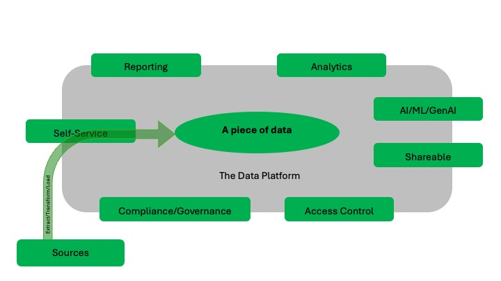

# A data platform - *"future proof"*

## Introduction

The IT world is undergoing significant changes in these times (2024-) mainly because of the "ChatGPT's" that are offering a lot of new features around text, sound, images and even videos under the domain of Generative AI - or simply GenAI.

Therefore, it is more crucial than ever to ensure that the right data with the right quality is fed into such services to maximize the benefits of these features.  But how could you predict a year ago what we can do today and what big change it is and hence plan for being able to support this. The short answer is - you couldn't.

And what new "possibilities/challenges" will tomorrow bring. Well, we really don't know, the only thing we know is that there will be changes and they are likely to happen sooner rather than later.

This document explains how you could create a data platform that will be able to handle "whatever might come" and hence give you the ability to at least from a data perspective navigate these opportunities/challenges.

The content of this document is not a "this is best practice", but a "you ought to consider this" when establishing your data platform.

It is based on the experience from different Microsoft-customers, that had a wish to streamline their processes creating a data platform for analytical tasks using cloud services.

>[!Note]
>This document will represent an ever lasting *work in progress*, as we learn new stuff all the time.
>The next topics will most likely be Governance/Compliance and GenAI, as we learn more about this in connection with 
>the different implementations we have of data platforms in use.

>[!Note]
>The words "data" and "dataset" are used to refer to any representation of information (text/images/sound/numbers....)

>[!Note]
> The document is mainly based on Microsoft technology components.

## Content

Besides covering the main topic on how to create a data platform and the direct disciplines that should be considered, other topics in 
connection with the data platform are also addressed, these can be found in separate sections of this repository.

These are follows:

|Section|Section|Section|Section|
|-------|-------|-------|-------|
|[Security](./Security/Security.md)|[Legislation](./Security/Legislation.md)|[Exit-strategy](./Security/Exit-and-risc-strategies.md)|[Risk-assessment](./Security/Exit-and-risc-strategies.md)|
|[Data-modelling](./DataModelling/DataModel.md)|[Data-establishment](./Operations/establish-data.md)|[Project roles](./Operations/project-roles.md)|[User roles](./Operations/user-roles.md)|
|[Operations/Resilience](./Operations/Operations.md)|[Data-operations](./DataOps/DataOps.md)|[Data Mesh](./DataOps/Data-mesh.md)|[Self-service](./DataOps/Self-service.md)|
|[Generative AI](./GenAI/GenAI.md)|[Cloud-environments](./DataOps/Cloud-env.md)|[Naming Standards](./DataOps/Naming-standards.md)|[Meta data handling](./DataOps/Meta-management.md)|
|[Data Agents](./GenAI/Agent.md)|[Datamarketplace](./GenAI/Marketplace.md)|||

## Background

The discussion in this document is about what data can be used for and how to ensure that you are always prepared for 
any new situation where data is needed. And that this approach is also done in a **compliant** as well as a **governed** way reflecting 
your guidelines and politics of data usage.

An overall message of the content in this document is the ability to be able to say to your users requesting data -

                   If data is not available today, it will be available tomorrow.

Lets have a closer look at the usage patterns of data covered here.

As shown in figure 1 in the center we have a "piece of data", that is any information that we would like to use *somewhere*.

This "piece" of data is most likely being used in different ways. Here is outlined the following:

1. **Reporting** where we provide the data through some application that makes it possible for me to read "something" out of the 
"numbers". Most likely this would be some kind of graph.
2. **Analytics** in this situation the data becomes mores active as they will be used by the end-user to work further and get answers to 
new questions. This is most likely done using a BI tool like PowerBI.
3. **AI/ML/GenAI** here the data is used for "simulations/predictions". And programming takes place, both programming using code as well 
as no-code/low-code tools. The programming is in most case done using Python and the tools you would meet here covers products like Visual 
Studio/Eclipse over Azure AI Foundry to CoPilot Studio. And the more you use no-code tools the more the language changes from Python to 
natural language ("ChatGPT talk").
4. **Shareable** when you have data that you find interesting you most likely wants to be able share those. In most case this needs to be 
a controlled operation so that we are sure that the receiving part is correct reflecting the politics we should have covering this.
5. **Access Control** is the simple fact that we need to control who sees what. This is in this document covered by the topics *data* and 
*datasets*.
6. **Compliance/Governance** covers the ability to document who is accessing what and ensuring this stays within our defined politics.
7. **Self-Service** being the "Nirvana" of handling data. The means that the end-users can request access to and - maybe - creation
of new datasets handled automatically by the data platform.
8. **Sources** covers which and how data is brought into the data platform. See figure 2.

*Figure 1*

When we are discussing where data comes from at where they are being used it will be so that (most likely) many applications you have already contains some kind of reporting/analytics part.
In this case it very much worth to make a decision on how to utilize this in the right way for your purposes.

*Figure 2*

The topics to discuss would then be (maybe per application):

1. The reporting capabilities is exposed directly from the application to the end-user - maybe through a common "interface" 
as shown on the figure.
2. All data is pushed/pulled into the data platform and then from here exposed.
3. Only data that needs to be combined with other applications data is pushed/pulled into the data platform.

Any combination of these are "correct", the important part is that it is documented what is being done and why.

>[!Note]
>It is required to make 2 and 3 work that you have ensured that you easily and without any further cost (licenses) can
>get you data out of these applications and that their is a documented and maintained interface based on a standard
>like REST API, SQL or Python SDK to do this.

## The Vision

The vision of the data platform described in this document is to have a platform where **Governance** and **Compliance** are the main drivers for providing access to data./ 4

Hence the concept of a self consistent dataset is a key element of this approach.

Also to provide a platform that can cover "what ever comes" and provide a situation where you can actually say *if it is not in the 
platform today, it will be there tomorrow*.

Having said that, the described data platform can be used in many different scenarios and of course should be adopted to an actual use 
case.

## Overall paradigm

To ensure that the data platform can handle “whatever might come” it is important to establish a set of guidelines. Hence the overall 
paradigm is to have a data platform fulfilling the following characteristics.

1. **Consistency** - The solution design is consistent to make it easy to operate and develop solutions further. The consistency level of 
any data object is always clear. This is to make sure that the value of the data can always be conveyed.
2. **Data Encapsulation** - The data in the data infrastructure can only be accessed through an interface that controls who can access 
what and when. The interface must let you change the data infrastructure without affecting external systems.
3. **Modularity** - The solutions in the data platform must be built with modularity in mind and with a clear interface, so it is easy to 
replace, add or remove resources and services.
4. **Technology Independent** - Architecture does not depend on the technology being used. This means that the processes, functionalities, 
and layers remain the same no matter what technology is used.
5. **Scalability** - Scalability (horizontal/vertical) is part of the solution design from the start, so that the implementation and 
operations are not impacted by bottlenecks, downtime, or unexpected license purchases.
6. **Restartability** - All services used in the solution should be able to be paused/stopped and even deleted. And be able to be started/
recreated. And this without any data loss or change in functionality.
7. **Accountability** - All services used in the solution must be individually trackable for usage - both for security and cost purposes.  
Agility - The focus is on minimum viable product (MVP) and ongoing feedback to previous steps in the data flow.
8. **Security** - Security must be integrated into the general architecture and the specific solution designs, both for information 
security and privacy. A change in components must not affect any security aspects. Compliance and governance must be maintained across the 
different layers over time.
9. **Reuse** - Solutions should be designed for reuse. The architecture should include templates for solution designs that speed up 
time-to-market and ensure standardization.
10. **Feedback** - The architecture should be continuously adjusted and improved based on feedback from the usage of the data platform.

## *Data* and *Datasets*

The concepts of *data* and *datasets* are **core components** of the data platform.

A very important aspect of especially *data* but also to some degree *datasets* is that a given object must be able to be handled, 
maintained and secured by itself, that is not through any technology component like a database, hence **file** handling is the overall 
aspect of this.

When the term *data* is used, it refers to a single data object like a file or table that contains only the *data* for that given object. 
For example, a source table like customers or invoices.

On the other hand, when the term *dataset* is used, it implies a collection of tables or files that are connected to each other. This 
could be a data mart setup with customer, product and time dimensions and a sales fact, also known as a star schema.

The *dataset* is the key component of the data platform, and it has some specific characteristics:

- The *dataset* is self-sufficient, meaning it does not depend on any other sources. It contains all the information needed.
- Only the columns/rows that are relevant for the task being supported are included.
- A *dataset* belongs to a group and not to specific individuals - in an Azure setup, the owner would be a group with an Entra ID.
- A *dataset* should have two more groups associated with it, one for creating the content and another for read-only access.
- Access to a *dataset* is granted by adding individuals to the group(s) depending on the task they need to perform.
- A *dataset* is not tied to a specific technology like a relational database. It is stored as files, often csv or parquet based. 
- A *dataset* can be provided with the appropriate technology for the task in question – like a relational database.

## Cloud aspects

This document explains how to create a data platform using cloud technology. And the described approach to a data platform has some features that are only achievable with a cloud approach.

*Figure 3*

As shown on *Figure 3* using cloud technologies, gives access to different types of services.

**Infrastructure as a Service (IaaS)** – this provides the ability to create various types of virtual machines and install any software needed on them. In this, the cloud vendor guarantees the service up to the level of the operating system. In the IaaS setup the focus is on which products should be used and hence providing the right “machines” for this.

**Platform as a Service (PaaS)** – this is for services like databases. We don't have to care about the infrastructure behind these services. The cloud vendor ensures all the required components behind the service itself. This includes updates, new versions and availability. In the PaaS setup the focus is only on what functionality is needed and not on which “product” could do this.

**Software as a Service (SaaS)** – is a "complete" solution like an ERP or a HR system. Here the cloud vendor assures access to a full package of applications, databases, and infrastructure needed for the SaaS service to work.

The data platform discussed is based on PaaS and/or SaaS services. In the chapter “Implementations”, different ways of doing this is discussed with the usage of different PaaS or SaaS services.

A key aspect of the cloud is that "everything is software". This means that when the need is - let's say - for a new Linux server, the various components that the server uses - like disks, network cards etc. - these components are generated by sending commands to the cloud infrastructure. So, we rely on software to "produce" these components.

This is known as infrastructure as code (IaC). In the data platform, this is used to create a relational database and load a *dataset* into this database using code.

This model also raises a discussion around which elements in the underlying infrastructure the cloud provider as well as the customer is responsible for in the different "silos" of on-prem, IaaS, PaaS and SaaS. This is discussed further this [section](DataOps/Cloud-env.md)

The operations of this model - known as Data Operations, or DataOps - is further discussed in this section [section](DataOps/DataOps.md).

## Logical architecture

The data platform arranges *data* and *datasets* in different areas according to the logical architecture as shown on Figure 2. This is to ensure that the approach 
can comply with the "rules" of the paradigm as mentioned previously.

*Figure 4*

The areas represent different states of the journey from *data* to *datasets* and thereby to reporting and analytics.

Referring to *Figure 4* the characteristics of the different areas are as follows:

**Source systems** are any system where *data* must be extracted from (batch) or where *data* is sent from (streamed).

The **ingest area** is where *data* from the source systems arrives. *Data* is kept with its original content. If the *data* is "table" 
data, no changes are made to any rows or columns, not even the format of the data. *Data* is stored in files - usually csv or parquet or 
in their binary format - like for videos, pictures, or sound. The *ingest area* should have a directory structure that makes it easy to 
identify the source of the data.

Also, there is no updating or overwriting of existing files - meaning that a new load creates new files. Over time, files in the *ingest 
area* should be archived or deleted if legal requirements demand this (such as GDPR).

*Data* is technically modified to comply with usable standards in the **transform area**. The *data* objects in this area are independent. 
This means that they do not have a mix of *data* from the source system, are not changed to be a golden record and do not restrict the 
number of rows or columns. They are "clean" objects that are convenient to work with when used for creating *datasets*.

From a technical perspective, the main task for transforming *data* is to make sure they have the same format for some of the "difficult" 
*data* types, such as dates (e.g. splitting time from the date into a separate column) and decimal number (".," or ",." as separators). 
The second main task is to ensure that the different *data* we want to have available in this area are easily joinable, meaning that the 
individual *data* object has the "reference keys" needed to be able to join with other *data* objects.

In the **publish area**, we create the *datasets* that are needed to meet the various business needs that require *data* from the data 
platform. We will apply techniques like star schemas and deliver these *datasets*  in what are commonly called *data* marts. 

The **consume area** is where the end users of the data platform will access the *datasets* from the *publish area* using the tools 
they find most suitable.

>[!Note]
>The paradigm described above is today also known as the *"Medallion data architecture"*, where *bronze* is the *ingest area*, *silver* is 
>*transform* and *gold* is *publish*. The *medallion architecture* does not reflect on the *consume area*. This document will use the 
>terms *ingest*, *transform*, *publish*, and *consume* as this reflects what has been used at the customers that is the inspiration for 
>this document. And it also reflects better the purpose of the different areas in the context of this document.

### Data platform and the Data Mesh paradigm

Data mesh is an architectural paradigm designed to address the challenges of scaling data management and analytics in large, complex 
organizations. It shifts from centralized data lakes and warehouses to a decentralized approach, enabling different teams to manage and 
utilize data independently.

This topic in the context of the **data platform** is discussed in more details in this [section](DataOps/Data-mesh.md)

### Interfaces

*Figure 3* indicates that the interface between the different areas is as important as the content of the areas.

These interfaces must ensure the **technology independency** we want in the platform – it must be easy to change/add new services – as 
well as ensuring that we know the data pathways.

Most of the customers we work with prefer these three interface options:

**REST API** – the “basic” interface that most (all) new services use to offer their functionalities. This level is highly technical and 
is not suitable for low/no-code.

**SQL** – the standard data query language that is widely used and supported by different data storage systems. Many people are familiar 
with SQL from its use in relational databases, but it is also available in other database systems.

If you “only” use the SQL standard language functionalities, this will give you a high degree of flexibility. This means that you will not 
use any specific capability that the vendor of the underlying technology has implemented – especially the use of the procedural languages 
provided in i.e. MS SQL Server or Oracle DB.

**Python** – the “new” data processing language. Python is widely used and reflects the current way of handling data. Python is a 
high-level programming language that can be interpreted. It has built-in data structures that are high-level, and it allows dynamic typing 
and binding, which make it ideal for Rapid Application Development, as well as for using it as a scripting or glue language to link 
existing components together.

Python's syntax is simple, easy to learn and emphasizes readability, which lowers the cost of program maintenance. Python supports modules 
and packages, which promotes program modularity and code reuse. The Python interpreter and the extensive standard library are free to 
obtain and distribute in source or binary form for all major platforms.  Many programmers love Python because it makes them more 
productive.

### Supporting Data Services

One more component of the implementation that *Figure 2* displays are Supporting data Services. 
These service are described further in this [section](Supporting_Data_Services/SupportingDataServices.md)

### Data models

The topic of handling the modelling of data in this setup is discussed further in this [section](DataModelling/DataModel.md)

## A special case – Real Time

We will approach Real Time data processing as a particular case and examine it from that perspective.

Real Time comes in different flavours, in this document we will use the following terms

- Real Time – *data* that is delivered immediately after collection.
- Near Real Time – *data* that is “delayed” due to communication or processing.
- Dynamic data – *data* that is updated and needs attention.

The data platform method in this document is **not** suitable for the Real Time situation, but it works well for Near Real Time and 
Dynamic Data. Dynamic data – which is based on events – is processed in the same manner as Near Real Time data in the data platform.

The general approach is that any or all real time *data* is also kept in the *ingest area* for more processing.
This enables the data platform to have features that can support a Real Time process where appropriate, but also to manage all knowledge 
that can be generated over time from the Real Time situations.
This can then help to avoid an undesired event from occurring - such as a train delay.

Or give more detailed information about a goal event in a football match and then being able to change odds rapidly based on the 
historical data available in the data platform.

To illustrate this, imagine a train that is delayed. The system that displays the information to the passengers at the station will 
receive the Real Time data about the delay right away and update the signs accordingly. In this process, the data itself is not much 
processed.

*Figure 5*

However, this *data* is **also** stored in the data platform, where there is some time, but not much, to generate a suggestion for 
alternative routes for the individual passengers who are waiting for the delayed train. This information can then be sent to an app on 
their smartphones.

## Another special case - ChatGPT/CoPilot

As AI/ML/GenAI is becoming more and more accessible the requirements and hence challenges on the data elements being used in such 
solutions gets even more important.

A typical approach for bringing your own data in scope of especially a GenAI solution is using a method known as RAG, standing for 
Retrieval Augmented Generation.

RAG is an architecture that augments the capabilities of a Large Language Model (LLM) like ChatGPT by adding an information retrieval 
system that provides **grounding** data. Adding an information retrieval system gives you control over grounding data used by an LLM
when it formulates a response. For an enterprise solution, RAG architecture means that you can constrain generative AI to your enterprise
content sourced from **vectorized** documents and images, and other data formats if you have embedding models for that content.

*Figure 6*

The decision about which information retrieval system to use is critical because it determines the inputs to the LLM. The information 
retrieval system should provide:

1. Indexing strategies that load and refresh at scale, for all of your content, at the frequency you require.

1. Query capabilities and relevance tuning. The system should return relevant results, in the short-form formats necessary for meeting the 
token length requirements of LLM inputs.

1. Security, global reach, and reliability for both data and operations.

1. Integration with embedding models for indexing, and chat models or language understanding models for retrieval.

Azure AI Search is an example of such a "database" which provides indexing and query capabilities, with the infrastructure and security of 
the Azure cloud.

Through code and other components, you can design a comprehensive RAG solution that includes all of the elements for generative AI over 
your proprietary content.

Based on the above we must ensure that the data we provide to the solutions created fits exactly what the user has access to, so that the 
grounding and hence the vector database contains only this. This can be done through the *publish area* as this area represents datasets 
with the exact content. So the task is to "load" the vector databases being used - and make sure these are stopped/removed after usage.

## Environments

In this section, we will explore how to use the six environments for implementing a data platform project. Depending on your preferences, 
you can of course decide how many of these environments you want to have and how you want to distribute the tasks that we will describe 
among fewer or more environments.

1. Sandbox – this environment is used for MVP testing.
2. Project room - development environments.
3. Development - code repository.
4. Testing - functional testing.
5. Quality Assurance - code review.
6. Pre-production - test on production data.
7. Production - production data.

## Data Policies

To control the *data* policies, we need to understand which environment we are working in. This document uses 5 environment types in the 
discussing of the processes.

1. Sandbox – environment used to test functionality in each service. These environments do NOT contain any business/company data.
2. Project rooms - These environments are used for establishing environments containing tools and data used to fulfill a development task.
3. Non-Production – environments that contain development, quality assurance and test scenarios.
4. Production – environments supporting pre-production and production scenarios.
5. Confidential – environments supporting data processing of highly confidential data.

As mentioned you can find projects handling the establishment of such environments in a secure setup - see "here" for more information.

## Data and security

Data security is a crucial aspect of any organization's operations. It involves protecting sensitive information from unauthorized access, 
corruption, or theft throughout its entire lifecycle. By implementing strong *data* security measures, organizations can help protect 
their valuable assets, meet relevant compliance requirements, and maintain customer trust in the usage of data.

Data security is important because it helps organizations guard against cyber attacks, insider threats, and human error, all of which can 
lead to data breaches. The four key issues in data security are confidentiality, integrity, availability, and compliance. As data is 
increasingly the target of attackers, organizations need security at the point of *data* to keep data safe and recover it faster. The goal 
of data security is to make your data resilient against any kind of misuse that being attacks, errors etc.

In summary, data security is essential for maintaining the confidentiality, integrity, and availability of an organization’s data. It 
helps protect valuable assets, meet compliance requirements, and maintain customer trust.

In the section [Security](Security/Security.md) you will find a much more detailed discussion on the security aspect.
This section will continue with some more technical possibilities.

In *Figure 7* you will find several ways to protect data which are available in Azure. This does not address the more general things like 
network security, Multi Factor Authentication etc. which is assumed to be in place.

*Figure 7*

**Application Based Access Control** – covers that an Application like SAP, Snowflake, Fabric, Dynamics etc. requires a login and hence 
grants the correct access to the underlying data used in the application. Often the underlying data store is a (relational) database, 
which is accessed from the application using a service account.

**Role Based Access Control** – also known as RBAC. This controls the access to a given resource and how it can be used. So popular said – 
can one get to the storage account?

**Attribute Based Access Control** – also known as ABAC - provides an extra mechanism for granting access making a “lookup” in another 
system. For example, you might be able to get to a storage account but their might a directory that requires that you are part of a given 
project. In this case you can make an ABAC “lookup” that checks this before providing access – depending on this result.

**Identity Based Access Control** – covers the capability that a given resource can be assigned an identity (becoming “a human”). And then 
you make sure that access to a given storage account is only provided to this “human” and hence you need to use this application to get to 
the data.

**Encryption Based Access Control** – this not really Access Control, because the *data* storage will be accessible, but I can only read/
use the *data* if I have the Key for decryption. So, it can(should) be part of your defense.

**Removal Based Access Control** – this approach is only feasible in the *publish area*. This approach utilizes the aspect of the *publish 
area* that a dataset store only “lives as long as being used”, in this case “...being used correctly”. Because this approach requires the 
ability to be able to recreate a given *dataset* store, this can also be used as a defense mechanism. So, if an attack is realized the 
easiest way to stop this is to simply remove the resource under attack if there is a risk of *dataset* loss.

## Data Operations

According to Wikipedia, DataOps is a collection of practices, processes and technologies that combines a holistic and process-oriented 
view of data with automation and methods from agile software engineering to enhance quality, speed, and collaboration and foster a culture 
of continuous improvement around data analytics.

A more detailed discussion about DataOps can be found in this [section](DataOps/DataOps.md)

### Environments and encryption policies

In different environments certain politics regarding encryption could be enforced. The following table is an example of what this could 
look like.

|Environment/Policy|Sandbox|Project room|Non-Production|Production|Confidential|
|------------------|-------|------------|--------------|----------|------------|
|Encryption at Rest|Audit|Audit|Audit|Required|Required|
|Encryption in Transit|Audit|Audit|Audit|Required|Required|
|Encryption in Processing|N/A|N/A|N/A|N/A|Required|

- Audit – it is required that a policy audit if encryption is in place, but does not require it. This can be used for risk-assessment.
- Required – the policy will prevent creating data storage of any kind without encryption.
- N/A – Not applicable.

### Environments and Tags

In the different environments different tags should be used to identify the nature of environment. The following table are examples of 
tags that could be attached to the different environments.

|Environment/Tag|Sandbox|Project room|Non-Production|Production|Confidential|Values|
|---------------|-------|------------|--------------|----------|------------|------|
|DataOwner|Audit|Required|Required|Required|Required|name of owner|
|Environment|Required|Required|Required|Required|Required|The type of environment like “Sandbox”|
|CostCenter|Required|Required|Required|Required|Required|Cost Center|

- Audit – tag should be in place.
- Required – tag must be present, if not the deployment will be denied.
- N/A – Not applicable.

### Development environment - Project room

A way of establishing a secure development environment could be to use what is called a Project room in this document. These project rooms 
represent an isolated environment normally owned by a unique AD-Group (one or more).

In the project room data, tools and code are established/maintained completely isolated. Access to a project room is done by adding or 
revoking people from the corresponding AD-Groups.

The following figure shows an example of a project room in the data platform environment.

*Figure 8*

Development being done in a project room can then be “checked in” to the overall data platform using i.e. a CI/CD process. An example of 
this is shown later in this document. Any data needed for doing the development could/should undergo a process that makes it a 
“non-production” *data*/*dataset*.

In case *data*/*datasets* in these project rooms need to be read-only, the ownership should be assigned to a second yet still unique 
AD-group.

In the rare situations where an integration connection between project rooms is needed, the ownership should be set to a third AD-group, 
still being unique to the project-room.

## CI/CD example

As mentioned above, a way of making sure coding in the data platform is done the “right away” you should consider using Continuous 
Integration/Continuous Deployment (CI/CD) principles. Such processes have pipeline workflow that describes what processes code goes 
through when being deployed to production.

The following Figure 9 show a simplified workflow.

*Figure 9*

A deeper discussion on CI/CD and the data platform can be found in this section [DataOps](DataOps/DataOps.md)

In connection with the continuous development and testing you often need to be able to handle data in non-production environments. Most 
likely you are not allowed to or do not want to use production data in these environments. Also, for testing purposes you may want to 
introduce faulty data in your 
datasets to be able to handle any exception handling scenarios.

## A practical approach

Based on the discussions in this document *Figure 10* shows what this could look like in “real life”.

On the left in this figure, you see the source system which is owned by “someone”, usually known as the system owners. These system owners 
are responsible for assuring that the data platform has access to the right systems. So, on the figure we have 3 systems called App 1, App 
2 and App 3 and they are each owned by a system owner here named System Owner 1 to 3.

In the middle we find the data platform with the *Ingest*, *Transform* and *publish area*. In the *ingest area* you see that data is taken 
one-to-one from the different App 1 to 3. Then we have a transform process that refines these raw data into their usable state.

Then on the right side of the figure we see what is required by the end-users in the *consume area*. The first user called data User 1 
needs *data* that only comes from App 1, so the dataset needed called *data* Product A is a straightforward process.

The Data User 2 needs data that comes from both App 1 and 2, but data present in App 3 most be excluded from that dataset, so in this case 
the process is a little more complicated, but because the *transform area* represents an area where easily can combine (and also 
exclude) data the fundamentals for doing this is in place, hence it be done rather smoothly.

The same goes for the Data Product C which represents data from App 2 excluding data present in App 3.

*Figure 10*

This also represents how the data platform should be able to exactly support the business needs quickly and smoothly. 

So, the overall term **if it is not available today, it will be tomorrow** can be achieved.

## Examples of implementations

The following are some examples of ways to implement a data platform using different services. Please remember that the overall paradigm 
is technology independence hence you should “mix and match” what suites best in regards of your business opportunities and challenges.

>[!Note]
>These folders "only" contains descriptive information for the time being but will eventually have Infrastructure-as-Code examples included.

[Azure Based](Microsoft/Azure/Azure.md) - using PaaS services from Azure

[Synapse based](Microsoft/Synapse/Synapse.md) - using Synapse PaaS service 

[Fabric based](Microsoft/Fabric/Fabric.md) - using the SaaS solution Microsoft Fabric

[DataBricks based](Partners/Databricks/Databricks.md) - using the 1st party PaaS service Azure DataBricks

[Snowflake based](Partners/Snowflake/Snowflake.md) - using the SaaS service Snowflake together with Azure services

[Microsoft Purview and the data platform](Microsoft/Purview/Purview.md) - governance and compliance of the data platform using Purview

