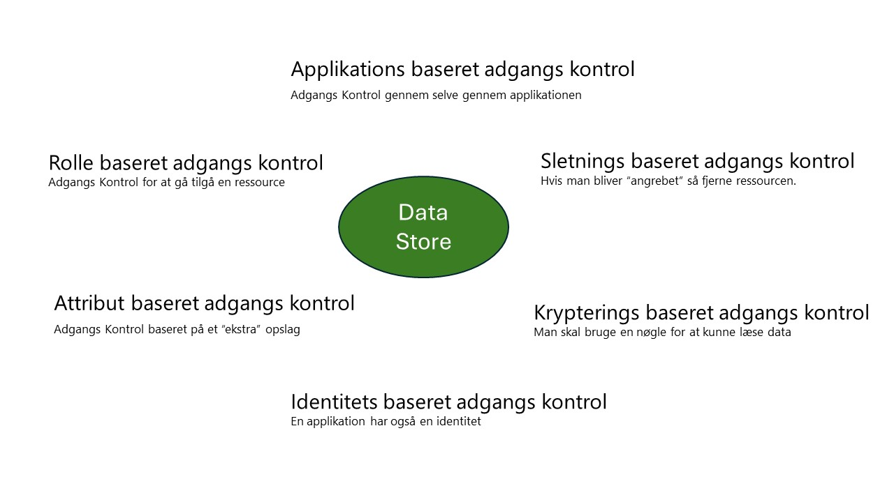

# En data platform - Sikkerhed "Under construction"

 

## Introduktion

This section focuses on the "mere" security aspect on how to handle data. It covers the challenges that need to be addressed as well as some thoughts on how to handle those.

This part is also a lot about processes and hence highlighting that you cannot solve data security by "just clicking some boxes in you IT systems".

## Data og sikkerhed

Datasikkerhed er et kritisk element i driften af enhver organisation. Det omhandler beskyttelsen af data mod ulovlig adgang, forringelse eller tyveri over hele dataenes levetid. Med indførelsen af robuste datasikkerhedstiltag kan firmaer sikre deres vigtige ressourcer, opnå overholdelse af regler og fastholde kundetilliden til, hvordan de håndterer data.

Datasikkerhed er kritisk, da den sikrer organisationer mod cyberangreb, insidertrusler og menneskelige fejl, som kan resultere i databrud. De væsentlige faktorer inden for datasikkerhed omfatter fortrolighed, integritet, tilgængelighed og overholdelse. Med voksende trusler mod data skal organisationer beskytte deres data ved kilden for at kunne opretholde datasikkerheden og hurtigt genoprette data efter et angreb. Formålet med datasikkerhed er at beskytte data imod alle former for misbrug, inklusive cyberangreb og menneskelige fejl.

For at konkludere er det væsentligt for datasikkerhed at bevare fortroligheden, integriteten og tilgængeligheden af en organisations oplysninger. Det understøtter beskyttelsen af vigtige ressourcer, hjælper med at imødekomme de specificerede standarders compliance krav og fastholder kundetillid.

Figur 4 viser forskellige metoder til databeskyttelse tilgængelige i Azure. Det dækker dog ikke generelle emner som netværkssikkerhed eller multifaktorgodkendelse, da det antages, at disse allerede er implementeret.

 
*Figur 4*

**Applikationsbaseret adgangskontrol** - dækker over, at en applikation som SAP, Snowflake, Fabric, Dynamics osv. kræver et login og dermed giver den korrekte adgang til de underliggende data, der bruges i applikationen. Ofte er det underliggende datalager en (relationel) database, som der er adgang til fra programmet ved hjælp af en tjenestekonto. 
Rollebaseret adgangskontrol – også kendt som RBAC. Dette styrer adgangen til en given ressource, og hvordan den kan bruges. Så populært sagt - kan man komme til lagerkontoen?

**Attributbaseret adgangskontrol** – også kendt som ABAC - giver ofte ekstra mekanisme til at give adgang til at foretage et "opslag" i et andet system. For eksempel kan man muligvis komme til en storage-konto, men deres kan være en mappe, der kræver, at man er en del af et givet projekt. I dette tilfælde kan man lave et ABAC "opslag", der kontrollerer dette, før man giver adgang - afhængigt af dette resultat.

**Identitetsbaseret adgangskontrol** - dækker den mulighed, som en given ressource kan tildeles en identitet (bliver "et menneske"). Og så sørger man for, at adgang til en given lagerkonto kun gives til dette "menneske", og derfor skal man bruge denne applikation til at komme til dataene.

**Krypteringsbaseret adgangskontrol** - dette er ikke rigtig adgangskontrol, fordi datalagringen vil være tilgængelig, men man kan kun læse / bruge dataene, hvis man har nøglen til dekryptering. Så det kan (bør) være en del af dit forsvar.

**Sletningsbaseret adgangskontrol** – denne tilgang er kun muligt i **publish** rområdet. Denne tilgang bruger det aspekt af **publish** området, at et *datasæt* kun "lever så længe det bruges", i dette tilfælde "... bliver brugt korrekt". Fordi denne tilgang kræver evnen til at kunne genskabe et givet *datasæt*, kan dette også bruges som en forsvarsmekanisme. Så hvis et angreb realiseres, er den nemmeste måde at stoppe dette på blot at fjerne ressourcen under angreb, hvis der er risiko for tab af data.

## DataOps

Ifølge Wikipedia er DataOps en samling af praksis, processer og teknologier, der kombinerer et holistisk og procesorienteret syn på data med automatisering og metoder fra agil softwareudvikling for at forbedre kvalitet, hastighed og samarbejde og fremme en kultur med løbende forbedringer omkring dataanalyse.

Mens DataOps startede som et sæt bedste praksis, har det nu udviklet sig til at blive en ny og særskilt tilgang til dataanalyse. DataOps dækker hele datalivscyklussen fra dataforberedelse til rapportering og anerkender den indbyrdes afhængige karakter af dataanalyseteamet og informationsteknologioperationer.

Inden for softwareudvikling lægger DevOps vægt på kontinuerlig levering ved hjælp af on-demand it-ressourcer og ved at automatisere test og implementering af software. Denne måde at udvikle software og it-drift på har forbedret hastigheden, kvaliteten, forudsigeligheden og omfanget af softwareudvikling og implementering. 
Ved at tage metoder fra DevOps sigter DataOps mod at bringe de samme forbedringer til dataanalyse. DataOps bør ikke knyttes til en bestemt teknologi, arkitektur, værktøj, sprog eller struktur.

