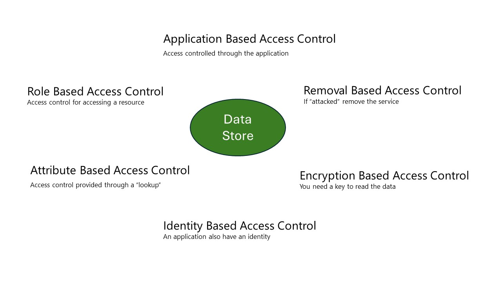

# A data platform - Security "Under construction"

 

## Introduction

This section focuses on the "mere" security aspect on how to handle data. It covers the challenges that need to be addressed as well as some thoughts on how to handle those.

This part is also a lot about processes and hence highlighting that you cannot solve data security by "just clicking some boxes in you IT systems".

In regard of scope, this document is in line with the overall Data Platform document and does not hence (yet) describe other aspects of data security than the once supporting this.
I think the most mechanism are useable for other kinds of data - including also "end-user" document handling like OneDrive.

## Data and security

Data security is a crucial aspect of any organization's operations. It involves protecting sensitive information from unauthorized access, corruption, or theft throughout its entire lifecycle.
By implementing strong *data* security measures, organizations can help protect their valuable assets, meet relevant compliance requirements, and maintain customer trust in the usage of data.

Data security is important because it helps organizations guard against cyber attacks, insider threats, and human error, all of which can lead to data breaches. The four key issues in data
security are confidentiality, integrity, availability, and compliance. As data is increasingly the target of attackers, organizations need security at the point of *data* to keep data safe and
be able to recover it faster. The goal of data security is to make your data as resilient as possible against any kind of misuse that being attacks, errors etc.

In summary, data security is essential for maintaining the confidentiality, integrity, and availability of an organization’s data. It helps protect valuable assets, meet compliance
requirements, and maintain customer trust.

## Legislation

This document will use the two EU directives NIS2 and GDPR and the US HPIAA rules as examples of legislation being implemented.
GDPR is used because it describes what you can do with personal data and therefor what you should do with valuable data.
NIS2 is used because it tells what to do if things goes wrong and what need to be considered trying to avoid this.
HIPAA is used because it focuses on Health Information, and is actually three laws in one. It consists of the Privacy Rule, the Security Rule and the Data Breach Notification Rule. 

### GDPR

This Regulation lays down rules relating to the protection of *natural persons* with regard to the processing of **personal** data and rules relating to the free movement of personal data.
This Regulation protects fundamental rights and freedoms of natural persons and in particular their right to the protection of personal data.
The free movement of personal data within the Union shall be neither restricted nor prohibited for reasons connected with the protection of natural persons with regard to the processing of personal data.

(Reference: https://gdpr-info.eu/art-1-gdpr/)

So this directive protects individuals data from misusage. One of the main objectives in the GDPR directive is that data need to be **classified**.

### NIS2

The NIS2 Directive (EU Directive 2022/2555) is a legislative framework designed to enhance cybersecurity across the European Union by establishing a high common level of security for network and information systems.
It builds upon the original NIS Directive, expanding its scope and strengthening requirements to better address evolving cyber threats.

Under NIS2, essential and important entities must adopt appropriate, proportionate technical, operational, and organizational measures to manage cybersecurity risks.
These measures aim to protect network and information systems, as well as to prevent or minimize the impact of incidents on service recipients and interconnected services.

The directive mandates an "all-hazards" approach, meaning that entities must be prepared to address a wide range of threats, from cyber attacks to physical disruptions, ensuring comprehensive protection and resilience in their operations.

(Reference: https://www.nis-2-directive.com/)

This directive regulates what needs to be in place regarding the usage of data. One of the main objectives is that you need to know where **all** your data is - as described in the most common used framework *behind* NIS 2 being CIS 18.

### HIPAA

HPIAA's three rules/laws:
•	The Privacy Rule: The HIPAA Privacy Rule establishes national standards to protect individuals' medical records and other individually identifiable health information (collectively defined as “protected health information”) and applies to health plans, health care clearinghouses, and those health care providers that conduct certain health care transactions electronically.  
•	The Security Rule: The HIPAA Security Rule establishes national standards to protect individuals’ electronic personal health information that is created, received, used, or maintained by a covered entity. The Security Rule requires appropriate administrative, physical and technical safeguards to ensure the confidentiality, integrity, and security of electronic protected health information. 
•	Data Breach Notifications: The Breach Notification Rule requires covered entities and business associates to notify affected individuals, HHS, and, in some cases, the media of a breach of unsecured PHI.

(Reference: https://www.hhs.gov/hipaa/index.html)

HPIAA is in effect together with other rules/laws, so data will live and need to be handled under these different kind of rules. 
These rules are i.e. Virginia Consumer Data Protection Act, Illinois’ Biometric Information Privacy Act etc. 

## Threats

When discussing security it is also essential to understand what it is we are trying to protect against - what are the threats ?

Their are som obvious threats that comes with the term cybersecurity. We need to protect data against outsider threats. These threats spans from others that wants to steal our data for own use, over "hijacking" of data to terror acts like deletion/destroying of data.

## Logical mechanism

Discover your most valuable asset, your data
Secure configuration to prevent sophisticated attacks
Detect how users are interacting with data and identify insider risks
Ensure your data remains secure from data leakage and data exfiltration activities

### Classification

### Labeling

### Policies

## Technical mechanism

In Figure 4 you will find several ways to protect data which are available in Azure. This does not address the more general things like network security, Multi Factor Authentication etc. which is assumed to be in place.

*Figure 4*

**Application Based Access Control** – covers that an Application like SAP, Snowflake, Fabric, Dynamics etc. requires a login and hence grants the correct access to the underlying data used in the application. Often the underlying data store is a (relational) database, which is accessed from the application using a service account.

**Role Based Access Control** – also known as RBAC. This controls the access to a given resource and how it can be used. So popular said – can one get to the storage account?

**Attribute Based Access Control** – also known as ABAC - provides an extra mechanism for granting access making a “lookup” in another system. For example, you might be able to get to a storage account but their might a directory that requires that you are part of a given project. In this case you can make an ABAC “lookup” that checks this before providing access – depending on this result.

**Identity Based Access Control** – covers the capability that a given resource can be assigned an identity (becoming “a human”). And then you make sure that access to a given storage account is only provided to this “human” and hence you need to use this application to get to the data.

**Encryption Based Access Control** – this not really Access Control, because the *data* storage will be accessible, but I can only read/use the *data* if I have the Key for decryption. So, it can(should) be part of your defense.

**Removal Based Access Control** – this approach is only feasible in the **publish area**. This approach uses the aspect of the **publish area** that a dataset store only “lives as long as being used”, in this case “...being used correctly”. Because this approach requires the ability to be able to recreate a given *dataset* store, this can also be used as a defense mechanism. So, if an attack is realized the easiest way to stop this is to simply remove the resource under attack if there is a risk of *dataset* loss.

## Data Security Operations

According to Wikipedia, DataOps is a collection of practices, processes and technologies that combines a holistic and process-oriented view of data with automation and methods from agile software engineering to enhance quality, speed, and collaboration and foster a culture of continuous improvement around data analytics.

While DataOps started as a set of best practices, it has now evolved to become a new and distinct approach to data analytics. DataOps covers the whole data lifecycle from data preparation to reporting and acknowledges the interdependent nature of the data analytics team and information technology operations.

In software development, DevOps emphasizes continuous delivery by using on-demand IT resources and by automating test and deployment of software. This way of software development and IT operations has improved velocity, quality, predictability and scale of software engineering and deployment.

Taking methods from DevOps, DataOps aims to bring these same improvements to data analytics. DataOps should not be linked to a specific technology, architecture, tool, language, or framework.
