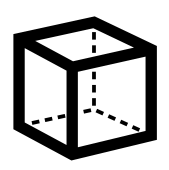

# Supporting Data Services - Common Data Model - Under konstruktion

 

## Indledning

Udtrykket *fælles datamodel* bruges om enhver standardiseret datamodel, der giver mulighed for data- og informationsudveksling mellem forskellige applikationer og datakilder. 

*Fælles datamodeller* har til formål at standardisere logisk infrastruktur, så relaterede applikationer kan "operere på og dele de samme data".
Tynd en organisation er en af de typiske opgaver i et datavarehus.

Hvis du nogensinde har været nødt til at samle data fra flere systemer og applikationer, ved du højst sandsynligt, hvilken dyr og tidskrævende opgave det kan være.
Uden at være i stand til at dele og forstå de samme data nemt, kræver hver applikation eller dataintegrationsprojekt sin egen implementering, som højst sandsynligt allerede har gjort det 
etableret et "andet sted" i din virksomhed.

## Hvad er der i en fælles datamodel?

Ud over dokumentationen af dens struktur og indhold indeholder en *Common Data Model* et sæt standardiserede og ofte udvidelige skemaer. Denne samling af skemaer omfatter enheder,
egenskaber, beskrivelser og relationer. Disse skemaer repræsenterer almindeligt anvendte begreber og aktiviteter, såsom kunde, adresse osv. 
Denne fremgangsmåde forenkler oprettelse, aggregering og analyse af data.

## Hvorfor bruge en Common Data Model?

Forestil dig, at du har tre forretningsapplikationer.

En til materialer, en til fremstilling og en til salg. Det er næsten sikkert, at hver af disse applikationer har sin egen repræsentation for aktiver, der bruges af alle tre applikationer, som f.eks.
aktivet for en konto. Et sådant aktiv indeholder højst sandsynligt de samme oplysninger, men repræsenteret på forskellige måder i hver applikation - forskel som navn på kolonner, datatyper, datalængde.

Hvis du brugte en *Common Data Model*, ville disse applikationer have haft et standardiseret format til at henvise til aktiver som en konto til, og (måske) kunne hver app have brugt de samme data.

Hver applikation vil derefter have sine egne yderligere data og skemaer, afhængigt af dens funktionalitet. 

Men når det kommer til udvikling, kan dine apps og rapporter derefter trække almindelige dataelementer hurtigt, rent og med tillid.

Som du ved, er dette virkelig ikke virkeligheden. Der er nogle initiativer til at lave sådanne modeller for data, ofte i "ERP-verdenen". Men ofte (=altid) bliver du nødt til at bruge en *Common Data Model*
som "oversætter" mellem forskellige systemer. I dette tilfælde giver det meget mening at bruge nogle af de tilgængelige industristandarddatamodeller, der findes.

Hvis du følger denne tilgang ved at oprette en ny applikation, bliver datamart eller rapport meget mere standardiseret. Og din udviklingsindsats kan koncentrere sig om forretningslogik frem for
figru finde ud af, hvordan man transformerer dataene *"endnu en gang"*.

Historisk set har arbejdet med at bygge en app været tæt forbundet med dataintegration, men med Common Data Model og de platforme, der understøtter det, kan de to ske uafhængigt af hinanden:

Appudviklere og/eller udviklere: Uanset om disse brugere udnytter kodebaserede platforme eller en platform med lav kode/ingen kode, f.eks. Power Apps eller Power BI, skal de gemme og administrere data for deres apps.

Dataintegratorer: Disse brugere er ansvarlige for at bringe data fra en række forskellige systemer for at gøre dem tilgængelige for apps at bruge.

Common Data Model forenkler datastyring og appudvikling ved at samle data i en kendt form og anvende strukturel og semantisk konsistens på tværs af flere apps og udrulninger. For at opsummere fordelene:

Strukturel og semantisk konsistens på tværs af programmer og udrulninger.

Forenklet integration og flertydighed af data, der indsamles fra processer, digitale interaktioner, produkttelemetri, personinteraktioner osv.

En samlet form, hvor dataintegrationer kan kombinere eksisterende virksomhedsdata med andre kilder og bruge disse data holistisk til at udvikle apps eller udlede indsigt.

Muligheden for at udvide skemaet og Common Data Model-standardobjekterne for at skræddersy modellen til din organisation.

